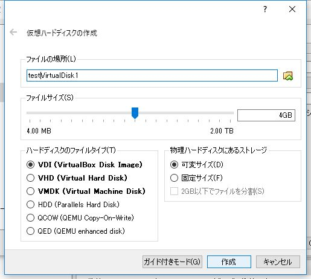
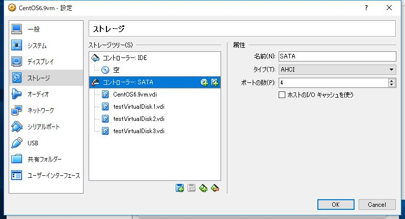

今日もLPIC 201の勉強です。病気になりそう。今回はディスク冗長化のRAIDの構築。新しくPC買ったらRAID5でファイルサーバを構築しようと考えているのでいい勉強の機会です。ちなみにソフトウェアRAIDはOSの機能で管理するRAIDで、ハードウェアRAIDはそれ用の機械をコンピュータの中につっこんでやるRAIDです。後者はOSからは/dev/sdbみたいに普通の1ディスクとして見えるそうな。

<!--more-->

## 要件

- VirtualBox 5.1.22
- CentOS 6.9(VM)
- 2.6.32-696.1.1.el6.x86_64

たかだか勉強のためにハードディスク買うお金なんか当然ないのでVMで。VMなら仮想ディスクの作成も超簡単。

## 1.仮想ディスクの作成

該当するVMを右クリックして設定をクリック。ストレージを選択するとこんな画面になっているはず。


コントローラー：SATAの右側のハードディスクの追加をクリック。



適当に名前つけて適当に容量決めて作成。ファイルタイプはなんでもいいですが、VirtualBoxデフォルトのVDIにしときます。ちなみにVHDはVirtual PCデフォルトで、VMDKはVMwareデフォルトの仮想ディスクのイメージファイル形式です。



今回はRAID5を試すので、同じ要領で3つ仮想ディスクを作成します。できたら起動。

## 2.RAID用のパーティション作成

LinuxでOS標準のソフトウェアRAIDを組む場合、RAIDに利用するパーティションのシステムIDをそれだと明示してやる必要があるのでやります。まずOSが起動したらちゃんと作成したデバイスが認識されているか確認。

```bash
<pre># ls -l /dev | grep sd
brw-rw----. 1 root disk 8,  0 6月 5 20:52 2017 sda
brw-rw----. 1 root disk 8,  1 6月 5 20:52 2017 sda1
brw-rw----. 1 root disk 8,  2 6月 5 20:52 2017 sda2
brw-rw----. 1 root disk 8, 16 6月 5 20:52 2017 sdb
brw-rw----. 1 root disk 8, 32 6月 5 20:52 2017 sdc
brw-rw----. 1 root disk 8, 48 6月 5 20:52 2017 sdd
```

確実にsdb～sddが今回作成した仮想ディスクなんですが、今後のことも考えて確認の手順をメモしときます。

```bash
#  df -T
/dev/mapper/VolGroup-lv_root
          ext4  36580952 10943444 23772600 32% /
tmpfs     tmpfs   961092        0   961092  0% /dev/shm
/dev/sda1 ext4    487652    93124   368928 21% /boot
```

この時点でsda2がまるごと論理ボリュームVolGroup-lv_rootになっているのだとなんとなく想像できますがきちんと確認します。

```bash
# lvdisplay
 --- Logical volume ---
 LV Path /dev/VolGroup/lv_root
 LV Name lv_root
 VG Name VolGroup
 LV UUID zdWC2r-Sp2C-ZJBw-02IO-e03g-LcC1-fxThXi
 LV Write Access read/write
 LV Creation host, time localhost.localdomain, 2017-05-28 18:56:43 +0900
 LV Status available
 # open 1
 LV Size 35.57 GiB
 Current LE 9106
 Segments 1
 Allocation inherit
 Read ahead sectors auto
 - currently set to 256
 Block device 253:0

 --- Logical volume ---
 LV Path /dev/VolGroup/lv_swap
 LV Name lv_swap
 VG Name VolGroup
 LV UUID wCnJIM-04Q0-HlAg-iN45-MuK7-T1Tb-jSh7Sg
 LV Write Access read/write
 LV Creation host, time localhost.localdomain, 2017-05-28 18:56:45 +0900
 LV Status available
 # open 1
 LV Size 3.94 GiB
 Current LE 1008
 Segments 1
 Allocation inherit
 Read ahead sectors auto
 - currently set to 256
 Block device 253:1</pre>
```

スワップ領域もあるじゃん。どちらもボリュームグループVolGroupに属しているのでそっちを見ます。

```bash
# vgdisplay VolGroup
 --- Volume group ---
 VG Name VolGroup
 System ID
 Format lvm2
 Metadata Areas 1
 Metadata Sequence No 3
 VG Access read/write
 VG Status resizable
 MAX LV 0
 Cur LV 2
 Open LV 2
 Max PV 0
 Cur PV 1
 Act PV 1
 VG Size 39.51 GiB
 PE Size 4.00 MiB
 Total PE 10114
 Alloc PE / Size 10114 / 39.51 GiB
 Free PE / Size 0 / 0
 VG UUID f0cwpy-ZWpe-JOll-yUFF-NwRo-7cbi-8h1HkO</pre>
```

Cur LV 2からさっきの論理ボリューム二つがこのボリュームグループから切り出されているとわかります。対してCur PV 1からこのボリュームグループは物理ボリュームただ一つから構成されているとわかります。

```bash
# pvdisplay
 --- Physical volume ---
 PV Name /dev/sda2
 VG Name VolGroup
 PV Size 39.51 GiB / not usable 3.00 MiB
 Allocatable yes (but full)
 PE Size 4.00 MiB
 Total PE 10114
 Free PE 0
 Allocated PE 10114
 PV UUID Hig5OQ-9dhU-eZO8-Pq2O-SGap-SqY1-jC104T</pre>
```

物理ボリューム/dev/sda2ただ一つがボリュームグループVolGroupを構成しているとわかりました。ここまででようやく現在使われているパーティションはsda1とsda2のみであり、sdb、sdc、sddが今回新しく作成した仮想ディスクだとわかりました。LVMはちゃんと確認しようとすると対応関係を追っていかなきゃならないのでめんどくさい。

ようやくパーティションを作り始めます。パーティションをテストとして一つだけつくった後、tコマンドでシステムタイプの設定モードに入り、さっき作成したパーティションのシステムタイプにLinux raidを表すfdを入力します。終わったら書き込み。

```bash
# fdisk /dev/sdb
(～前略～)
コマンド (m でヘルプ): n
コマンドアクション
 e 拡張
 p 基本パーティション (1-4)
p
パーティション番号 (1-4): 1
最初 シリンダ (1-522, default 1):
Using default value 1
Last シリンダ, +シリンダ数 or +size{K,M,G} (1-522, default 522):
Using default value 522

コマンド (m でヘルプ): t
選択した領域 1
16進数コード (L コマンドでコードリスト表示): fd
領域のシステムタイプを 1 から fd (Linux raid 自動検出) に変更しました

コマンド (m でヘルプ): w
パーティションテーブルは変更されました！

ioctl() を呼び出してパーティションテーブルを再読込みします。
ディスクを同期しています。
```

sdbからパーティションを切り出し、sdb1をシステムタイプfdで作成しました。同じことをsdcとsddにもやります。やっとパーティション作成完了。

## 3.Raid構成

mkadmコマンドでsdb1、sdc1、sdd1を束ね、/dev/md0というRAIDデバイスをレベル5で作成します。

```bash
# mdadm -C /dev/md0 --level 5 --raid-devices 3 /dev/sdb1 /dev/sdc1 /dev/sdd1
mdadm: Defaulting to version 1.2 metadata
mdadm: array /dev/md0 started.
```

できた。無事作成できたか確認。

```bash
# cat /proc/mdstat
Personalities : [raid6] [raid5] [raid4]
md0 : active raid5 sdd1[3] sdc1[1] sdb1[0]
 8381440 blocks super 1.2 level 5, 512k chunk, algorithm 2 [3/3] [UUU]

unused devices: <none>
```

きちんとつくれてます。より詳しい情報はこっちで見れます。

```bash
# mdadm --detail /dev/md0
/dev/md0:
 Version : 1.2
 Creation Time : Mon Jun 5 21:22:09 2017
 Raid Level : raid5
 Array Size : 8381440 (7.99 GiB 8.58 GB)
 Used Dev Size : 4190720 (4.00 GiB 4.29 GB)
 Raid Devices : 3
 Total Devices : 3
 Persistence : Superblock is persistent

 Update Time : Mon Jun 5 21:22:31 2017
 State : clean
 Active Devices : 3
Working Devices : 3
 Failed Devices : 0
 Spare Devices : 0

 Layout : left-symmetric
 Chunk Size : 512K

 Name : localhost.localdomain:0 (local to host localhost.localdomain)
 UUID : e7fe02a9:439dd82b:443c94bb:ce425dbe
 Events : 18

 Number Major Minor RaidDevice State
 0 8 17 0 active sync /dev/sdb1
 1 8 33 1 active sync /dev/sdc1
 3 8 49 2 active sync /dev/sdd1</pre>
```

## 4.設定ファイルの作成

以下のコマンドでconfファイル作成。

```bash
# mdadm --detail --scan >> /etc/mdadm.conf
```

が、これの扱いには注意したほうがよさそう。このファイルに記載されていないデバイスはそもそもRAIDデバイスとして認識されないらしいので、例えばハードディスクの破損などでディスクを交換し、このファイルを更新しないまま再起動なんかしたら新しいハードディスクは読み込まれないらしい。でもこのファイルが存在しなくても再起動時にRAIDは構築してくれるらしい。あれば読む、なければ他を読むんだろうけどあんま詳しい挙動はわかってない。

## 5.ファイルシステムの作成とマウント

RAIDデバイスを作成できたらあとは普通のハードディスクと同じ。ファイルシステムを作成してマウントして書き込みテストします。長くなってきたので飛ばします。

```bash
# mkfs -j /dev/md0
# mkdir 777 /testraid
# echo "/dev/md0 /testraid ext3 defaults 1 2" >> /etc/fstab
# mount -a
# echo writetest &gt; /testraid/write_test
# cat /testraid/write_test
writetest
```

ぜんぶ無事できてたらOK。

## 6.RAIDであそぼう

```bash
# mdadm --manage /dev/md0 --remove /dev/sdd1
mdadm: hot remove failed for /dev/sdd1: Device or resource busy
```

いきなりはRAIDディスクアレイからディスクひっこぬけない。

```bash
# mdadm --manage /dev/md0 --fail /dev/sdd1
mdadm: set /dev/sdd1 faulty in /dev/md0

# cat /proc/mdstat
Personalities : [raid6] [raid5] [raid4]
md0 : active raid5 sdd1[3](F) sdc1[1] sdb1[0]
 8381440 blocks super 1.2 level 5, 512k chunk, algorithm 2 [3/2] [UU_]

unused devices: <none>

# mdadm --manage /dev/md0 --remove /dev/sdd1
mdadm: hot removed /dev/sdd1 from /dev/md0

# cat /proc/mdstat
Personalities : [raid6] [raid5] [raid4]
md0 : active raid5 sdc1[1] sdb1[0]
 8381440 blocks super 1.2 level 5, 512k chunk, algorithm 2 [3/2] [UU_]

unused devices: <none>
```

ディスクにFailフラグを付けて故障を示すと引っこ抜ける。

```bash
# echo writetest2 > /testraid/write_test
# cat /testraid/write_test
writetest2
```

RAID5なのでディスク1個引っこ抜いてても普通につかえる。

```bash
# mdadm --manage --add /dev/md0 --add /dev/sdd1
mdadm: added /dev/sdd1

# cat /proc/mdstat
Personalities : [raid6] [raid5] [raid4]
md0 : active raid5 sdd1[3] sdc1[1] sdb1[0]
 8381440 blocks super 1.2 level 5, 512k chunk, algorithm 2 [3/2] [UU_]
 [=====>...............] recovery = 28.3% (1186568/4190720) finish=0.2min speed=197761K/sec

unused devices: <none>

# cat /proc/mdstat
Personalities : [raid6] [raid5] [raid4]
md0 : active raid5 sdd1[3] sdc1[1] sdb1[0]
 8381440 blocks super 1.2 level 5, 512k chunk, algorithm 2 [3/3] [UUU]

unused devices: <none>
```

ひっこぬいた仮想ディスクも普通にもどせる。再構成が走って、しばらくしてもっかいみると元にもどってる。

おわり。マストドン503返してるの気づきました？　アプデ失敗してデータ飛びました。どうしよう。
