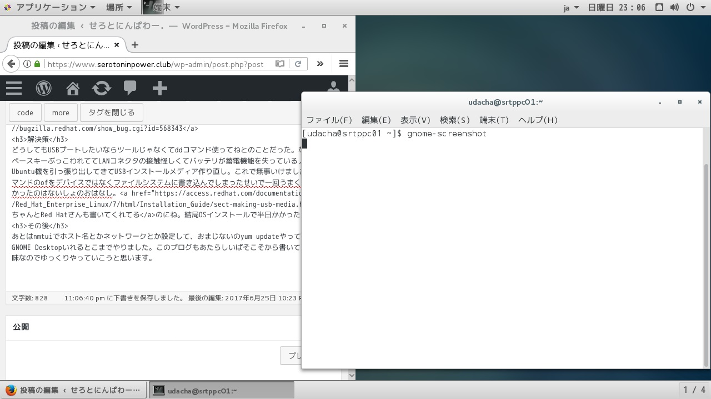

# {{this.$page.frontmatter.title}}

<CategoriesAndDate/>

{{this.$page.frontmatter.description}}
  
<!--more-->

## 事象

写真とり忘れたのが痛いんですけど、USBからカーネルを起動してる最中に延々とdracut-initque timeoutが連発されて、スプラッシュイメージがはじっこまでいってそこから動きがなくなる。

## 原因

ちょっと調べたけどanacondaのバグだとのこと。Federa13だと修正されてるっぽいです。問題の本質が知りたかったけどちょっとカーネルの動きとかパイソンとかわからないです……最近こんなんばっかだな。
  
<https://bugzilla.redhat.com/show_bug.cgi?id=568343>

## 解決策

どうしてもUSBブートしたいならツールじゃなくてddコマンド使ってねとのことだった。なのでスペースキーぶっこわれててLANコネクタの接触怪しくてバッテリが蓄電機能を失っているノートのUbuntu機を引っ張り出してきてUSBインストールメディア作り直し。これで無事いけました。ddコマンドのofをデバイスではなくパーティションに書き込んでしまったせいで一回うまくいかなかったのはないしょのおはなし。[ちゃんとRed Hatさんも書いてくれてる][1]のにね。結局OSインストールで半日かかったよ。

## その後

あとはnmtuiでホスト名とかネットワークとか設定して、おまじないのyum updateやって、vimとGNOME Desktopいれるとこまでやりました。このブログもあたらしいぱそこそから書いてるよ。趣味なのでゆっくりやっていこうと思います。

おわり。

 [1]: https://access.redhat.com/documentation/ja-JP/Red_Hat_Enterprise_Linux/7/html/Installation_Guide/sect-making-usb-media.html
