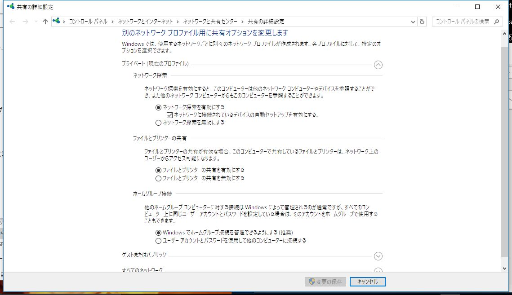
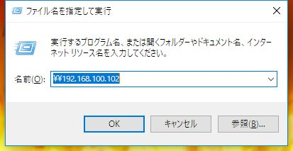
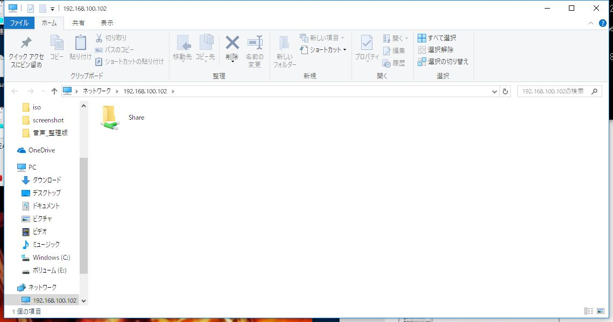
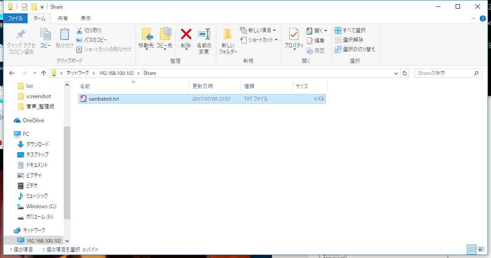

# {{this.$page.frontmatter.title}}

<span style="color: #ff0000;">20180729 Sambaのセキュア化設定(SMBv1無効化、ディジタル署名有効化)とプリンタ関連のログ抑制設定を追加</span>

LPIC 202の勉強がてらSambaサーバ構築してみました。Sambaとは簡単に言うとWindowsからアクセスできるファイルサーバです。Active Directoryのドメインコントローラにもなれたりするらしいですが難しそうなのでいったん置いておきます。

<!--more-->

## LAN内から認証なしでsambaへアクセスするための肝

- security = userモードを利用するが、samba用のUNIXアカウントを作成しないこと
- LAN内からのみアクセスを許可すること
- ゲスト認証のみ許可すること
- 共有ディレクトリの所有者・所有グループは共にnobodyとし、パーミッションは777とすること
- 新規にディレクトリやファイルを作成した際に、その所有者・所有グループは共にnobodyになるようにすること

これらの設定で、セキュリティを保ちつつ、認証不要なゲストアカウントがフルアクセス権を持った状態でログインできます。security = shareというモードだと上記の面倒な設定が不要なのですが、最近のセキュリティが厳しくなったWindowsとの連携がうまくいかないらしく、そのうちモード自体を消すよみたいなことが言われています。

## 要件

- CentOS Linux release 7.3.1611 (Core)
- 3.10.0-514.26.1.el7.x86_64

## 構築手順

必要なものをインストール

```bash
sudo yum install samba
```

バージョンを確認

```bash
$ smbd -V
Version 4.4.4
```

設定ファイルを編集

<span style="color: #ff0000;">20180729 Sambaのセキュア化設定(SMBv1無効化、ディジタル署名有効化)とプリンタ関連のログ抑制設定を追加</span>

```ini
$ sudo vim /etc/samba/smb/conf
[global]
#文字コードの指定
dos charset = CP932
unix charset = UTF-8
#ワークグループの指定
workgroup = SEROTONINWG
#エクスプローラとかでフォルダの横に表示されるコメント。%vはsambaのバージョン、%hはホスト名を示すsmb.confの変数
server string = Samba %v on %h Linux
#アクセス制限。これ以外はdenyされる。EXCEPTでルータを除外
hosts allow = 192.168.100. localhost EXCEPT 192.168.100.1
#net bios名の指定。ホスト名と一緒にしておく
netbios name = srtppc02
#net bios名をdnsサーバに解決してもらうかどうか
dns proxy = no
#ログレベルの指定
log level = 3
#sambaが稼働しているホストのUNIXユーザを用いて認証を行う。ほかにもLDAPサーバやADサーバを用いて認証を行うようにもできる
security = user
#sambaユーザとして認証できなかった場合にどうするか。bad userの場合、存在しないユーザでログインしようとした時にゲスト認証だとみなす
map to guest = bad user

#SMBディジタル署名有効化(サーバ側とクライアント側)
server signing = mandatory
client signing = mandatory
#SMB暗号化を有効(任意とする)
smb encrypt = auto
#SMBv1を無効化
min protocol = SMB2

#プリンタ関連のログを抑制する
load printers = no
printing = bsd
printcap name = /dev/null

[Share]
#共有させるフォルダ
path = /samba/share/
#ブラウジング機能を有効とするかどうか
browsable =yes
#書き込み可能かどうか
writable = yes
#ゲストユーザのログインが可能かどうか
guest ok = yes
#全てのユーザをゲストとするかどうか
guest only = yes
#読込みのみとするか
read only = no
#フルアクセスでファイル作成
create mode = 0777
#フルアクセスでディレクトリ作成
directory mode = 0777
```

共有ディレクトリの作成。nobodyにフルアクセス権を持たせる

```bash
sudo mkdir -p /samba/share
sudo chmod -R 0777 /samba/share
sudo chown -R nobody:nobody /samba/share
```

sambaの自動起動設定と再起動

```bash
sudo systemctl enable smb
sudo systemctl enable nmb
sudo systemctl restart smb
sudo systemctl restart nmb
```

firewalldの現在のzone確認

```bash
$ sudo firewall-cmd --list-all
 myfirewall (active)
 target: default
 icmp-block-inversion: no
 interfaces: enp0s31f6
 sources:
 services: ssh
 ports:
 protocols:
 masquerade: no
 forward-ports:
 sourceports:
 icmp-blocks:
 rich rules:
 ```

firewalldのゾーンmyfirewallにsambaが使うポートを穴空け

```bash
sudo firewall-cmd --permanent --zone=myfirewall --add-service=samba
sudo firewall-cmd --reload
```

SELinuxにsambaの利用を許可させる

```bash
sudo chcon -t samba_share_t /samba/share
```

## Windows側からの疎通確認

まずはWindowsのネットワーク探索とファイルとプリンターの共有を許可してやる必要があります。スタートボタン右クリック→ネットワーク接続→共有オプションからいけます。



ネットワーク探索とはブラウジング機能のこと。定期的にpingのようなものを飛ばしてLAN内にほかのWindows機がいるか確認する機能。これを有効にしておく(browsable =yes)と、エクスプローラの｢ネットワーク｣欄にLAN内のWindows機やsambaサーバが表示されます。なお、有効にしてから実際にエクスプローラで他のPCが見えるようになるまでは多少時間がかかります。

続いてwin+Rで\\<sambaサーバのIPアドレス>と入力。ネットワーク探索が完了していればnet bios名でもOKです。どうでもいいですがこのウィンドウの背後では偽物語が流れていました。



無事アクセスできるとこんな画面になっているはず。



shareをダブルクリックして共有ディレクトリを開く。テストとして以下のようにファイルを作成してみる。



中身は適当に。


保存してLinux側からも見れてるか確認。

```bash
$ cat /samba/share/sambatest.txt
 test
```

大丈夫そうですね。将来的にはHDD3台増設し、そこをsambaでエクスポートして、音楽を置いておいてどこからでも聞けるみたいな感じにしたいです。ただしバカでかいPCなので電気代などが心配。ミュージックサーバ用途ならラズパイ買ってきたほうがいいんだろうなぁ。

話変わりますけど最近ずっとこころがしんどい。

## 参考

- [Samba4を「ふつうに」使おう！(2015/08/08 OSC 2015 Kansai@Kyoto)][1]
- [[Linux]sambaでフルアクセス（認証なし）の共有フォルダ作成 ][2]
- [CentOS7にSambaをインストール][3]

 [1]: https://www.slideshare.net/takahashimotonobu/samba420150809-osc-2015-kansaikyoto
 [2]: http://d.hatena.ne.jp/akihito_sado/20120722/p1
 [3]: https://orebibou.com/2014/12/centos7%E3%81%ABsamba%E3%82%92%E3%82%A4%E3%83%B3%E3%82%B9%E3%83%88%E3%83%BC%E3%83%AB/
