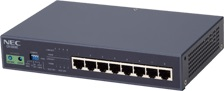
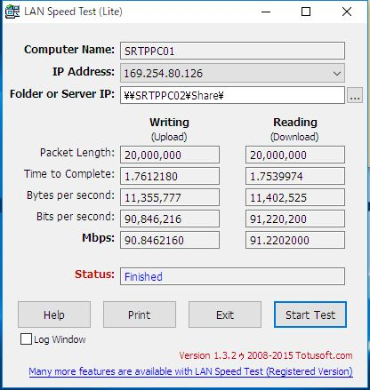
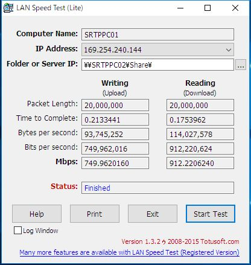

# {{this.$page.frontmatter.title}}

これまで自宅LANのHUBには、昔つかってた無線LANルータをハブモードにして使用していました。これがもう10年くらい前の代物で、なんとギガビットイーサネットに対応していない。LAN内通信のボトルネックになっていたので、ギガビット対応のHUBに買い換えました。<!--more-->

## かったもの

これ。



<http://jpn.nec.com/qxseries/qx-s600e/index.html>

NECの法人向けの8ポートハブQX-608E。中古で4500円だった。8ポートも何に使うのかって？　買ってから考えるんだよ。

## 通信速度の変化

まずはHUBを取り換える前のLinux機のNICの状況を見てみましょう。

```bash
$ ethtool enp0s31f6
Settings for enp0s31f6:
 Supported ports: [ TP ]
 Supported link modes: 10baseT/Half 10baseT/Full
 100baseT/Half 100baseT/Full
 1000baseT/Full
 Supported pause frame use: No
 Supports auto-negotiation: Yes
 Advertised link modes: 10baseT/Half 10baseT/Full
 100baseT/Half 100baseT/Full
 1000baseT/Full
 Advertised pause frame use: No
 Advertised auto-negotiation: Yes
 Speed: 100Mb/s
 Duplex: Full
 Port: Twisted Pair
 PHYAD: 1
 Transceiver: internal
 Auto-negotiation: on
 MDI-X: on (auto)
Cannot get wake-on-lan settings: Operation not permitted
 Current message level: 0x00000007 (7)
 drv probe link
 Link detected: yes
 ```

1000baseTに対応しているけどSpeedは100Mb/sしか出ないよと書いています。HUBが原因です。オートネゴシエーション機能で隣接機器の通信規格を教えてもらい、自ら通信速度を制限しています。

Lan SpeedTestというWindowsのツールを用いて、実際のファイル転送速度を見てみましょう。Windows機からLinuxのSambaサーバへ20MBのファイルを書き込む/読み込む速度を計測します。自分のIPアドレスが169から始まる無効な仮想アダプタになってるけど、こっちのアダプタでだめなら有効な方のアダプタに振り向けてくれるっぽいので気にせず使います。



Mbpsの行を見ると、書き込み/読み込み共に90Mbps程度。完全にファストイーサネット規格のHUBが邪魔をしていることがわかります。

ここでHUBを交換しました。Linux機のNICを見てみましょう。

```bash
$ ethtool enp0s31f6
Settings for enp0s31f6:
 Supported ports: [ TP ]
 Supported link modes: 10baseT/Half 10baseT/Full
 100baseT/Half 100baseT/Full
 1000baseT/Full
 Supported pause frame use: No
 Supports auto-negotiation: Yes
 Advertised link modes: 10baseT/Half 10baseT/Full
 100baseT/Half 100baseT/Full
 1000baseT/Full
 Advertised pause frame use: No
 Advertised auto-negotiation: Yes
 Speed: 1000Mb/s
 Duplex: Full
 Port: Twisted Pair
 PHYAD: 1
 Transceiver: internal
 Auto-negotiation: on
 MDI-X: on (auto)
Cannot get wake-on-lan settings: Operation not permitted
 Current message level: 0x00000007 (7)
 drv probe link
 Link detected: yes
```

Speedの行を見ると、きちんとギガビットに対応してくれています。

実際にファイル転送速度を計測してみます。



Mbpsの行を見てください。めっちゃ上がっとるやんけ。読み込み速度は10倍まで上がりました。書き込みはHDDへのアクセスがボトルネックとなっていそうですね。おたくだからこういう数字を眺めてにやにやする。おわり。
