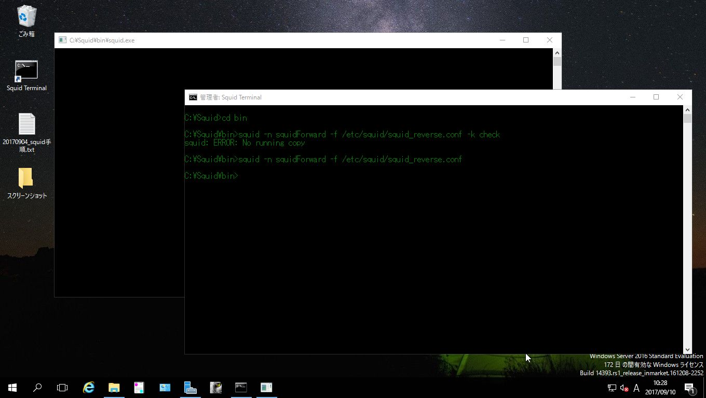

# {{this.$page.frontmatter.title}}

<Date/><ShowCategoriesOfPost/>

{{this.$page.frontmatter.description}}

<!--more-->

## Windows版Squidについて

Squidは*nix系で動作するサーバアプリですが、Windows上でも動かすことができます。[ラズパイでは前回Linux(Ubuntu MATE)でやりました][1]が、今回Windows(Windows Server 2016 評価版)でもやってみました。

## インストール

<http://squid.diladele.com/>からインストーラをおとしてインストール。

インストール時にデスクトップに配置されたSquid Server Trayはゴミ箱につっこみましょう。簡単な管理ツールなんだけど簡単すぎて柔軟に設定ができません。もう一つ配置されたSquid Terminalは、起動するディレクトリがSquidのインストールディレクトリに、文字色が白から緑に変更されたただのコマンドプロンプトなので、残してもいいですが消してもいいです。

## *nix版とWindows版のちがい

まず一つ目がディレクトリについて。デフォルトだとC:\Squid\がインストールディレクトリであり、ここにSquid関連のものが配置されています。ルートディレクトリがC:\Squid\な*nixだと思えば大丈夫です。たとえばLinuxでは/etc/squid/squid.confとして配置する設定ファイルは、WindowsではC:\Squid\etc\squid\squid.confとして配置します。

二つ目がパス区切り文字について。WIndowsのパス区切り文字はバックスラッシュであり、*nix系ではスラッシュです。コマンドプロンプトの操作はバックスラッシュ、squidコマンドの引数や各種設定ファイル内のディレクトリ記述はスラッシュにするようにしてください。

三つ目はサービス管理について。Linuxでいうserviceやsystemctlなどのデーモン管理コマンドはWindows版Squidでは当然使えません。なので、起動/終了は、C:\Squid\bin中のコマンドsquidを直接叩くことになります。自動起動設定(Linuxで言うsystemctl enable squid)について、昔はsquid -iでSquidをWindowsのサービスとして登録することもでできたみたいですが、今やるとそんなオプションないよと怒られる。サービス化ができないのでバックグラウンドでの実行ができず、そのためSquid起動中は何も表示されない真っ黒なコマンドプロンプト画面が別窓で表示され続けます。不気味だし不用意にバッテン押しちゃったらSquidも止まっちゃうし不便。このWIndowsサービス化はちょっと宿題にします。

<span style="color: #ff0000;">20171022 解決しました</span>。<https://www.serotoninpower.club/archives/278>

この3つ以外は*nix版とほとんど同じです。Linuxで使ってた設定ファイルをWindows版にコピペしても問題なく動きます。前回の記事の広告ブロック用プロキシの設定ファイル持ってきて、デスクトップのWindowsにSquid入れてローカルプロキシにするなんてこともできます。

## Squidコマンドのオプション

* nオプション：プロセス名を指定。デフォルト値：squid
* fオプション：設定ファイル名を指定。デフォルト値:/etc/squid/squid.conf
* kオプション：以下を引数にとる
  * checkで構文チェック
  * reconfigureで設定ファイル再読み込み
  * shutdownで終了

以下実行例。ちなみに*nixでも以下のコマンドオプションは同じです。ラズパイのあれはほぼ全部デフォルト値だったのでserviceモジュールでやっちゃったけど(って書いてから気付いて調べたけどAnsibleってsystemdモジュールあるんじゃん)。

```powershell
#構文チェック。プロセス起動済みなら出力なし、起動前なら以下の出力のみ出ればOK
C:\Squid\bin&gt;squid -n squidForward -f /etc/squid/squid_forward.conf -k check
squid: ERROR: No running copy

#起動
C:\Squid\bin&gt;squid -n squidForward -f /etc/squid/squid_forward.conf

#起動中に設定ファイル再読み込み
C:\Squid\bin&gt;squid -n squidForward -f /etc/squid/squid_forward.conf -k reconfigure

#終了(二回くらいコマンド叩かんと終了してくれんときある)
C:\Squid\bin&gt;squid -n squidForward -f /etc/squid/squid_forward.conf -k shutdown
```

起動が完了すると最終的にこんな画面になります。右の緑のコマンドプロンプトがSquidを操作している画面で、左後ろの真っ黒い画面がSquidプロセスが動作している窓。



## 所感

Windows版はどうも動作不安定で、ちょっとコマンド間違えるとハングするなんてことざらで軌道に乗るまでしんどかったです。なんでわざわざWindowsでやらないといけないんだろう……(察してください)。ちなみにSquidはフォワードプロキシとして有名ですが、これをリバースプロキシとして構築し、さらに別プロセスでフォワードプロキシも同時に動かすなんてこともやってみたので別記事であげます。

後回しになってるけどAnsibleについてもブログ書いて言葉に起こして知識整理したい。

 [1]: https://www.serotoninpower.club/archives/216
