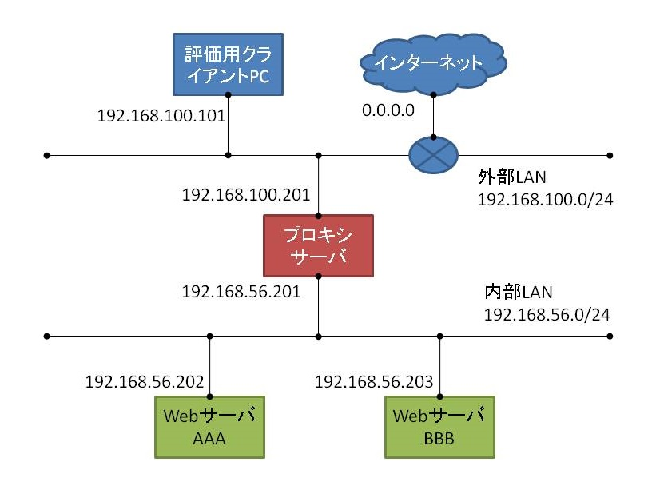
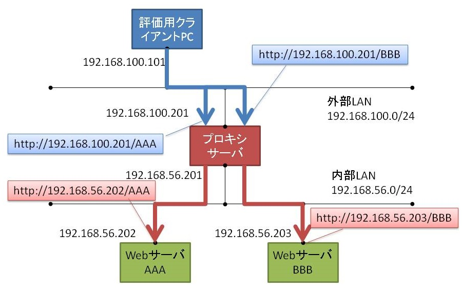
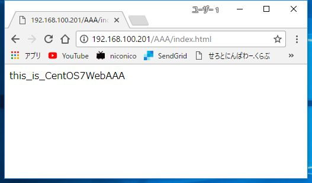
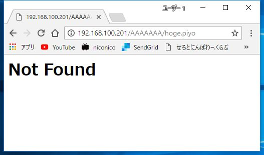

# {{this.$page.frontmatter.title}}

<Date/><ShowCategoriesOfPost/>

[前の記事][1]ではSquid単体をWindows上で起動する手順について書きました。今回は同様にSquidをWindowsで起動させ、フォワードプロキシとリバースプロキシを同時に動かす方法についてメモします。リバプロもプロセス分離もこれまたドキュメント少なくて大変でした。リバプロのコンフィグなんてほぼフルスクラッチだよ。

<!--more-->

## システム要件

* インターネットにはリバースプロキシサーバのみ公開し、LAN内に複数存在するWebサーバにはurlのパスによってアクセスを振り分けられるようにする
* LAN内のWebサーバからインターネットへの通信はフォワードプロキシサーバを経由し、定められたサイトにしかアクセスできないようにしセキュリティを高める(e.g. dropboxへのファイル持ち出しを禁止)
* リバースプロキシサーバとフォワードプロキシサーバは同一サーバを利用し、それぞれ別プロセスで稼働させ、保守運用性を高める(e.g. リバプロのみ止めてWebサーバのアップデートをフォワプロ経由インターネットより行う)
* キャッシュはしない

## システム構成図



上記を評価環境とします。お勉強のために実際にグローバルIPアドレスを払い出してもらうわけにはいかないので、評価用クライアントPCからのアクセスはインターネットからのアクセスだと仮定するものとします。プロキシサーバとWebサーバの実体は評価用クライアントPCのVirtualBox上で動いているVMです。プロキシサーバはWindows Server 2016+Squidで、WebサーバはCentOS7.3+httpdです。外部LANはVirtualBoxのブリッジアダプタで物理LANとして作成し、Windows Server 2016に仮想NICを割り当てます。内部LANはホストオンリーアダプタ+プロミスキャスモードで仮想LANとして作成し、仮想NICを3台のサーバすべてに割り当てます。

## Squidによるリバースプロキシ



このように、インターネットから直接アクセスできない内部LANに存在するWebサーバへのアクセスを、DMZに存在するリバースプロキシが代理で行えるよう構成します。振り分け方法はいろいろあるのですが、今回はホスト名orIPアドレスに続くパス(AAA、BBB)で振り分けることにします。

### Webサーバの準備(リバースプロキシ用)

Webサーバとしてhttpdを構築済みとします。配信するサンプルコンテンツをWebサーバ2台で以下のように作成。これで各Webサーバにアクセスしたとき、そのホスト名が表示されるページが作成できます。

```bash
#WebサーバAAA
echo  this_is_`hostname` | sudo tee /var/www/html/AAA/index.html

#WebサーバBBB
echo  this_is_`hostname` | sudo tee /var/www/html/BBB/index.html</pre>
```

### squid_reverse.conf

リバースプロキシの設定ファイルです。設定ファイルはリバースとフォワードで分けたいため、デフォルトのsquid.confから変更して作成します(①で後述)。

```bash
#192.168.100.201のNIC、80番ポートで待ち受ける
#accelモード(リバプロ)で稼働する
#ブラウザのキャッシュコントロールを無効にする
http_port 80 accel defaultsite=192.168.100.201 ignore-cc
#③で後述
visible_hostname squidReverse

#②で後述
pid_filename /var/run/${service_name}.pid

#外部LAN以外からのリバプロ要求は拒否する
acl localnet dmz 192.168.100.0/24
http_access deny !dmz

#WebサーバAAAへの振り分け設定。詳しくは後述
acl AAA urlpath_regex ^/AAA/ ^/AAA$
http_access allow AAA
cache_peer 192.168.56.202 parent 80 0 no-query originserver name=serverAAA
cache_peer_access serverAAA allow AAA
cache_peer_access serverAAA deny all

#WebサーバBBBへの振り分け設定
acl BBB urlpath_regex ^/BBB/ ^/BBB$
http_access allow BBB
cache_peer 192.168.56.203 parent 80 0 no-query originserver name=serverBBB
cache_peer_access serverBBB allow BBB
cache_peer_access serverBBB deny all

#振り分けられなかったものはすべてアクセス拒否
http_access deny all

#同時コネクション数の指定
max_filedescriptors 3200

#エラー画面の設定
#/usr/share/squid/createdErrPage内に独自のエラーページ作成
#Squidを隠蔽するため、全エラーを404で返す
#デフォルトだとアクセス制御で拒否されたらSquidは403を返す
#404.htmlは適当に作成し、error_directory内に格納する
error_directory /usr/share/squid/createdErrPage
deny_info 404:404.html dmz
deny_info 404:404.html all
#クライアントのIPアドレスをそのままWebサーバへ渡す
forwarded_for on

#Squidを使用していることを隠蔽するため各種htmlヘッダを削除
#Webサーバが返すServerヘッダも削除される
reply_header_access X-Squid-Error deny all
reply_header_access X-Cache deny all
reply_header_access Via deny all
reply_header_access Server deny all

#コンテンツキャッシュを行わない設定
acl nocache src all
cache deny nocache
cache_store_log none

#エラーページをキャッシュしない(保有時間を0秒に)
negative_ttl 0 seconds

#コアダンプを残すディレクトリ指定
coredump_dir /var/cache/squid
#ログをApache風に見やすく
logformat squidReverse %tl %6tr %>a %Ss/%03>Hs %<st %rm %ru %un %Sh/%<A %mt
#ログファイル名を指定
access_log stdio:/var/log/squid/accessReverse.log squidReverse

#Squidに関するエラー・デバックログを記録するファイル名を指定
#cache_logという名前だけどキャッシュとは関係ない
cache_log /var/log/squid/cacheReverse.log

#ログを13世代保有する
logfile_rotate 13
```

404.htmlは｢`<h1>Not Found</h1>`｣とだけ書いて配置しました。

### パスによる振り分け設定について

以下だけクローズアップします。

```bash
acl AAA urlpath_regex ^/AAA/ ^/AAA$
http_access allow AAA
cache_peer 192.168.56.202 parent 80 0 no-query originserver name=serverAAA
cache_peer_access serverAAA allow AAA
cache_peer_access serverAAA deny all
```

まず、urlpath_regexでaclを定義します。これはurlのホスト名以下のパスを正規表現で定義できるaclです。｢^/AAA/ ｣はパスが｢/AAA/｣で始まるものという意味で、｢^/AAA$｣はパスが｢/AAA｣に完全一致するものという意味です。この二つで指定せんと例えば｢/AAAAAA/hoge.piyo｣なんてパスでもAAAにアクセスできちゃいます。なお、acl行で複数条件を記述すると、OR条件で判断されます。

上記のaclに当てはまるアクセスはhttp_access allow AAAで許可します。

んで｢cache_peer 192.168.56.202 parent 80 0 no-query originserver name=serverAAA｣で以下の設定をします。

* 192.168.56.202：リバプロ先のIPアドレス
* parent：リバプロ先が単体の親サーバだと指定(siblingでキャッシュを共有する並列プロキシサーバ、multicastで同内容を複数サーバにリバプロ)
* 80；80番ポートに転送
* 0：ICPを無効化(キャッシュを共有するプロトコル。相手先が別のsquidでキャッシュを共有したい場合は1で有効化)
* no-query：ICPクエリ発行を無効化
* originserver：リバプロ先が別のプロキシではなくWebサーバであると指定
* name=serverAAA：リバプロとしてのacl名を定義

最後に｢cache\_peer\_access serverAAA allow AAA｣で、AAAのaclに当てはまるものはserverAAAへのリバプロを許可し、それ以外は拒否します。

んでBBBも同内容で作成。複雑……。コンフィグは終わったので起動できますが、その前にフォワードプロキシのコンフィグを作成します。

## Squidによるフォワードプロキシ


今度はフォワードプロキシ。内部LANからインターネットへは直接アクセスできないので、プロキシサーバに代理アクセスをお願いするよう構築します。その際、あらかじめホワイトリスト方式で定義されたドメインにしかアクセスできないようにします。今回はgoogle.comドメインのみ許可します。

### Webサーバの準備(フォワードプロキシ用)

Webサーバがプロキシを扱えるよう、/etc/profile.dにproxy.shを作成し スクリプトで環境変数を設定します。このディレクトリはbash起動時に読まれます。

```bash
PROXY=192.168.56.201:8080

export http_proxy="http://$PROXY"
export https_proxy="http://$PROXY"

export no_proxy="127.0.0.1,localhost"
```

以下のコマンドでbash環境を再読み込みし、環境変数がセットされたか確認。

```bash
[vagrant@CentOS7WebAAA ~]$ source /etc/profile.d/proxy.sh
[vagrant@CentOS7WebAAA ~]$ echo $http_proxy
http://192.168.56.201:8080
```

### squid_forward.conf

内部LANからのホワイトリスト記載のドメインのフォワード要求のみ許可。内部情報が洩れる内部IPアドレスやHTTPヘッダは隠します。詳しくは割愛。

```bash
http_port 8080
visible_hostname squidForward

pid_filename /var/run/${service_name}.pid

acl localnet src 192.168.56.0/24
http_access deny !localnet

acl whitelist dstdomain "/etc/squid/whitelist"
http_access allow whitelist

http_access deny all

dns_nameservers 192.168.100.1
error_directory /usr/share/squid/errors/ja-jp
logformat squid %tl %6tr %>a %Ss/%03>Hs %<st %rm %ru %un %Sh/%<A %mt
forwarded_for off

request_header_access X-Forwarded-For deny all
request_header_access Via deny all
request_header_access Cache-Control deny all

acl nocache src all
cache deny nocache
cache_store_log none

coredump_dir /var/cache/squid
access_log /var/log/squid/accessForward.log
cache_log /var/log/squid/cacheForward.log
logfile_rotate 13
```

以上でリバプロとフォワプロの設定完了。Squidを起動します。

## Squid複数プロセスを分けて同時起動する

フォワードプロキシとリバースプロキシを同時に動かしたい場合、これを一つのサーバプロセスでやると、片方こけたときに逆側の通信もできないなんてことになります。保守運用性を考え、プロセスはなるべく小さく分割します。そのためにやることは以下。

### ①設定ファイルの分離

squidの設定ファイルはsquid.confがデフォルト値です。フォワード用、リバース用に設定は分けたいので別名ファイルを作成します。今回は`squid_forward.conf`と`squid_reverse.conf`というファイル名にしました。

### ②pidファイルの分離

複数プロセスで動かそうと思ったらまずはpidを分けねばなりません。Squidはテキストファイルを作成し、そのファイルに現在起動中のSquidプロセスのpidを記載することで管理しています。このpidファイル名・配置場所をコンフィグファイルで指定することで、pidを分けます。`squid_forward.conf`と`squid_reverse.conf`に以下を記載します。

```bash
pid_filename /var/run/${service_name}.pid
```

${service_name}は変数。後述のnオプションで指定した値が入ります。

### ③異なるvisible_hostnameをつける

複数プロセスを立ち上げる場合は、squidのホスト名も分けます。キャッシュが競合したり、設定によっては通信がループすることもあるとか。

* squid_forward.conf

```bash
visible_hostname squidForward
```

* squid_reverse.conf

```bash
visible_hostname squidReverse
```

### ④起動時のnオプション

プロセスをOSに判別してもらうために、起動時にはnオプションでユニークな名前を付けます。これが先述の${service_name}に読み込まれます。

```powershell
C:\Squid\bin> squid -n squidForward -f /etc/squid/squid_forward.conf
C:\Squid\bin> squid -n squidReverse -f /etc/squid/squid_reverse.conf
```

## Squid起動

長かった。プロキシサーバにて④のコマンドを実行。真っ黒なコマンドプロンプトの画面が二つ出てきたら完了。動作確認をします。

### インターネットからのリバプロアクセス

評価用クライアントPCからプロキシサーバへアクセスします。まずプロキシサーバ自体へパスをつけずアクセス。振り分け設定に引っかからないので403を返しますが、deny_info 404:404.html allで変更しているのでこうなります。


つづいてWebサーバAAAにアクセス。きちんとhostnameが表示されています。



WebサーバBBBも同様。


変なパスをつけてもきちんと404返します。これでOK。



### インターネットへのフォワプロアクセス

WebサーバAAAからcurlコマンドでアクセスしてみます。ホワイトリストには｢.google.com｣とのみ記載してあります。

```bash
<pre>[vagrant@CentOS7WebAAA ~]$ curl -l https://google.com
<HTML><HEAD><meta http-equiv="content-type" content="text/html;charset=utf-8">
<TITLE>302 Moved</TITLE></HEAD><BODY>
<H1>302 Moved</H1>
The document has moved
<A HREF="https://www.google.co.jp/?gfe_rd=cr&dcr=0&ei=3tm0WcruKOnC8gfB3YzgDA">here</A>.
</BODY></HTML>
```

302でアクセスはできていることがわかります。

```bash
[vagrant@CentOS7WebAAA ~]$ curl -l https://yahoo.com
curl: (56) Received HTTP code 403 from proxy after CONNECT
```

ホワイトリストには記載していないyahoo.comへのアクセスはこのようにSquidで403ではじかれます。できた。

## 所感

初めて複数サーバが連動するシステムをつくりました。vagrantによる環境構築自動化でかなり労力を削減できていて気持ちがいい。

なお、Squidは他のプロキシサーバと比較してキャッシュができるのが良い点です。今回の要件ではキャッシュをしません。Squidの悪い点としてはSquidそのものはWebサーバの機能を持たないことです。特定パスにGET打って200帰ってくるかどうか見るみたいなL7レイヤのヘルスチェックができず、L4レイヤでポート監視しかできません。つまりお前それnginxでよくねってこと。おわり。

 [1]: https://www.serotoninpower.club/archives/227
