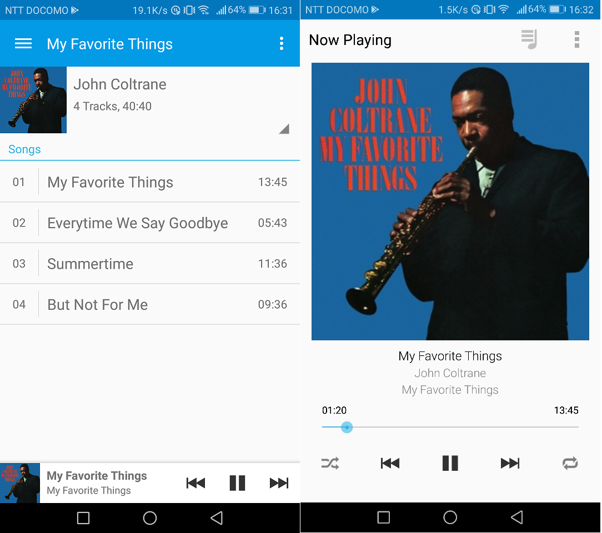

# {{this.$page.frontmatter.title}}

<Date/><ShowCategoriesOfPost/>

{{this.$page.frontmatter.description}}

<!--more-->

## つかうもの

* USB-DAC+アンプ+パッシブスピーカー

自宅に転がってるヤマハのTHR10というギターアンプで済ませました。ギターもすっかりやらなくなったな。SEやめたい。

* ファイルサーバ

すでにCentOS7に立ててあるSambaを利用。Sambaと後述のミュージックサーバアプリでSELinuxのポリシーが競合して大変でしたのでそれも書きます。

* ミュージックサーバアプリ

mpd(Music Player Daemon)を使います。デーモンアプリなのでフロントエンドでリソース喰わないのがいいよね。他にもGNOME標準のRhythmBoxなんてアプリにプラグインを追加したら同じようなことができるそうです。これはフロントエンドでリソース喰いますが。

* クライアントアプリ

AndroidのアプリMPDroidを使います。Andoroidのmpdクライアントならほぼこれ一択。iOSやWindowsにも似たようなアプリはあります。

## LinuxにUSB-DACを認識させる

ドライバを必要としない汎用DACならば、つないだだけでOSに認識されます。今回使うTHR10も汎用DACなので何もせずとも認識されていました。

```bash
[udacha@srtppc02 ~]$ sudo aplay -l
**** ハードウェアデバイス PLAYBACK のリスト ****
カード 0: PCH [HDA Intel PCH], デバイス 0: ALC887-VD Analog [ALC887-VD Analog]
 サブデバイス: 1/1
 サブデバイス #0: subdevice #0
カード 0: PCH [HDA Intel PCH], デバイス 3: HDMI 0 [HDMI 0]
 サブデバイス: 1/1
 サブデバイス #0: subdevice #0
カード 0: PCH [HDA Intel PCH], デバイス 7: HDMI 1 [HDMI 1]
 サブデバイス: 1/1
 サブデバイス #0: subdevice #0
カード 0: PCH [HDA Intel PCH], デバイス 8: HDMI 2 [HDMI 2]
 サブデバイス: 1/1
 サブデバイス #0: subdevice #0
カード 1: THR10 [THR10], デバイス 0: USB Audio [USB Audio]
 サブデバイス: 1/1
 サブデバイス #0: subdevice #0
```

一番最後のTHR10のとこがそれです。カード名｢THR10｣、デバイス番号｢0｣をメモっておきます。

## nuxリポジトリからmpdのインストール

mpdは標準のリポジトリにはありません。nuxリポジトリからダウンロードするので、それを追加。dextopってなんだdesktopじゃないのか。

```bash
[udacha@srtppc02 ~]$ sudo rpm -Uvh http://li.nux.ro/download/nux/dextop/el7/x86_64/nux-dextop-release-0-5.el7.nux.noarch.rpm
```

普段は本リポジトリを使わないこと、優先度を下げておくことを設定します。下記ファイルのすべてのセクションに｢enable=0｣と｢priority=11｣を追記します。

```bash
[udacha@srtppc02 ~]$ sudo vim /etc/yum.repos.d/nux-dextop.repo
```

そしてmpdインストール。依存関係でインストールするパッケージにEPELのものが含まれるので、EPELリポジトリを使用する旨もオプションで指定。

```bash
[udacha@srtppc02 ~]$ sudo yum install --enablerepo=nux-dextop --enablerepo=epel mpd
```

## 設定

｢`bind_to_address`｣を編集。デフォルトだと｢`"any"`｣になっており、ipv6にバインドされる可能性があるため、明示的にipv4に変更。

```bash
[udacha@srtppc02 ~]$ sudo vim /etc/mpd.conf
music_directory "/var/lib/mpd/music" #デフォルト値
playlist_directory "/var/lib/mpd/playlists" #デフォルト値
db_file "/var/lib/mpd/mpd.db" #デフォルト値
log_file "/var/log/mpd/mpd.log" #デフォルト値
state_file "/var/lib/mpd/mpdstate" #デフォルト値
user "mpd" #デフォルト値
bind_to_address "0.0.0.0" #編集
port "6600" #アンコメントで明示
```

audio_outputを編集。デフォルトでは以下のようになっていました。

```bash
audio_output {
  type "pulse"
  name "My Pulse Output"
  ## server "remote_server" # optional
  ## sink "remote_server_sink" # optional
}
```

ここをすべてコメントアウトし、下記のように追加。deviceのところは"plughw:<カード名>,<デバイス番号>"のように指定します。mixer_type &#8220;none"はmpd側で音量調節をさせない設定です。音量調節はUSB-DACに任せます。

```bash
audio_output {
  type "alsa"
  name "THR10"
  device "plughw:THR10,0"
  mixer_type "none"
}
```

misic_directoryを既存のSambaの音楽置き場のシンボリックリンクにする。

```bash
[udacha@srtppc02 ~]$ sudo ln -s /home/samba/share/01_music/ /var/lib/mppd/music/
```

mpdが使用するディレクトリを作成。

```bash
[udacha@srtppc02 ~]$ sudo mkdir /var/run/mpd
```

mpdが使用するディレクトリの所有者を変更。

```bash
[udacha@srtppc02 ~]$ sudo chown -R mpd:mpd /var/lib/mpd
[udacha@srtppc02 ~]$ sudo chown -R mpd:mpd /var/run/mpd
```

ファイアウォール穴あけ。

```bash
[udacha@srtppc02 ~]$ firewall-cmd --get-active-zone
myfirewall
 interfaces: enp0s31f6
[udacha@srtppc02 ~]$ sudo firewall-cmd --add-port=6600/tcp --zone=myfirewalll --permanent
[udacha@srtppc02 ~]$ sudo systemctl reload firewalld
```

## SELinuxの設定

ついつい無効化しがちなSELinuxですが、勉強のためEnforcingで自宅サーバを運用しています。今回はそれに結構詰まりました。

SELinuxは、ユーザやリソースをユーザ、ロール、タイプの3つの識別子で識別します。ユーザのタイプは特にドメインと呼びます。このユーザのドメインとリソースのタイプの対応関係ごとに、｢何を｣｢どうするか｣の許可をホワイトリスト形式で記述していきます。｢何を｣はクラスにあたり、リソースを細分化したものです。ファイル、ディレクトリ、プロセス、ソケットなど。｢どうするか｣は読み、書き、検索、実行、メモリへのマッピングなどの挙動です。

前提として、既存のSambaが利用するディレクトリには/home以下のディレクトリである/home/samba/shareを割り当てており、そこに｢`public_content_rw_t`｣というタイプを割り当てていました。mpdのドメインは`mpd_t`ですが、このドメインが`public_content_rw_t`を読み書きできるようにする適切なデフォルトのポリシーがない。

/var/log/audit/audit.logを見る感じ、その他にもいくつかSELinuxのエラーが出るようです。audit2allowなんていうログからポリシーを自動生成してくれるツールもあるのですが、自動生成なのでガバガバになりがちであること、せっかくなので勉強したいことの二つの理由から、ポリシーを自作することにします。

適当なディレクトリでmympd.teというファイルを作成して編集。

```bash
[udacha@srtppc02 ~]$ vim mympd.te
module mympd 1.0;
require {
 type mpd_t;
 type public_content_rw_t;
 type mpd_var_lib_t;
 type mpd_tmp_t;
 type config_home_t;
 class dir { getattr read search open };
 class file { getattr read search open execute };
 class process { execmem };
}
allow mpd_t public_content_rw_t:dir { getattr read search open };
allow mpd_t public_content_rw_t:file { getattr read search open};
allow mpd_t mpd_var_lib_t:file { execute };
allow mpd_t config_home_t:dir { getattr read search open };
allow mpd_t mpd_tmp_t:file { execute };
allow mpd_t mpd_t:process { execmem };
```

一行目には自作したポリシーの名前とバージョンを記述します。既存のポリシー名と被らないよう注意(警告が出ます)。requireディレクティブの中ではアクセス制御に利用するドメインやタイプ、クラスを列挙し、クラスの中に挙動を記述していきます。ドメインやタイプはログにベタ書きなのでわかりやすいですが、クラスはtclassのところに、挙動はdeniedの直後に書いてあります。定義が終わったら、allowに続いて許可したいドメイン、タイプ、クラス、挙動の組み合わせを列挙していきます。

作成したらコンパイル。mympdを置いてあるディレクトリで実行します。コンパイルにはselinux-policy-develというツールがいるので、インストールしていない場合は事前にインストールしておく。

```bash
[udacha@srtppc02 ~]$ sudo make -f /usr/share/selinux/devel/Makefile
```

成功したらインストール。

```bash
[udacha@srtppc02 ~]$ sudo semodule -i mympd.pp
```

んで/var/log/audit/audit.logを見ながら動作を確認。動作の確認にはクライアントアプリであるMPDroidを利用します。ダメだった場合下記のコマンドでモジュールをアンインストールして、再びmympd.teを編集してコンパイルしてインストール。この繰り返しで少しずつエラーを減らしていきます。

```bash
[udacha@srtppc02 ~]$ sudo semodule -r mympd
```

エラーが消えたらOK。満を持して起動&自動起動設定。

```bash
[udacha@srtppc02 ~]$ sudo systemctl start mpd
[udacha@srtppc02 ~]$ sudo systemctl enable mpd
```

以上。スマホがリモコンのネットワークミュージックサーバが完成しました。MPDroidの操作画面はこんな感じ。スマホをWi-FiにつなぎCentOS7と同じネットワークに所属させ、MPDroidにCentOS7のIPとポートを入力することで、スマホがリモコンになります。MPDroidで再生を押すと、CentOS7に直結されたTHR10から音楽が流れます。かなり満足。



## 所感

ちょうどLPIC 303 Securityを受けようとしていたところだったので、SELinuxのいい勉強になりました。自宅の音楽環境も整ったことだし満足。三連休中も仕事でしたがいい息抜きになりました。明日は仕事辞めます。

## 参考

* [mpcbridge サウンドデバイスの認識][1]
* [ももいろテクノロジー mpd (Music Player Daemon) で自宅サーバをジュークボックスにする][2]
* [CentOS forums Where to find mpd?][3]
* [わんこいん SELinuxのポリシー・モジュールを自作する][4]

 [1]: https://mpcbridge.fourthgate.jp/sounddevice.html
 [2]: http://inaz2.hatenablog.com/entry/2013/07/10/180408
 [3]: https://centos.org/forums/viewtopic.php?f=13&t=59737
 [4]: http://wankomagic.hatenablog.com/entry/2013/05/02/012203
