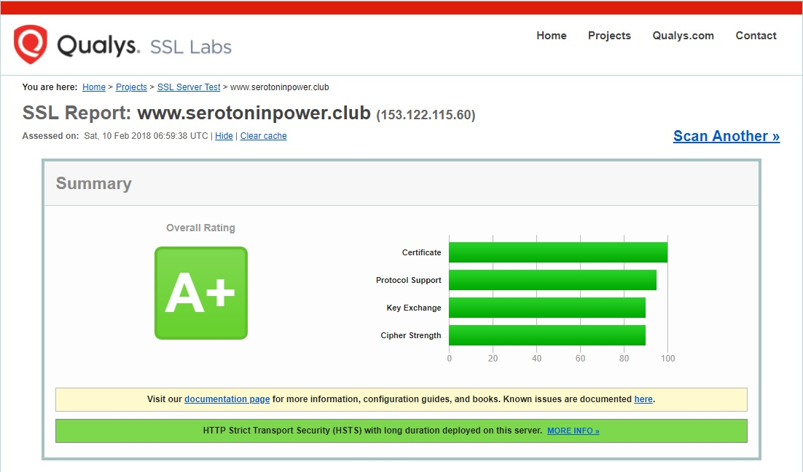
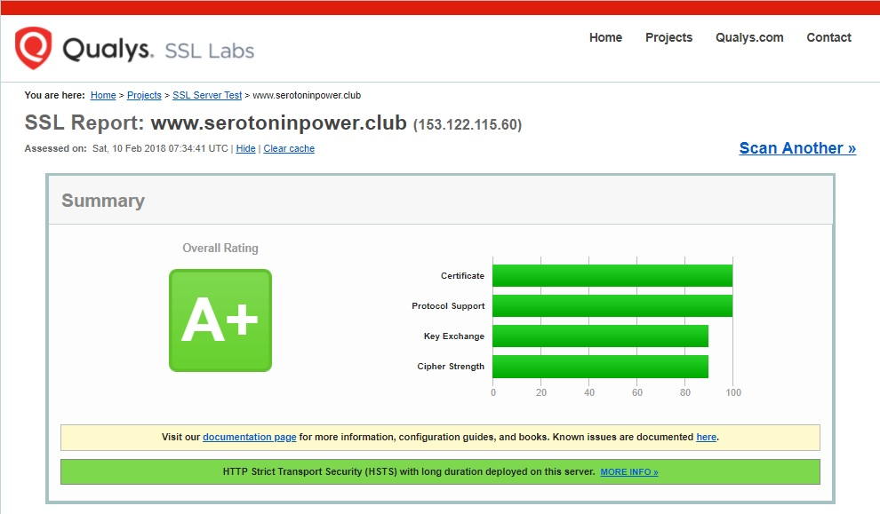
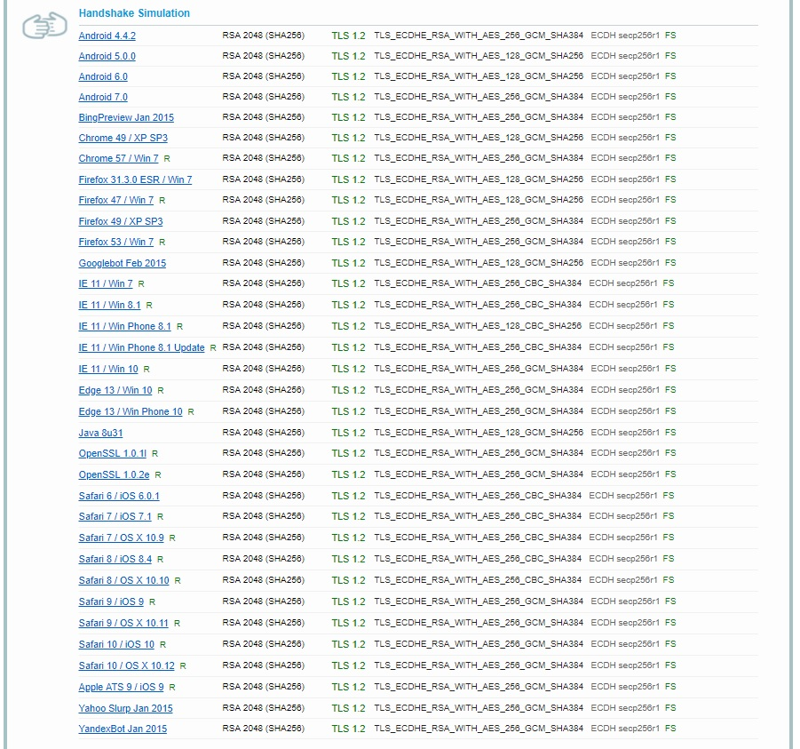

# {{this.$page.frontmatter.title}}

<https://www.ssllabs.com/ssltest/>というWebサーバのSSL/TLS強度をテストしてくれるサイトがあります。このブログサーバ構築時に、ネットの記事のコンフィグコピペでA+をとれるようにしたっきり放置していて、いろいろ設定も変えたし時間も流れた現在、再度ここで最高ランクA+を取れるようにしようというのが今回の記事の趣旨。

<!--more-->

## 要件

```bash
# httpd -v
Server version: Apache/2.4.6 (CentOS)
Server built: Oct 19 2017 20:39:16
# openssl version
OpenSSL 1.0.2k-fips 26 Jan 2017
```

## 現在のランク

<https://www.ssllabs.com/ssltest/>に自分のWebサーバのFQDNを入力します。｢Do not show the results on the boards｣にチェックを入れておくと、｢最近スキャンされたサーバ｣ランキングに表示されなくなります。

んで結果はこう。


あれ？構築時にA+とれるようにしといたのにB？

## `This server’s certificate chain is incomplete. Grade capped to B.`について

なんかオレンジ色のバーで`This server’s certificate chain is incomplete. Grade capped to B.`って言われてます。証明書チェーンが不完全？　そういえば証明書関連のパラメータいじったような……って思ってhttpdのコンフィグ見てみます。

```bash
SSLCertificateFile /etc/letsencrypt/live/www.serotoninpower.club/fullchain.pem
#SSLCertificateChainFile /etc/letsencrypt/live/www.serotoninpower.club/fullchain.pem
```

`SSLCertificateFile` はサーバ証明書のパスを、`SSLCertificateChainFile`は中間証明書のパスを記述するディレクティブです。`fullchain`は`chain`と違い、サーバ証明書と中間証明書が一体になったファイルなので、これを`SSLCertificateFile` に記述してもいいです。ここはOK。ですが、`SSLCertificateChainFile`は、公式ドキュメントにこんなことが書いてあったので、大昔にテストしてA+を取ったあとにコメントアウトした記憶があります。

```bash
SSLCertificateChainFile is deprecated

SSLCertificateChainFile became obsolete with version 2.4.8, when SSLCertificateFile was extended to also load intermediate CA certificates from the server certificate file.
```

出典：<http://httpd.apache.org/docs/current/mod/mod_ssl.html#sslcertificatechainfile>

よく読むと2.4.8からじゃん。このサーバ2.4.6じゃん。というわけでアンコメント。

```bash
SSLCertificateFile /etc/letsencrypt/live/www.serotoninpower.club/fullchain.pem
SSLCertificateChainFile /etc/letsencrypt/live/www.serotoninpower.club/fullchain.pem
```

んでもっかいテスト。



ああA+にもどった。よかった。

## プロトコルや暗号スイートの設定

A+には戻りましたが、Protocol SupportやKey Exchange、Cipher Strengthがへこんでいます。ここらへんは昔にネットの記事のコピペで設定したものなので、今の知識をもって自分で設定を変更してみます。

テストの詳細結果はこんな感じ。かなりの数でWEAKと表示されています。


WEAKはもちろんWEAKと表示されていないものについて何がいけないのか、私が読み取ったのは以下の通り。

  1. RSA鍵交換を使っている
  2. TLS1.0が使われている
  3. SHA1(画面表示上ではSHA)が使われている
  4. CBCモードのブロック暗号が使われている

上から3つは無効にしてしまいましょう。SHA1を無効化すると、TLS1.1も使えなくなるためTLS1.1も無効化。CBCは無効化するとWindows7から見れなくなる(=GCMに対応していない)ため、そのままにしておきます。

まずは現状の設定値。コピペだから意味わからず書いていて書く順番がぐちゃぐちゃ。

```bash
SSLProtocol all -SSLv2 -SSLv3 +TLSv1.2
SSLCipherSuite DEFAULT:!EXP:!SSLv2:!DES:!IDEA:!SEED:!3DES:!RC4:!DH
```

これをこうする。

```bash
SSLProtocol +TLSv1.2
SSLCipherSuite DEFAULT:!kRSA:!kDHr:!kDHd:!aNULL:!eNULL:!EXP:!DES:!3DES:!RC4:!RC2:!IDEA:!MD5:!SHA1
```

SSLCipherSuiteのDEFAULT値から、使わないものを!で無効化していきます。それぞれの値の意味は[Apache公式ドキュメントのmod_sslのSSLCipherSuiteディレクティブ][1]を参照。なお、DEFAULT値はopensslのバージョンに依存します。確認方法は#openssl ciphers DEFAULTで。見やすいようsedで整形。

```bash
# openssl ciphers DEFAULT | sed -e "s/:/\n/g"
ECDHE-RSA-AES256-GCM-SHA384
ECDHE-ECDSA-AES256-GCM-SHA384
ECDHE-RSA-AES256-SHA384
ECDHE-ECDSA-AES256-SHA384
ECDHE-RSA-AES256-SHA
ECDHE-ECDSA-AES256-SHA
DH-DSS-AES256-GCM-SHA384
DHE-DSS-AES256-GCM-SHA384
DH-RSA-AES256-GCM-SHA384
DHE-RSA-AES256-GCM-SHA384
DHE-RSA-AES256-SHA256
DHE-DSS-AES256-SHA256
DH-RSA-AES256-SHA256
DH-DSS-AES256-SHA256
DHE-RSA-AES256-SHA
DHE-DSS-AES256-SHA
DH-RSA-AES256-SHA
DH-DSS-AES256-SHA
DHE-RSA-CAMELLIA256-SHA
DHE-DSS-CAMELLIA256-SHA
DH-RSA-CAMELLIA256-SHA
DH-DSS-CAMELLIA256-SHA
ECDH-RSA-AES256-GCM-SHA384
ECDH-ECDSA-AES256-GCM-SHA384
ECDH-RSA-AES256-SHA384
ECDH-ECDSA-AES256-SHA384
ECDH-RSA-AES256-SHA
ECDH-ECDSA-AES256-SHA
AES256-GCM-SHA384
AES256-SHA256
AES256-SHA
CAMELLIA256-SHA
PSK-AES256-CBC-SHA
ECDHE-RSA-AES128-GCM-SHA256
ECDHE-ECDSA-AES128-GCM-SHA256
ECDHE-RSA-AES128-SHA256
ECDHE-ECDSA-AES128-SHA256
ECDHE-RSA-AES128-SHA
ECDHE-ECDSA-AES128-SHA
DH-DSS-AES128-GCM-SHA256
DHE-DSS-AES128-GCM-SHA256
DH-RSA-AES128-GCM-SHA256
DHE-RSA-AES128-GCM-SHA256
DHE-RSA-AES128-SHA256
DHE-DSS-AES128-SHA256
DH-RSA-AES128-SHA256
DH-DSS-AES128-SHA256
DHE-RSA-AES128-SHA
DHE-DSS-AES128-SHA
DH-RSA-AES128-SHA
DH-DSS-AES128-SHA
DHE-RSA-SEED-SHA
DHE-DSS-SEED-SHA
DH-RSA-SEED-SHA
DH-DSS-SEED-SHA
DHE-RSA-CAMELLIA128-SHA
DHE-DSS-CAMELLIA128-SHA
DH-RSA-CAMELLIA128-SHA
DH-DSS-CAMELLIA128-SHA
ECDH-RSA-AES128-GCM-SHA256
ECDH-ECDSA-AES128-GCM-SHA256
ECDH-RSA-AES128-SHA256
ECDH-ECDSA-AES128-SHA256
ECDH-RSA-AES128-SHA
ECDH-ECDSA-AES128-SHA
AES128-GCM-SHA256
AES128-SHA256
AES128-SHA
SEED-SHA
CAMELLIA128-SHA
PSK-AES128-CBC-SHA
ECDHE-RSA-DES-CBC3-SHA
ECDHE-ECDSA-DES-CBC3-SHA
EDH-RSA-DES-CBC3-SHA
EDH-DSS-DES-CBC3-SHA
DH-RSA-DES-CBC3-SHA
DH-DSS-DES-CBC3-SHA
ECDH-RSA-DES-CBC3-SHA
ECDH-ECDSA-DES-CBC3-SHA
DES-CBC3-SHA
IDEA-CBC-SHA
PSK-3DES-EDE-CBC-SHA
KRB5-IDEA-CBC-SHA
KRB5-DES-CBC3-SHA
KRB5-IDEA-CBC-MD5
KRB5-DES-CBC3-MD5
ECDHE-RSA-RC4-SHA
ECDHE-ECDSA-RC4-SHA
ECDH-RSA-RC4-SHA
ECDH-ECDSA-RC4-SHA
RC4-SHA
RC4-MD5
PSK-RC4-SHA
KRB5-RC4-SHA
KRB5-RC4-MD5
```

上記のDEFAULT値から使わないものを除いていくとこうなる。

```bash
# openssl ciphers DEFAULT:-kRSA:-kDHr:-kDHd:-aNULL:-eNULL:-EXP:-DES:-3DES:-RC4:-RC2:-IDEA:-MD5:-SHA1 | sed -e "s/:/\n/g"
ECDHE-RSA-AES256-GCM-SHA384
ECDHE-ECDSA-AES256-GCM-SHA384
ECDHE-RSA-AES256-SHA384
ECDHE-ECDSA-AES256-SHA384
DHE-DSS-AES256-GCM-SHA384
DHE-RSA-AES256-GCM-SHA384
DHE-RSA-AES256-SHA256
DHE-DSS-AES256-SHA256
ECDH-RSA-AES256-GCM-SHA384
ECDH-ECDSA-AES256-GCM-SHA384
ECDH-RSA-AES256-SHA384
ECDH-ECDSA-AES256-SHA384
ECDHE-RSA-AES128-GCM-SHA256
ECDHE-ECDSA-AES128-GCM-SHA256
ECDHE-RSA-AES128-SHA256
ECDHE-ECDSA-AES128-SHA256
DHE-DSS-AES128-GCM-SHA256
DHE-RSA-AES128-GCM-SHA256
DHE-RSA-AES128-SHA256
DHE-DSS-AES128-SHA256
ECDH-RSA-AES128-GCM-SHA256
ECDH-ECDSA-AES128-GCM-SHA256
ECDH-RSA-AES128-SHA256
ECDH-ECDSA-AES128-SHA256
```

んでテストしなおし。



Protocol Supportが満点になりました。これはTLS1.2のみにしたから。詳細結果はこちら。WEAKが消えたぜ。


各OS/ブラウザの互換性も最低限保っています。これ以上やると古いOSやブラウザから見れなくなる。たとえば前述の通りCBCを無効化するとWindows7からまったく見れなくなりますし、128bitのAESを無効化するとAndroid6.0から見れなくなります。ちなみに今回した設定では、インターネットエクスプローラ10以前からは見れなくなりますが、IEならみんな最新版使っているだろうからまぁいいかと。



## 所感

わかった上でやれると何事も楽しい。

 [1]: http://httpd.apache.org/docs/current/mod/mod_ssl.html#sslciphersuite
