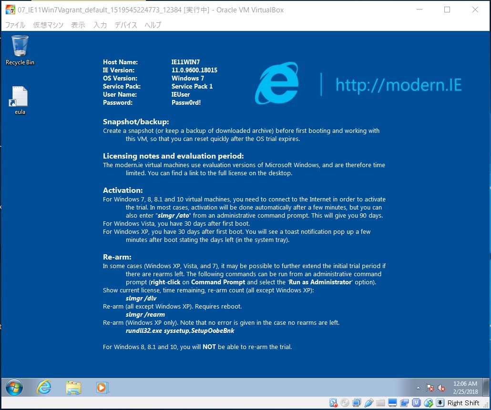

# {{this.$page.frontmatter.title}}

Vagrant Cloudには[MS公式のWindows10のVagrant Box][1]があります。でもWindows7はないっぽい。と思ったらMS公式のサイトにあった。それを使ってWindows7の仮想マシンをVagrantで構築する手順のメモ。Vagrantfileがちょっとめんどくさい。

<!--more-->

## Windows7のvagrant boxの入手

ここ。Vagrant CloudではなくMS公式のサイトからzipで配信されています。

<https://developer.microsoft.com/en-us/microsoft-edge/tools/vms/>


Virtual MachineでWindowsのエディションを選択します。選択できるのは以下のとおり。ちなみにIE11 on Win7はEnterprise版でした。

* IE8 on Win7 (x86)
* IE9 on Win7 (x86)
* IE10 on Win7 (x86)
* IE11 on Win7 (x86)
* IE11 on Win81 (x86)
* MSEdge on Win10 (x64) Stable (16.16299)
* MSEdge on Win10 (x64) Preview (17.17074)

エディションを見てもわかる通り、MSはOSの検証目的というよりブラウザの互換性の検証目的でこれらの仮想マシンを配布しているようです。私は前者の目的で使います。IE11 on Win7 (x86)を選択し、その下のSelect PlatformでVagrantを選択。そしてzipファイルでboxをダウンロード。

## boxのインポートとinit

ダウンロードしたzipを解凍すると、`IE11 – Win7.box`というファイルがでてきます。これをWin7Vagrant作業用フォルダにコピー。コピーしたら、同じディレクトリ上でPowershellを開き、以下のコマンドを入力して、vagrantのローカルライブラリにboxを追加します。

```powershell
PS > vagrant box add Win7IE11 "IE11 - Win7.box"
```

Win7IE11というのは任意の識別名。あとでVagrantfileに記載するので適当に決めておきます。`IE11 – Win7.box`は先ほど解凍してでてきたboxファイル。作業ディレクトリと同じディレクトリに存在するならファイル名だけを、違うディレクトリならそのパスも含めて入力します。

次に以下のコマンド。vagrantが利用するディレクトリやVagrantfileを初期化します。

```powershell
PS > vagrant init
```

## VagrantでWindowsを動かす際特有のVagrantfile設定

initで出てきたVagrantfileを書き換え。config.vm.boxにはbox addの際に指定した｢任意の識別名｣を記載します。

```ruby
Vagrant.configure("2") do |config|

config.vm.provider "virtualbox" do |vb|
 vb.gui = true
 vb.memory = "2048"
 end

 config.vm.box = "Win7IE11"
 config.vm.guest = "windows"
 config.ssh.username = "IEUser"
 config.ssh.password = "Passw0rd!"
 config.ssh.insert_key = false
 config.ssh.shell = 'sh -l'
 config.ssh.sudo_command = ''

 config.vm.synced_folder ".", "/vagrant", disabled: true

end
```

* config.vm.guest：デフォルト値は｢linux｣。ゲストOSの種類をWindowsだよとVagrantに教えてあげないと、マウント設定やNW設定がうまくいかない。
* config.ssh.username/password：デフォルト値は｢varant/vagrant｣。このboxはIEUser/Passw0rd!なので変更。Windowsではあるが、このVagrant boxに一応sshdは立っている。でもややこしいことに、Windows版sshdにOSレベルの設定は不可能なので、Vagrantの設定には使えない。じゃあなんで設定するかというと単純にブート中にssh接続テストをする際にユーザIDとパスワードが違うよと言ってこけるから。めんどくさい。
* config.ssh.insert_key：デフォルト値は｢true｣。Windows版sshでは鍵の扱いがUnix系のopensshと異なるようで、ゲストにssh鍵を配置しないという意味のfalseに設定しないとこける。めんどくさい。
* config.ssh.shell：デフォルト値は｢bash -l｣。IEuserのsshログインシェルはshに設定されているようなので変更。めんどくさい。
* config.ssh.sudo_command：デフォルト値は｢sudo -E -H %c｣。%cはコマンドの意味。Windowsにはsudoの概念がないので空白にしておく。

## 起動

以下のコマンドで起動。

```powershell
PS > vagrant up
```



起動完了。リモデ有効にしたり言語を英語から日本語にしたりするのはお好みで。ちなみに初回起動時はありえん量のWindowsUpdateが降ってきて若干めんどくさい。試してないですが、同じ手順でWindows8.1なんかもいけると思う。

## 欠点

実はこのbox、WinrmもRDPもデフォルトでFWにてポートが閉じられている。つまりNW設定とかなんやらをVagrantで行えず、一度VirtualBoxコンソールに入って操作しないといけない。めんどくさい。初期セットアップを自動化できただけでもよしとするか……

## 所感

VirtualBoxを使う以上やっぱり遅さが気になる。ESXiとかにシフトしていきたいけどマシン組むのにメモリが高すぎて今は時期が悪い。

 [1]: https://app.vagrantup.com/Microsoft/boxes/EdgeOnWindows10
