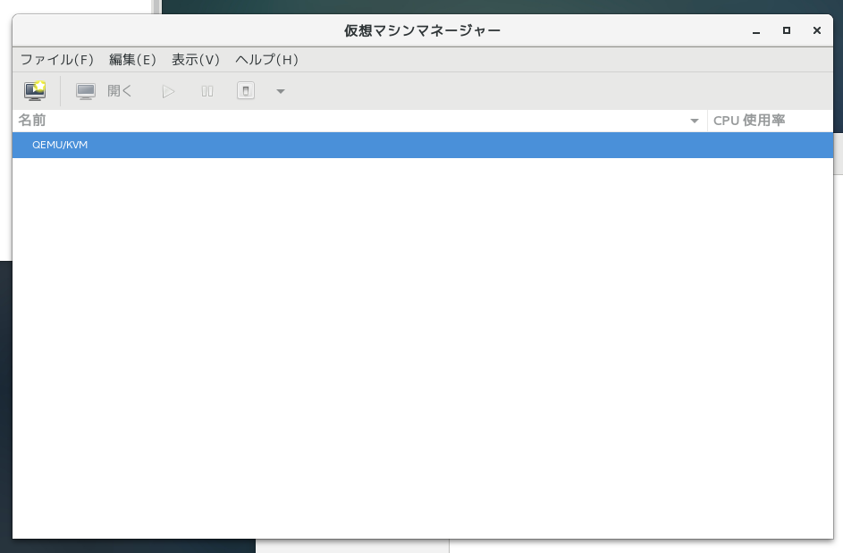
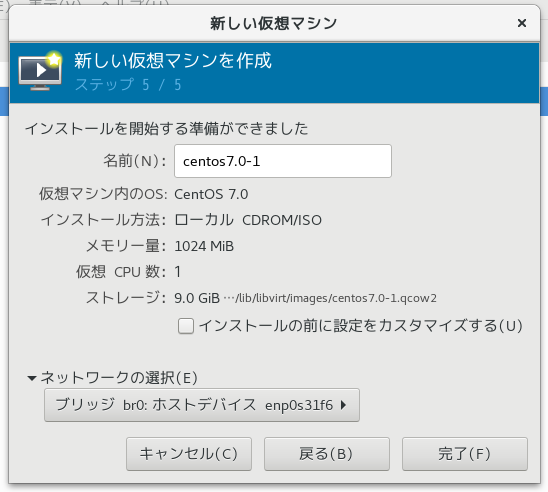
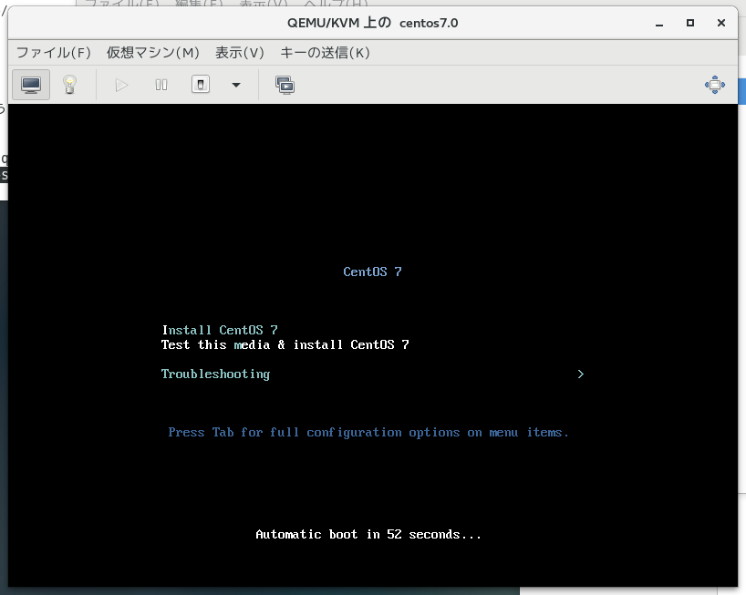
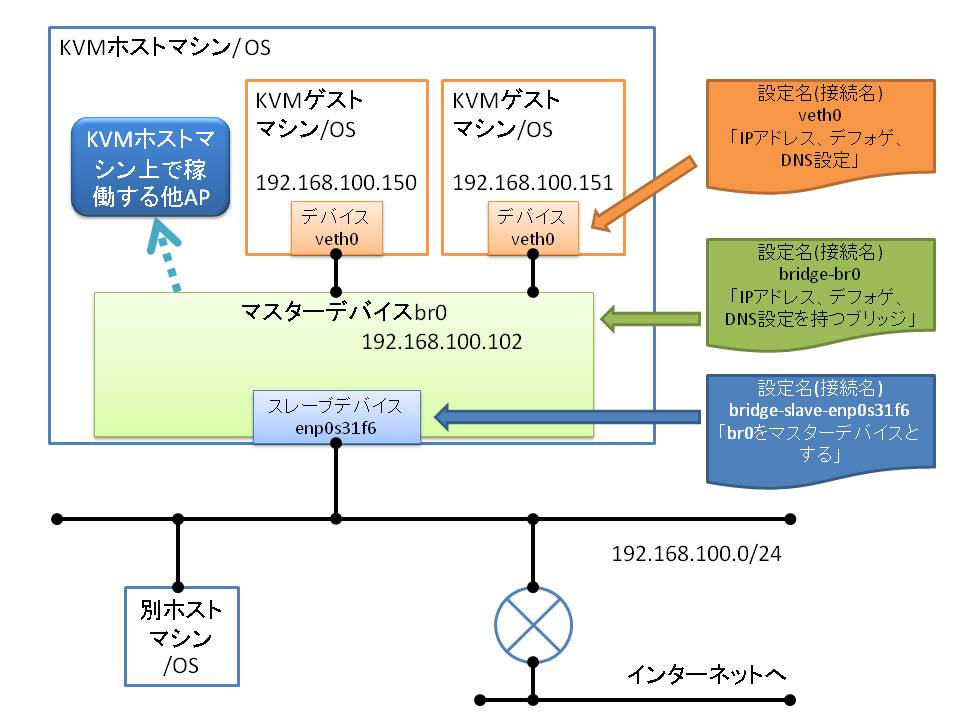

# {{this.$page.frontmatter.title}}

{{this.$page.frontmatter.description}}

<!--more-->

## 前提

```bash
[udacha@srtppc02 ~]$ cat /etc/redhat-release
CentOS Linux release 7.4.1708 (Core)
[udacha@srtppc02 ~]$ uname -a
Linux srtppc02 3.10.0-514.26.1.el7.x86_64 #1 SMP Thu Jun 29 16:05:25 UTC 2017 x86_64 x86_64 x86_64 GNU/Linux
[udacha@srtppc02 ~]$ cat /proc/cpuinfo | grep "model name"
model name : Intel(R) Core(TM) i3-7100 CPU @ 3.90GHz
model name : Intel(R) Core(TM) i3-7100 CPU @ 3.90GHz
model name : Intel(R) Core(TM) i3-7100 CPU @ 3.90GHz
model name : Intel(R) Core(TM) i3-7100 CPU @ 3.90GHz
[udacha@srtppc02 ~]$ cat /proc/meminfo | grep MemTotal
MemTotal: 7707560 kB
```

CPUは仮想化支援機構に対応していることが前提です。最近のintel CPUなら大丈夫。以下のコマンドでCPUに仮想化支援機能があるか確認。出力があればOKです。出力内容は省きますが、スレッドごとに対応/非対応が表示され、i3-7100を使っているので、4行表示されていました。

```bash
[udacha@srtppc02 ~]$ cat /proc/cpuinfo | grep vmx
```

AMDのCPUなら以下のコマンドで確認。

```bash
cat /proc/cpuinfo | grep svm
```

なお、CPUに仮想化支援機能が存在していても、BIOS/UEFIで無効にされていると使用できないので注意。

## インストール&起動

KVMは`Kernel-based Virtual Machine`であり、Linuxカーネルにデフォルトでその機能が組み込まれていますが、その管理回りだとかAPI周りだとかは新規にインストールする必要があります。ディストリによってはこれらがすでに入っていることも。

```bash
[udacha@srtppc02 ~]$ sudo yum install qemu-kvm libvirt virt-install virt-manager bridge-utils
```

* qemu-kvm:ハードウェアエミュレータ。KVMにはハイパーバイザとしての機能しかないたのでエミュレーションソフトが必要。メモリやディスクI/Oをエミュレートします。CPUエミュレートはCPUの仮想化支援機能で。
* libvirt：仮想化ソフト管理用の共通API。KVMのみならずXenやLXC、ESXiなどいろんなものを管理できます。LinuxのネットワークにおけるNetworkManagerのようなもの。
* virt-install：インストールメディア等から新しい仮想マシンを作成するためのツール。libvirtプロジェクトで作成されているものの一つです。libvirt同様にいろいろな仮想化基盤に対応しています。
* virt-manager：仮想マシンを管理するlibvirtプロジェクトのGUIインタフェース。極力コマンドでやりたいのであまり使いません。仮想マシンのGUIインストール時に使用するコンソールとしてのみ利用します。そうでなければVNCクライアントを操作端末に入れて仮想マシンに接続してGUIインストール作業をする方法もあります。
* bridge-utils：仮想ブリッジのユーティリティ。ただし、仮想ブリッジの作成はNetworkManagerからやります。ありがちですけど、NetworkManagerが入っている環境ではネットワーク関連は全てこれからやらないとこける(私はこけた)。今回は仮想ブリッジの接続確認の表示のために使います。

インストール後、KVMのカーネルモジュールが有効か念のため確認。OSインストール後に意図的に無効にしているとかでなければ有効なはず。kvm、kvm\_intel（またはkvm\_amd）が存在していることを確認。

```bash
[udacha@srtppc02 ~]$ lsmod | grep kvm
kvm_intel 170181 0
kvm       554609 1 kvm_intel
irqbypass 13503  1 kvm
```

そして起動。

```bash
[udacha@srtppc02 ~]$ sudo systemctl start libvirtd
[udacha@srtppc02 ~]$ sudo systemctl enable libvirtd
```

## ブリッジネットワーク作成

VirtualBoxもそうでしたが、KVMはデフォルトではNATを利用して仮想マシンが外界と疎通できるようになっています。外界から仮想マシンにアクセスするためにはポートごとにDNATを設定する必要がありますが、仮想マシンを普通にサーバとして使うにはいちいち変換テーブルを定義なぞしていられません。なのでブリッジネットワークを作成します。手順自体はさらっとしていますが、概念を理解するのにてこずったので後のほうでまとめておきます。

### 仮想ブリッジの作成

NetworkManagerから。これがインストールされている環境ではこれ以外でネットワークをさわるべきではない。

```bash
[udacha@srtppc02 ~]$ nmcli con add type bridge ifname br0
```

### 仮想ブリッジのSTP無効化、IPなど設定

ブリッジを作成するとデフォルトでスパツリが有効になっています。単独のブリッジとして動かすのでスパツリは不要。余計なパケット垂れ流しますし無効化しておきます。

```bash
[udacha@srtppc02 ~]$ nmcli con mod bridge-br0 bridge.stp no
```

作成した仮想ブリッジに、｢物理ホストで使用していた値と同じ値の｣固定IPアドレス、デフォゲ、DNS設定を行う。ここがはてなポイントその1だった。

```bash
[udacha@srtppc02 ~]$ nmcli con mod bridge-br0 ipv4.method manual ipv4.address "192.168.100.102/24" ipv4.gateway "192.168.100.1" ipv4.dns 192.168.100.1
```

### 仮想ブリッジに物理NICを接続

作成した仮想ブリッジに物理NICを接続します。接続後、｢もともとあった物理NICの設定は不要になる｣ため削除します。ここがはてなポイントその2。削除の際は通信が途切れるので、ネットワーク越しに構築を行っているなら同時にリブートをかけるようにしておく。直前にsudo打っておくなど、なんらかの方法でsudoのパスワードは聞かれないようにしておいてください。

```bash
[udacha@srtppc02 ~]$ nmcli con add type bridge-slave ifname enp0s31f6 master bridge-br0
[udacha@srtppc02 ~]$ nmcli con del enp0s31f6 && sudo reboot
```

## 仮想ブリッジの設定確認

仮想ブリッジbr0が作成されたことを確認。物理NIC(例ではenp0s31f6)の接続名が`bridge-slave-*`になっていてブリッジに接続されていることを確認。nmcliではどのブリッジに接続されているかはわかりません。

```bash
[udacha@srtppc02 ~]$ nmcli dev
DEVICE     TYPE     STATE     CONNECTION
br0        bridge   connected bridge-br0
virbr0     bridge   connected virbr0
enp0s31f6  ethernet connected bridge-slave-enp0s31f6
lo         loopback unmanaged --
virbr0-nic tun      unmanaged --
```

物理NICがbr0に接続されていることを確認。

```bash
[udacha@srtppc02 ~]$ brctl show
bridge name bridge id         STP enabled interfaces
br0         8000.7085c23f5a84 no          enp0s31f6
virbr0      8000.5254001f3189 yes         virbr0-nic
```

ipがbr0に割り当てられていることを確認。

```bash
[udacha@srtppc02 ~]$ ip a
1: lo: <LOOPBACK,UP,LOWER_UP> mtu 65536 qdisc noqueue state UNKNOWN qlen 1
 link/loopback 00:00:00:00:00:00 brd 00:00:00:00:00:00
 inet 127.0.0.1/8 scope host lo
 valid_lft forever preferred_lft forever
 inet6 ::1/128 scope host
 valid_lft forever preferred_lft forever
2: enp0s31f6: <BROADCAST,MULTICAST,UP,LOWER_UP> mtu 1500 qdisc pfifo_fast master br0 state UP qlen 1000
 link/ether 70:85:c2:3f:5a:84 brd ff:ff:ff:ff:ff:ff
3: br0: <BROADCAST,MULTICAST,UP,LOWER_UP> mtu 1500 qdisc noqueue state UP qlen 1000
 link/ether 70:85:c2:3f:5a:84 brd ff:ff:ff:ff:ff:ff
 inet 192.168.100.102/24 brd 192.168.100.255 scope global br0
 valid_lft forever preferred_lft forever
 inet6 fe80::3a22:b686:36f3:c9ed/64 scope link
 valid_lft forever preferred_lft forever
4: virbr0: <NO-CARRIER,BROADCAST,MULTICAST,UP> mtu 1500 qdisc noqueue state DOWN qlen 1000
 link/ether 52:54:00:1f:31:89 brd ff:ff:ff:ff:ff:ff
 inet 192.168.122.1/24 brd 192.168.122.255 scope global virbr0
 valid_lft forever preferred_lft forever
5: virbr0-nic: <BROADCAST,MULTICAST> mtu 1500 qdisc pfifo_fast master virbr0 state DOWN qlen 1000
 link/ether 52:54:00:1f:31:89 brd ff:ff:ff:ff:ff:ff
 ```

以上でブリッジネットワーク作成完了。

## お試しで仮想マシン作成

とりあえずvirt-managerを使ってポチポチ仮想マシンを構築してみます。ゆくゆくは自動化&コード化したいところ。これもVagrantを使うのがいいのかな。スナップショット取っておいて複製後にAnsibleで自動展開するのがいいのかな。

まずはホストマシンにGUIログインし、以下のコマンドで｢仮想マシンマネージャー｣を起動。sudoつけない場合、起動はしますがあらゆる操作が怒られます。ユーザをグループに追加してもいいです。

```bash
[udacha@srtppc02 ~]$ sudo virt-manager
```

このようにQEMU/KVMで仮想化基盤が稼働していることを確認します。virt-managerはlibvirtプロジェクトなので、他の仮想基盤が本ホストで稼働している場合、それもこの画面に表示されるはず。



｢ファイル｣→｢新しい仮想マシン｣をクリック。今回はローカルのインストールメディアを利用して仮想マシンをインストールします。isoはどっかから落っことしてきて/var/lib/libvirt/images配下に置いておいてください。


インストールメディアのイメージファイルを選択。


割り当てるメモリとCPU数を選択。


ストレージデバイスの選択。ディスクイメージを置くパスも変更できますが、今回はそのまま(/var/lib/libvirt/images/)で。


最終確認画面が出ますが、忘れずに｢ネットワークの選択｣を行います。さっき作成したbr0を選択。そしたら完了。



ちょっとまって仮想マシンのGUIインストーラが表示されたら成功。あとは普通のLinuxマシン同様ぽちぽちインストールしていきます。



最後に疎通確認。外界からブリッジ接続経由でsshなどでアクセス出来たら成功。CentOS on  CentOS with KVMができました。GUIなんてまぁめんどいのできっとこの方法での仮想マシン作成はもうやらない。

## NetworkManagerとKVMと仮想ブリッジ

構築はわりとすんなりいけたのですが、悩んだのがここ。｢既存の物理NICを仮想ブリッジにして、物理NICを接続する｣と言われたとき混乱しました。物理NICは現に存在していて、その背後に仮想ブリッジを接続するんでないの？ と。しかも仮想ブリッジにIP設定をして、物理NICには何も設定をしない。どういうことなんだと。

私が混乱していた理由は、NetworkManagerのデバイス名と接続名を混同していたからと、マスターとスレーブの概念を逆に理解していたからでした。そういえば今までちゃんとNetworkManagerについて勉強したことなかったな。

まずはデバイス名と接続名の違いについて。

* デバイス名(ifname)：仮想や物理を問わず、ネットワークデバイスを識別するための名前、重要なのが、NetworkManagerではデバイスに直接設定を付与するというわけではないということ。
* 接続名(con-name)：設定を識別するための名前。ここで設定を定義し、その設定をデバイスに紐づけることでデバイスが設定を持つことになります。

ちょうどfirewalldの｢ゾーンをNICに割り当てる｣という考え方と同じですね。ややこしいのはデバイス名と接続名がまったく同じ名前なことがあること。スタンドアロンの物理NICをスタンドアロンで使う場合はデフォルトで同名なのでややこしい。続いてマスターデバイスとスレーブデバイスの違いについて。

* マスターデバイス：設定を持つ論理的なデバイス。例えばチーミングでも、物理的なデバイスそれ自体にアクセスするのではなく、チーミングされた論理デバイスにアクセスします。今回はブリッジとしてマスターデバイスを作成したので、ここにIPアドレス等の設定をします。
* スレーブデバイス：論理デバイスを構成する物理デバイス(仮想も含みます。論理ではないという意味)。

上記を踏まえて、NetworkManagerでやったことを説明するとこんなかんじ。

```bash
nmcli con add type bridge ifname br0
```

デバイス名(ifname)br0をブリッジとして作成。接続名(conn-name)は省略されたため、NetworkManagerの命名規則に則りbridge-br0として作成。

```bash
nmcli con mod bridge-br0 bridge.stp no
nmcli con mod bridge-br0 ipv4.method manual ipv4.address "192.168.100.102/24" ipv4.gateway "192.168.100.1" ipv4.dns 192.168.100.1
```

接続名(conn-name)bridge-br0の設定を付与。

```bash
nmcli con add type bridge-slave ifname enp0s31f6 master bridge-br0
```

デバイス名(ifname)enp0s31f6をブリッジスレーブとして作成。接続名は省略されたため、NetworkManagerの命名規則に則りbridge-slave-enp0s31f6として作成。

```bash
nmcli con del enp0s31f6
```

接続名enp0s31f6を削除。デバイスを削除したわけではないことに注意。これにより、デバイス名enp0s31f6の管理が既存の接続名enp0s31f6からbridge-slave-enp0s31f6に移管され、デバイスenp0s31f6が接続名bridge-br0のブリッジスレーブとなる。

ゲストマシンもNetworkManageでネットワークが管理されていると仮定したとき、イメージとしてはこんな感じ。KVMホストマシンはブリッジとして稼働しているため、ゲストマシンのIPアドレス宛に来た通信は、ブリッジの動作としてそっちに転送する。ただし、ブリッジ自分自身もIPアドレスを持っているため、自分宛のIPアドレスに来たアクセスは自分が処理する。



なんとなくこれが腹落ちするまで時間がかかったので、メモとして残しておきます。

## 所感

KVMのインストール自体はすんなり終わりました。ずっと仮想マシンの管理はVagrantでやっていたので、久しぶりに仮想マシンのインストールを手動でやりましたがやっぱりめんどくさい。早急に何か考えねば。それとは別に、仕事で使うかもしれないのでリバースプロキシとしてのnginxの検証も仮想マシン立ててやりたい。ここでネットワークセグメントを好きに切れるKVMが生きてくれると嬉しい。
