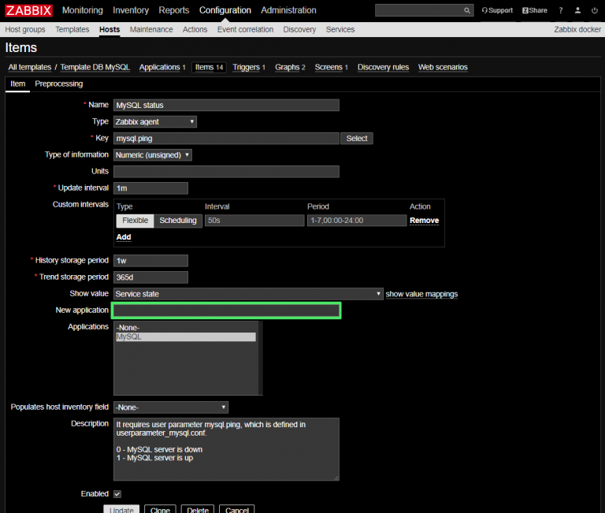
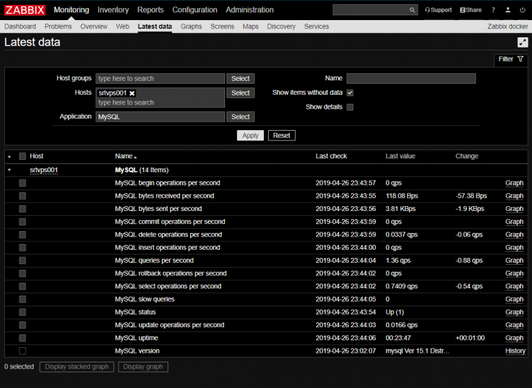

# {{this.$page.frontmatter.title}}

<CategoriesAndDate/>

{{this.$page.frontmatter.description}}

<!--more-->

## 環境

ZabbixサーバはZabbix 4.0.3。以下監視対象のMySQLサーバの環境。

```bash
$ cat /etc/redhat-release
CentOS Linux release 7.6.1810 (Core)
$ zabbix_agentd --version
zabbix_agentd (daemon) (Zabbix) 3.0.22
Revision 84876 14 September 2018, compilation time: Sep 18 2018 21:31:35

Copyright (C) 2018 Zabbix SIA
License GPLv2+: GNU GPL version 2 or later &lt;http://gnu.org/licenses/gpl.html>.
This is free software: you are free to change and redistribute it according to
the license. There is NO WARRANTY, to the extent permitted by law.
$ mysql --version
mysql  Ver 15.1 Distrib 5.5.60-MariaDB, for Linux (x86_64) using readline 5.1
```

## Template DB MySQLの内容を確認

Configuration → Templates → Template DB MySQLを開き、Itemsの一覧を開きます。なんでもいいので一つItemを開いてみます。



Descriptionの欄に｢`It requires user parameter mysql.ping, which is defined in userparameter_mysql.conf.`｣とあります。このアイテムのKeyはmysql.pingであり、それは`useparameter_mysql.conf`で定義されると書いてあります(実際は.confファイルの名前は何でもいい)。テンプレートこそZabbixにビルトインされていますが、どうやって監視するかはuserparameterで定義する必要があるということです。

## Template DB MySQLの監視に必要なKeyとコマンドの対応を定義する

このテンプレートのアイテムのDescriptionを全て見てみると、以下の3種類のKeyの定義が必要だとわかります。

* `mysql.status[*]`
* `mysql.ping`
* `mysql.version`

なので、この監視テンプレートでMySQL監視するためにこの3つのKeyとCommandの対応を定義してあげます。`Key – Command`の対応は監視対象ホストのZabbixエージェントの設定で定義付けます。

ここでこの紐づけを考えるのが面倒なので｢Zabbix MySQL｣でぐぐりました。こういうところが技術者としてよくない点なんだよな。こちらのサイト様を参考に、定義ファイルを作成しました。

[MySQL/MariaDBのステータスをZabbixで監視する方法](https://pig-log.com/mysql-status-zabbix/)

```bash
$ cat userparameter_mysql.conf
UserParameter=mysql.status[*],echo "show global status where Variable_name='$1';" | mysql --defaults-extra-file=/etc/zabbix/zabbix_agentd.conf.d/zabbix_my.cnf -N | awk '{print $$2}'
UserParameter=mysql.ping,mysqladmin --defaults-extra-file=/etc/zabbix/zabbix_agentd.conf.d/zabbix_my.cnf ping 2>&1 | grep -c alive
UserParameter=mysql.version,mysql -V
```

参考にさせて頂いたサイトに記載のコンフィグから、`--defaults-extra-file`オプションのパスだけ変更しています。そしてこの`userparameter_mysql.conf`というファイルを`zabbix_agentd.conf`にてincludeされているディレクトリに置いておきます。

```bash
$ grep ^Include /etc/zabbix/zabbix_agentd.conf
Include=/etc/zabbix/zabbix_agentd.conf.d/*.conf
$ ls /etc/zabbix/zabbix_agentd.conf.d/*.conf
/etc/zabbix/zabbix_agentd.conf.d/userparameter_mysql.conf
```

## ZabbixエージェントがMySQLへ接続できるようにする

この`--defaults-extra-file` オプションは、MySQLのコンフィグファイルを指定するオプションです。少なくともMySQLへの接続情報だけは書いておかないと、mysqlコマンドやmysqladminコマンドでMySQLの状態が確認できないので、下記内容で作成しておきます。なお、passwordはダブルクオーテーションでくくる必要があります。

```bash
$ cat /etc/zabbix/zabbix_agentd.conf.d/zabbix_my.cnf
[client]
user=zabbix_agent
password="XXXXXXXX"
```

ZabbixエージェントがMySQLを監視する用のMySQLユーザは、アプリケーションがDBに接続するためのユーザとは別に作っておきます。なお、Keyと対応しているコマンドのうち、`mysql.status[*]`のコマンドはMySQLに直接ログインしてコマンドをたたいていますが、SHOW GLOBAL STATUSを叩くのには何の権限も必要ないため、MySQLのzabbix_agentユーザに何かGRANTする必要はありません(ユーザを作るだけでOK)。

```bash
$ sudo mysql -uroot -p
MariaDB [(none)]> create user 'zabbix_agent'@'localhost' identified by 'XXXXXXXX';
MariaDB [(none)]> exit
```

念のため、今作成したzabbix_agentユーザでMySQLに接続できるか確認しておいた方がいいです。

```bash
$ mysql -uzabbix_agent -p
```

## 監視できていることを確認

Zabbixエージェントを再起動します。

```bash
$ sudo systemctl status zabbix-agent
```

そしてちょっと待ってからZabbixサーバのMonitoring → Latest dataを確認して、値が取れていたらOK。そういえばスロークエリのロギング有効化してないんだよなぁってのをこの画面みて思い出しました。



## おわりに

Rubyから逃げるためにZabbixやってます。逃げても逃げても追ってくるんだけど。
