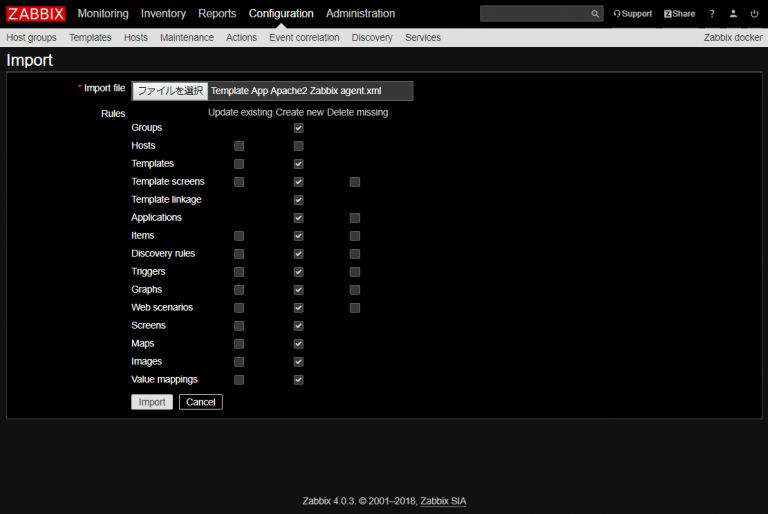
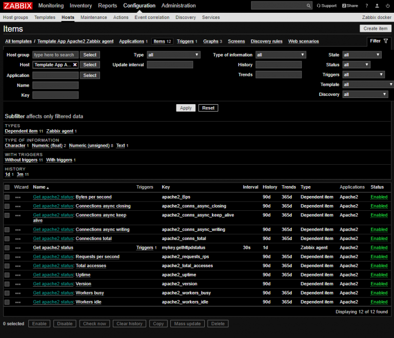
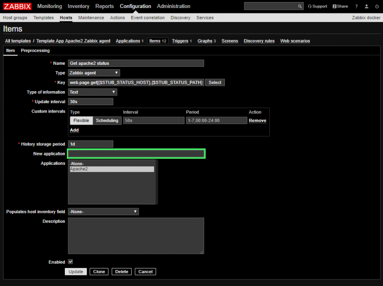
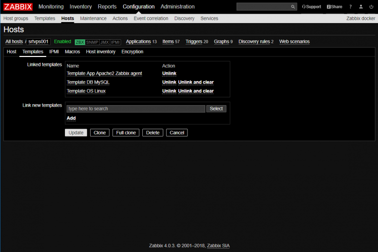
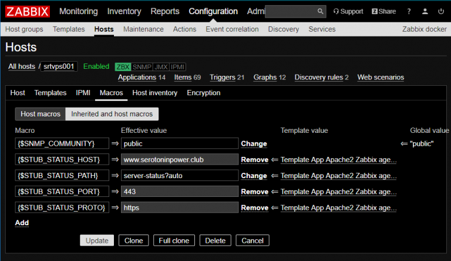
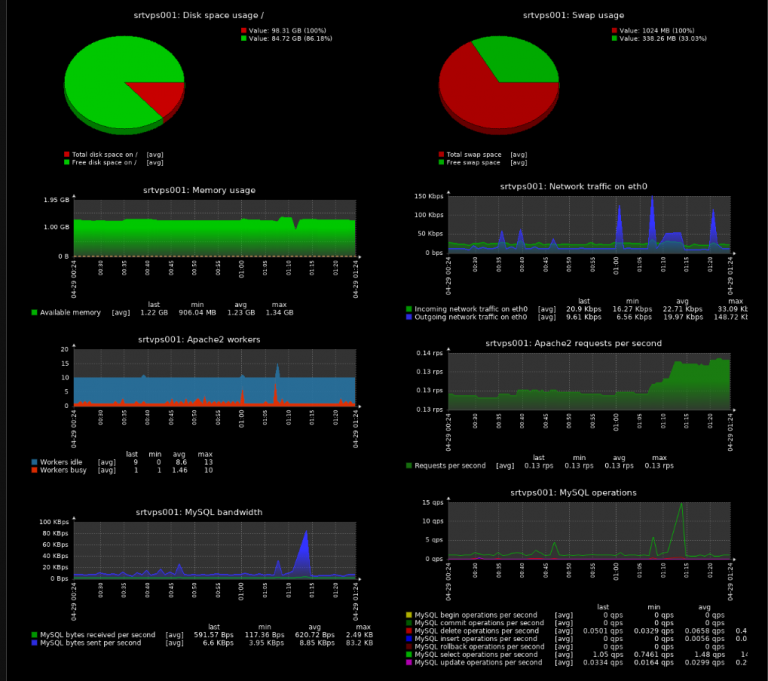

Zabbixで個別アプリケーションを監視しよう第3弾。ApacheはZabbixのビルトインのテンプレートに入ってますが、なんとシンプルチェックでHTTP、HTTPSそれぞれのサービスが稼働しているかどうかしか監視してくれない。なのでより細かく監視ができるテンプレートを導入します。んで導入にあたってHSTSなApacheを監視できなかったのでそれにも対応しました。

<!--more-->

## TL;DR

* Zabbixエージェントがmod_status経由でApacheの監視をするテンプレートを探してきたよ
* HSTSなApacheの監視には対応していなかったからテンプレートを直したよ
* MPMがeventのApacheにしか対応していないテンプレートだったからApacheのバージョンとれなかったけど取れるようにテンプレート修正したよ

## 監視テンプレートを探す

例によってZabbix Shareという監視テンプレートの共有サイトを見ます、

<https://www.zabbix.com/integrations/apache>

RatingがRecommendedになっているもの以外、外部スクリプトを呼び出してApacheを監視する仕組みのテンプレートが多かったです。余計なスクリプトは動かしたくなかったため、Reccomendされていた`github.com/v-zhuravlev/zbx_template_apache2`のテンプレートをお借りすることにしました。

<https://github.com/v-zhuravlev/zbx_template_apache2>

README.mdを読むと、Apacheのモジュールである`mod_status`の出力結果をパースして監視するっぽいですね。ざっと他のテンプレートも見ましたが、スクリプトでやるやつも結局は`mod_status`の出力を読んでいるみたいです。外部スクリプトは極力作りたくない(置きたくない、管理したくない)ので、このテンプレートを使うことにしました。

まずはApache側でmod_statusを有効化しておきます。

## Apacheでmod_statusを有効化

Loadmoduleされているか確認し、されていなければアンコメントして有効化しておく。

```bash
$ pwd
/etc/httpd
$ sudo grep mod_status * -r
conf.modules.d/00-base.conf:LoadModule status_module modules/mod_status.so
```

httpdの設定ファイルの適当なところで`mod_status`の出力設定を行います。Locationコンテナに指定したパスへのアクセスがあったら、処理をserver-statusハンドラー(`mod_status`)に渡します。このパスは外部から見られないようアクセス制御をしておきます。

```bash
<location /server-status>
  SetHandler server-status
  <requireany>
    Require ip 127.0.0.1
    Require ip <自サーバのIPアドレス>
    Require host <自サーバのFQDN>
  </requireany>
</location>
```

mod_rewriteを使用している環境の場合、この/server-statusへのアクセスが書き換えられないように設定しておきます。

```bash
<directory /var/www/html>
  <ifmodule mod_rewrite.c>
    RewriteEngine On
    RewriteBase /

(~snip~)

    #mod_status用
    RewriteRule ^server-status$ - [L]

(~snip~)

    RewriteRule ^index\.php$ - [L]
    RewriteCond %{REQUEST_FILENAME} !-f
    RewriteCond %{REQUEST_FILENAME} !-d
    RewriteRule . /index.php [L]
  </ifmodule>
</directory>
```

私のmod_statusは、一番最後で存在しないファイルやディレクトリへのアクセスを全てindex.phpに向ける設定にしています。｢server-status｣は実際に存在するファイル/ディレクトリではない(Apacheがこのパスにアクセスを受けたらハンドラーがレスポンスを生成して返す)ため、そのindex.phpに振り向ける規則の前に、server-statusへのアクセスはリダイレクトしない、という設定を追加します。

構文チェックして問題なければリロード。

```bash
$ sudo httpd -t
Syntax OK
$ sudo systemctl reload httpd
```

念のため、server-statusが取得できるか確認します。Apacheが入っているサーバ上からcurlで確認します。

```bash
$ $ curl -sS https://www.serotoninpower.club/server-status?auto
Total Accesses: 17418
Total kBytes: 221213
CPULoad: .0918152
Uptime: 131438
ReqPerSec: .132519
BytesPerSec: 1723.41
BytesPerReq: 13005.1
BusyWorkers: 1
IdleWorkers: 9
Scoreboard: _W___..__.___...................................................................................................................................................................................................................................................
```

## 監視テンプレートのインポート

先ほどダウンロードしてきたテンプレートの中には、2つのxmlファイルがあります。Zabbixサーバが直接/server-statusにGETした結果をパースして監視する方式のテンプレートと、Zabbixエージェントに内部から/server-statusを監視してもらう方法。私は後者でやりたいため、Template App Apache2 Zabbix agent.xmlのほうを利用します。

ZabbixサーバのConfiguration → Templates → Importから。



## インポートしたテンプレートはhttpsなserver-status画面を確認できないことに気付く

このTemplateのItemを見てみます。



｢Get apache2 status｣というItemがあって、そのItem に他全てのItemが依存している旨が記載されています。そのGet apache2 statusの中身を見てみます。



Keyの中身は以下のようになっています。

```bash
web.page.get[{$STUB_STATUS_HOST},{$STUB_STATUS_PATH},{$STUB_STATUS_PORT}]
```

web.page.getはZabbixビルトインのKeyです。このKeyは、仕様としてhttp以外のプロトコルでのアクセスができません。とりわけhttpsには対応してくれよとZabbixのユーザフォーラムにも意見が出ていますが、音沙汰なしです。

<https://support.zabbix.com/browse/ZBXNEXT-1816>

このテンプレートの監視方式は、mod_statusで生成された`/server-status?auto`のWebページの文字列をパースしてApacheの状態を確認する、という方式なので、`/server-status`をhttpsで公開するしているサーバは監視することができません。

監視ソフト(Zabbix)が対応してないからという理由で、せっかくのHSTSなサーバを、`/server-status`のみhttpで公開するというのはあまり本質的な解決方法ではありません。なので、httpsでも監視できるようこのKeyを修正します。

## そもそもevent MPMのApache向けの監視だったことに気付く

### Get apache2 status: Version

上述のGet apache2 statusに依存するVersionというアイテムのPreprocessiongを見てみます。


Get apache2 statusで取得した結果を正規表現でパースし、｢`ServerVersion: XXX`｣のXXXを取得する処理になっていますが、Get apache2 statusで取得する`/server-status?auto`に｢ServerVersion｣という文字列は含まれていませんので監視できません。これはUserParameterで`httpd -v`を打つ仕組みに変更して監視しようと思います。まずここでなんかおかしいなと。

### Get apache2 status: Connections*

以下の4つが当てはまります。

* Connections async closing
* Connections async keep alive
* Connections async writing
* Connections total

どれもGet apache2 statusの結果をPreprocesingにて正規表現でパースして値を取得する処理になっているのですが、これらも該当する文字列が/server-status?auto中にない……。と思って調べたらこれevent MPMで稼働しているApacheのステータスなのね……。テンプレート自体がevent MPM向けだったっぽいですね。event MPMなら上記のServerVersionも表示されるっぽい。まぁ私のApacheはpreforkなのでこれらのConnections*系は監視しなくていいです。

<https://github.com/v-zhuravlev/zbx_template_apache2/issues/1>

## アイテムを修正する

ここからいろいろテンプレートを直していきました。

### Get apache2 status

以下のようにアイテムのKeyを修正します。`$STUB_STATUS_PROTO`として、プロトコルを指定する変数を追加し、併せてKey名を独自定義のものに修正しました。

#### 修正前

```bash
Key: web.page.get[{$STUB_STATUS_HOST},{$STUB_STATUS_PATH},{$STUB_STATUS_PORT}]
```

#### 修正後

```bash
Key: mykey.curl[{$STUB_STATUS_PROTO},{$STUB_STATUS_HOST},{$STUB_STATUS_PATH},{$STUB_STATUS_PORT}]
```

### Get apache2 status: Version

UserParameterを使い、Zabbixエージェントにhttpd -vを打たせてApacheのバージョンを取得させる想定で修正します。

* TypeはDependent itemからzabbix agentに変更しておきます。zabbixエージェントがコマンドが打つだけなので、他のアイテムに依存するわけではないからです。
* 独自Keyを定義しておいて、あとでZabbixエージェント側の設定ファイルでこのKeyに紐づくコマンドを定義します。
* 取得できるデータ型もCharacter(一文字)からText(複数文字)に変更しておきます。
* Preprocessingは不要ですので、項目ごと削除します。

#### 修正前

```bash
Type: Dependent item
Key: apache2_version
Type of information: Character
Preprocessing steps:
  Name: Regular expression
  Parameters: ServerVersion: \s*(.+)
              \1
```

#### 修正後

```bash
Type: Zabbix agent
Key: mykey.httpd_v
Type of information: Text
Preprocessing steps: なし
```

## アイテム｢Get apache2 status｣のトリガを修正する

アイテムを変更した(監視の仕方を変えて取得するデータのフォーマットも変わった)ため、そのアイテムによって引かれるトリガも修正します。

Configuration → Templates → Template App Apache2 Zabbix agent → Triggersをクリックします。


先ほど修正したmykey.curlの実行結果が、｢`.str(“HTTP/1.1 200”)}=0`｣もしくは｢`.nodata(30m)}=1`｣の場合に｢Failed to fetch apache2 server status page｣というトリガーを引く設定になっています。Apacheのserver-statusが取得できなかったよというトリガーです。

まず、orでつながれている後者の`.nodata(30m)`は、30秒間何もデータが得られなかったときに1を返し、そうでなければ0を返すZabbixの関数です。これは修正不要です。

｢`.str()`｣は、実行結果のテキストからかっこの中身のテキストを検索し、ヒットすれば1を、しなければ0を返すZabbixの関数です(逆のほうがよくね？)。私が確認したCentOS7のApache2.4.6には、`/server-status?auto`に｢`"HTTP/1.1 200"`｣という文字は含まれていませんでした。Apacheが稼働していることがわかって、`/server-status?auto`の結果を取得できているかどうかがわかればいいと考えたので、`/server-status?auto`に｢Uptime｣の文字が含まれているかどうかを判断する方式に変更します。変更したらUpdate。

### 修正前

```bash
{Template App Apache2 Zabbix agent:mykey.curl[{$STUB_STATUS_PROTO},{$STUB_STATUS_HOST},{$STUB_STATUS_PATH},{$STUB_STATUS_PORT}].str("HTTP/1.1 200")}=0
```

### 修正後

```bash
{Template App Apache2 Zabbix agent:mykey.curl[{$STUB_STATUS_PROTO},{$STUB_STATUS_HOST},{$STUB_STATUS_PATH},{$STUB_STATUS_PORT}].str("Uptime")}=0
```


## テンプレートのMacroでアイテムに追加した変数のデフォルト値を追加する

先ほどのGet apache2 statusにて、変数`$STUB_STATUS_PROTO`を追加しました。この変数は、テンプレートにてデフォルト値を定義しておきます。Configuration → Templates からこのテンプレートを開き、Macrosを開きます。以下のように、変数定義を追加。このテンプレートで定義している値はホスト単位でオーバーライドできますので、デフォルト値はhttpにしておきます。そしてUpdate。


## テンプレートを監視対象ホストへリンク & ホスト変数の定義

このテンプレートをホストにリンクさせます。Configuration → HostsからApacheを監視したいホストをクリック。Templatesタブに移動し、Template App Apache2 Zabbix agentをSelectしてAddしてUpdate。



つづいてTemlateの変数をオーバーライドします。再びConfiguration → HostsからApacheを監視したいホストをクリック。 Macros画面に移動します。｢Inherited and host macros｣にトグルすると、テンプレートから引き継いだ変数一覧が表示されます。`$STUB_STATUS_HOST`にて監視するホスト名と、`$STUB_STATUS_PORT` でポート番号、 `$STUB_STATUS_PROTO`でプロトコルを指定します。私はそれぞれ以下のように設定しました。終わったらUpdate。

* `$STUB_STATUS_HOST` : www.serotoninpower.club
* `$STUB_STATUS_PORT` : 443
* `$STUB_STATUS_PROTO` : https



これでZabbix側での設定は終わり。

## 修正したアイテムの`Key – Command`の対応付けをエージェントに設定する

以下のようなZabbixエージェントの設定ファイルを作成します。

```bash
$ cat /etc/zabbix/zabbix_agentd.conf.d/userparameter_apache.conf
UserParameter=mykey.curl[*],curl -Ss $1://$2:$4/$3
UserParameter=mykey.httpd_v,httpd -v
```

### `mykey.curl[*]`

Keyは`mykey.curl[*]`。アスタリスクの意味は、Zabbixサーバから送られたmykey.curlのKeyの変数すべてを一旦受け取るということです。実際は、さきほどのItemのKeyの修正の際に定義した{`$STUB_STATUS_PROTO`},{`$STUB_STATUS_HOST`},{`$STUB_STATUS_PATH`},{`$STUB_STATUS_PORT`}の4つが送られてきます。 この受け取った変数は、シェルと同様に$<数字>で呼び出すことができます。その変数を呼び出してcurlコマンドを組み立てます。$3と$4の順番が若干気持ち悪いけど、テンプレ改変前のアイテム｢Get apache2 status｣の並びと合わせています。

### `mykey.httpd_v`

そのままhttpd -vを打つだけ。

## ZabbixエージェントがUnsafeなUserParameterを受け取れるようにする

`$STUB_STATUS_PATH`には、｢`server-status?auto`｣という文字が格納されています。この?という文字はZabbixエージェントにとってのUnsafeな文字であるため、デフォルトではUserParameterで?を含む文字列を受け取った場合にコマンドの実行を拒否します。ワイルドカードだからですかね。

そのため、?などUnsafeな文字をZabbixエージェントが受け取ってコマンドを実行することを許可してやる必要があります。以下の設定を付与。

```bash
$ grep ^UnsafeUserParameters /etc/zabbix/zabbix_agentd.conf
UnsafeUserParameters=1
```

ちなみに、Unsafeだとされている文字の一覧は公式にあります。

<https://www.zabbix.com/documentation/3.4/manual/appendix/config/zabbix_agentd>

私はこれがわからんくて2時間くらい悩みました。。。

## 監視が出来ていることの確認

Zabbixエージェントを再起動し、ZabbixサーバのMonitoring → Latest dataから確認。値がとれていることが確認出来たら完了。


`Connection*`系は前述のとおりevent MPMでしかとれないので表示されていません。ただ、`/server-status?auto`のScoreboardでリクエストに対して各Apacheの子プロセスがどういう処理を行っているか取れるので、余裕があるときに関しできるようにしてみたいです(Zabbixサーバ側で正規表現で改行を含むScoreboardの値をとってくるのがしんどすぎて諦めた。なんかうまいやり方無いかな)。

## おわりに

監視できた項目をScreenに起こすとこんな感じ。かっこよくなってきた。



Zabbixはそろそろもうよくて別な勉強をしないといけない。もう何も勉強したくない。

 [1]: https://github.com/v-zhuravlev/zbx_template_apache2
 [2]: https://github.com/v-zhuravlev/zbx_template_apache2/issues/1
