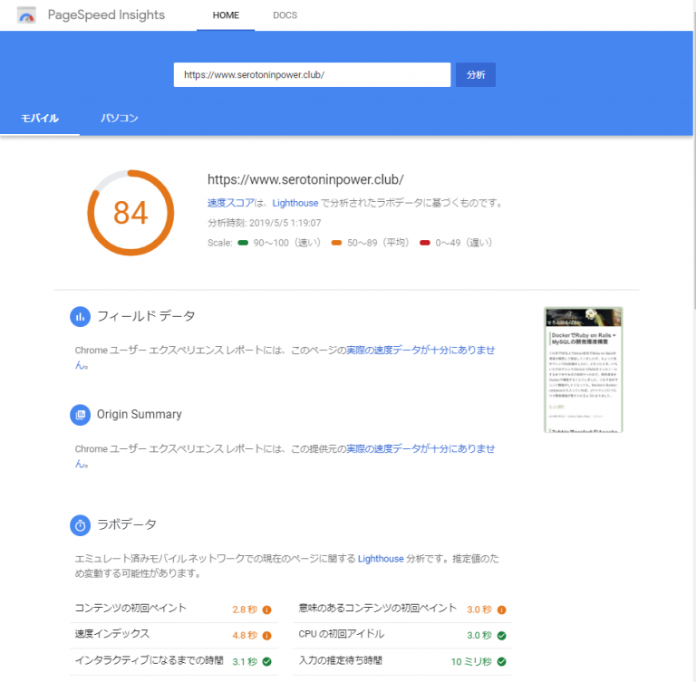
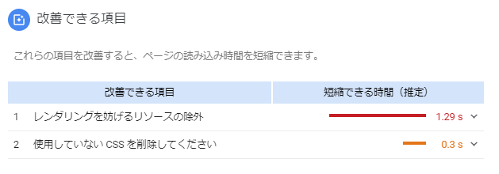

# {{this.$page.frontmatter.title}}

やろうやろうと思って後回しにしてきたPHPのアップデートをついにやりました。手順をメモに残しておきます。ついでにPHP7台になってどれだけ速度が上がるかどうかも。

<!--more-->

## 既存環境

```bash
$ cat /etc/redhat-release
CentOS Linux release 7.6.1810 (Core)

$ php -v
PHP 5.4.16 (cli) (built: Oct 30 2018 19:30:51)
Copyright (c) 1997-2013 The PHP Group
Zend Engine v2.4.0, Copyright (c) 1998-2013 Zend Technologies

$ yum list installed | grep php
php.x86_64                          5.4.16-46.el7                    @base
php-cli.x86_64                      5.4.16-46.el7                    @base
php-common.x86_64                   5.4.16-46.el7                    @base
php-gd.x86_64                       5.4.16-46.el7                    @base
php-mbstring.x86_64                 5.4.16-46.el7                    @base
php-mysql.x86_64                    5.4.16-46.el7                    @base
php-pdo.x86_64                      5.4.16-46.el7                    @base
```

既存環境でのページ表示速度はこちら。[Google PageSpeed Insights][1]で計測しました。



以下のサーバー応答時間の短縮というところがPHPのアプデで改善できそうな項目です。


## アップデート手順

### PHP設定ファイルのバックアップ

/etc/php.iniおよび/etc/php.d/*をバックアップしておきます。

### 既存のPHPを削除

```bash
sudo yum remove php php-cli php-common php-gd php-mbstring php-mysql php-pdo
```

### remiリポジトリを追加

CentOS7のbaseリポジトリではphp7は配信されていません。remiリポジトリを利用します。

```bash
$ sudo yum install -y https://rpms.remirepo.net/enterprise/remi-release-7.rpm
Loaded plugins: fastestmirror
remi-release-7.rpm                                                                            |  16 kB  00:00:00
Examining /var/tmp/yum-root-HKqHt0/remi-release-7.rpm: remi-release-7.6-2.el7.remi.noarch
Marking /var/tmp/yum-root-HKqHt0/remi-release-7.rpm to be installed
Resolving Dependencies
--&gt; Running transaction check
---&gt; Package remi-release.noarch 0:7.6-2.el7.remi will be installed
--&gt; Finished Dependency Resolution

Dependencies Resolved

=====================================================================================================================
 Package                    Arch                 Version                         Repository                     Size
=====================================================================================================================
Installing:
 remi-release               noarch               7.6-2.el7.remi                  /remi-release-7                19 k

Transaction Summary
=====================================================================================================================
Install  1 Package

Total size: 19 k
Installed size: 19 k
Downloading packages:
Running transaction check
Running transaction test
Transaction test succeeded
Running transaction
  Installing : remi-release-7.6-2.el7.remi.noarch                                                                1/1
  Verifying  : remi-release-7.6-2.el7.remi.noarch                                                                1/1

Installed:
  remi-release.noarch 0:7.6-2.el7.remi

Complete!
```

### remi-php73リポジトリからPHP7.3をインストール

remi-php73を指定してphp本体をインストールします。依存するパッケージはremiからもインストールされるので、こちらもenablerepoしておきます。この2つのリポジトリの優先度はきちんとremi-release-7.rpmでインストールした/etc/yum.repos.d/remi*にて定義(remiにあるphp5.4よりremi-php7.3にあるphp7.3のほうが優先される)されています。

```bash
$ sudo yum install --enablerepo=remi-php73,remi php php-cli php-common php-gd php-mbstring php-mysql php-pdo
Loaded plugins: fastestmirror
Loading mirror speeds from cached hostfile
 * base: ftp.riken.jp
 * centosplus: ftp.riken.jp
 * epel: ftp.riken.jp
 * extras: ftp.riken.jp
 * remi: ftp.riken.jp
 * remi-php73: ftp.riken.jp
 * remi-safe: ftp.riken.jp
 * updates: ftp.riken.jp
remi                                                                                          | 3.0 kB  00:00:00
remi-php73                                                                                    | 3.0 kB  00:00:00
remi-safe                                                                                     | 3.0 kB  00:00:00
(1/3): remi-php73/primary_db                                                                  | 196 kB  00:00:00
(2/3): remi-safe/primary_db                                                                   | 1.4 MB  00:00:00
(3/3): remi/primary_db                                                                        | 2.3 MB  00:00:00
Package php-mysql is obsoleted by php-mysqlnd, trying to install php-mysqlnd-7.3.5-1.el7.remi.x86_64 instead
Resolving Dependencies
--> Running transaction check
---> Package php.x86_64 0:7.3.5-1.el7.remi will be installed
--> Processing Dependency: libargon2.so.0()(64bit) for package: php-7.3.5-1.el7.remi.x86_64
---> Package php-cli.x86_64 0:7.3.5-1.el7.remi will be installed
---> Package php-common.x86_64 0:7.3.5-1.el7.remi will be installed
--> Processing Dependency: php-json(x86-64) = 7.3.5-1.el7.remi for package: php-common-7.3.5-1.el7.remi.x86_64
---> Package php-gd.x86_64 0:7.3.5-1.el7.remi will be installed
--> Processing Dependency: gd-last(x86-64) >= 2.1.1 for package: php-gd-7.3.5-1.el7.remi.x86_64
--> Processing Dependency: libgd.so.3()(64bit) for package: php-gd-7.3.5-1.el7.remi.x86_64
---> Package php-mbstring.x86_64 0:7.3.5-1.el7.remi will be installed
--> Processing Dependency: libonig.so.5()(64bit) for package: php-mbstring-7.3.5-1.el7.remi.x86_64
---> Package php-mysqlnd.x86_64 0:7.3.5-1.el7.remi will be installed
---> Package php-pdo.x86_64 0:7.3.5-1.el7.remi will be installed
--> Running transaction check
---> Package gd-last.x86_64 0:2.2.5-8.el7.remi will be installed
--> Processing Dependency: libwebp.so.7()(64bit) for package: gd-last-2.2.5-8.el7.remi.x86_64
---> Package libargon2.x86_64 0:20161029-3.el7 will be installed
---> Package oniguruma5.x86_64 0:6.9.1-1.el7.remi will be installed
---> Package php-json.x86_64 0:7.3.5-1.el7.remi will be installed
--> Running transaction check
---> Package libwebp7.x86_64 0:1.0.2-1.el7.remi will be installed
--> Finished Dependency Resolution

Dependencies Resolved

=====================================================================================================================
 Package                     Arch                  Version                           Repository                 Size
=====================================================================================================================
Installing:
 php                         x86_64                7.3.5-1.el7.remi                  remi-php73                3.2 M
 php-cli                     x86_64                7.3.5-1.el7.remi                  remi-php73                4.9 M
 php-common                  x86_64                7.3.5-1.el7.remi                  remi-php73                1.1 M
 php-gd                      x86_64                7.3.5-1.el7.remi                  remi-php73                 79 k
 php-mbstring                x86_64                7.3.5-1.el7.remi                  remi-php73                508 k
 php-mysqlnd                 x86_64                7.3.5-1.el7.remi                  remi-php73                232 k
 php-pdo                     x86_64                7.3.5-1.el7.remi                  remi-php73                125 k
Installing for dependencies:
 gd-last                     x86_64                2.2.5-8.el7.remi                  remi                      134 k
 libargon2                   x86_64                20161029-3.el7                    epel                       23 k
 libwebp7                    x86_64                1.0.2-1.el7.remi                  remi                      265 k
 oniguruma5                  x86_64                6.9.1-1.el7.remi                  remi                      188 k
 php-json                    x86_64                7.3.5-1.el7.remi                  remi-php73                 64 k

Transaction Summary
=====================================================================================================================
Install  7 Packages (+5 Dependent packages)

Total download size: 11 M
Installed size: 43 M
Is this ok [y/d/N]: y
Downloading packages:
warning: /var/cache/yum/x86_64/7/remi/packages/gd-last-2.2.5-8.el7.remi.x86_64.rpm: Header V4 DSA/SHA1 Signature, key ID 00f97f56: NOKEY
Public key for gd-last-2.2.5-8.el7.remi.x86_64.rpm is not installed
(1/12): gd-last-2.2.5-8.el7.remi.x86_64.rpm                                                   | 134 kB  00:00:00
(2/12): libwebp7-1.0.2-1.el7.remi.x86_64.rpm                                                  | 265 kB  00:00:00
(3/12): libargon2-20161029-3.el7.x86_64.rpm                                                   |  23 kB  00:00:00
Public key for php-7.3.5-1.el7.remi.x86_64.rpm is not installed                    ] 4.2 MB/s | 3.8 MB  00:00:01 ETA
(4/12): php-7.3.5-1.el7.remi.x86_64.rpm                                                       | 3.2 MB  00:00:01
(5/12): php-json-7.3.5-1.el7.remi.x86_64.rpm                                                  |  64 kB  00:00:00
(6/12): php-mbstring-7.3.5-1.el7.remi.x86_64.rpm                                              | 508 kB  00:00:00
(7/12): php-mysqlnd-7.3.5-1.el7.remi.x86_64.rpm                                               | 232 kB  00:00:00
(8/12): php-cli-7.3.5-1.el7.remi.x86_64.rpm                                                   | 4.9 MB  00:00:01
(9/12): php-pdo-7.3.5-1.el7.remi.x86_64.rpm                                                   | 125 kB  00:00:00
(10/12): php-gd-7.3.5-1.el7.remi.x86_64.rpm                                                   |  79 kB  00:00:00
(11/12): oniguruma5-6.9.1-1.el7.remi.x86_64.rpm                                               | 188 kB  00:00:33
php-common-7.3.5-1.el7.remi.x8 FAILED                                          =   ]  3.2 B/s |  10 MB  75:33:36 ETA
http://mirror.innosol.asia/remi/enterprise/7/php73/x86_64/php-common-7.3.5-1.el7.remi.x86_64.rpm: [Errno 12] Timeout on http://mirror.innosol.asia/remi/enterprise/7/php73/x86_64/php-common-7.3.5-1.el7.remi.x86_64.rpm: (28, 'Operation too slow. Less than 1000 bytes/sec transferred the last 30 seconds')
Trying other mirror.
(12/12): php-common-7.3.5-1.el7.remi.x86_64.rpm                                               | 1.1 MB  00:00:00
---------------------------------------------------------------------------------------------------------------------
Total                                                                                 67 kB/s |  11 MB  00:02:45
Retrieving key from file:///etc/pki/rpm-gpg/RPM-GPG-KEY-remi
Importing GPG key 0x00F97F56:
 Userid     : "Remi Collet &lt;RPMS@FamilleCollet.com>"
 Fingerprint: 1ee0 4cce 88a4 ae4a a29a 5df5 004e 6f47 00f9 7f56
 Package    : remi-release-7.6-2.el7.remi.noarch (installed)
 From       : /etc/pki/rpm-gpg/RPM-GPG-KEY-remi
Is this ok [y/N]: y
Running transaction check
Running transaction test
Transaction test succeeded
Running transaction
  Installing : php-json-7.3.5-1.el7.remi.x86_64                                                                 1/12
  Installing : php-common-7.3.5-1.el7.remi.x86_64                                                               2/12
  Installing : libargon2-20161029-3.el7.x86_64                                                                  3/12
  Installing : php-cli-7.3.5-1.el7.remi.x86_64                                                                  4/12
  Installing : php-pdo-7.3.5-1.el7.remi.x86_64                                                                  5/12
  Installing : libwebp7-1.0.2-1.el7.remi.x86_64                                                                 6/12
  Installing : gd-last-2.2.5-8.el7.remi.x86_64                                                                  7/12
  Installing : oniguruma5-6.9.1-1.el7.remi.x86_64                                                               8/12
  Installing : php-mbstring-7.3.5-1.el7.remi.x86_64                                                             9/12
  Installing : php-gd-7.3.5-1.el7.remi.x86_64                                                                  10/12
  Installing : php-mysqlnd-7.3.5-1.el7.remi.x86_64                                                             11/12
  Installing : php-7.3.5-1.el7.remi.x86_64                                                                     12/12
  Verifying  : php-7.3.5-1.el7.remi.x86_64                                                                      1/12
  Verifying  : php-pdo-7.3.5-1.el7.remi.x86_64                                                                  2/12
  Verifying  : php-common-7.3.5-1.el7.remi.x86_64                                                               3/12
  Verifying  : php-gd-7.3.5-1.el7.remi.x86_64                                                                   4/12
  Verifying  : php-mysqlnd-7.3.5-1.el7.remi.x86_64                                                              5/12
  Verifying  : php-cli-7.3.5-1.el7.remi.x86_64                                                                  6/12
  Verifying  : gd-last-2.2.5-8.el7.remi.x86_64                                                                  7/12
  Verifying  : oniguruma5-6.9.1-1.el7.remi.x86_64                                                               8/12
  Verifying  : libargon2-20161029-3.el7.x86_64                                                                  9/12
  Verifying  : php-json-7.3.5-1.el7.remi.x86_64                                                                10/12
  Verifying  : libwebp7-1.0.2-1.el7.remi.x86_64                                                                11/12
  Verifying  : php-mbstring-7.3.5-1.el7.remi.x86_64                                                            12/12

Installed:
  php.x86_64 0:7.3.5-1.el7.remi      php-cli.x86_64 0:7.3.5-1.el7.remi       php-common.x86_64 0:7.3.5-1.el7.remi
  php-gd.x86_64 0:7.3.5-1.el7.remi   php-mbstring.x86_64 0:7.3.5-1.el7.remi  php-mysqlnd.x86_64 0:7.3.5-1.el7.remi
  php-pdo.x86_64 0:7.3.5-1.el7.remi

Dependency Installed:
  gd-last.x86_64 0:2.2.5-8.el7.remi       libargon2.x86_64 0:20161029-3.el7     libwebp7.x86_64 0:1.0.2-1.el7.remi
  oniguruma5.x86_64 0:6.9.1-1.el7.remi    php-json.x86_64 0:7.3.5-1.el7.remi

Complete!
```

上記yumコマンド実行中に以下の文章が記載されていました。

```bash
Package php-mysql is obsoleted by php-mysqlnd, trying to install php-mysqlnd-7.3.5-1.el7.remi.x86_64 instead
```

これ手動でphp-mysqlndに入れ替えなきゃあかんのかと思ったら自動的にphp-mysqlndに置き換えてインストールしてくれたみたいですね。

## アップデート確認

```bash
$ php -v
PHP 7.3.5 (cli) (built: Apr 30 2019 08:37:17) ( NTS )
Copyright (c) 1997-2018 The PHP Group
Zend Engine v3.3.5, Copyright (c) 1998-2018 Zend Technologies
```

私の環境ではトラブルなくアプデできました。ただ、[Crayon Syntax Highlighter][2]というWordPressのプラグインがPHP7.3に対応していないようで、このプラグインを有効化していると記事がタイトルしか表示されなくなったため、無効化しました。代わりに[Enlighter – Customizable Syntax Highlighter][3]というプラグインを入れてみましたが、まだ使いこなせていない感じ。たぶんけっこう高機能です。

んで肝心の速度ですが……。


6ポイント上がって大台の90に乗りました！ アップデート前にGoogle PageSpeed Insightsじゃなくてきちんと各リソースごとのレンダリング時間を計測しておけばよかったな……



改善できる項目からサーバ応答時間の短縮が消えました。やったね。人間がアクセスした体感でも若干早くなってる気はする。

## おわりに

このブログの速度が6ポイント改善したからって誰が幸せになるんだという虚しさと日々戦っています。

 [1]: https://developers.google.com/speed/pagespeed/insights/
 [2]: https://github.com/aramk/crayon-syntax-highlighter
 [3]: https://wordpress.org/plugins/enlighter/
