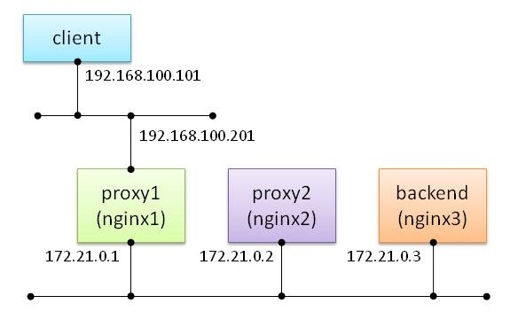

主にバックエンドにRailsを利用する環境向け。LBやリバースプロキシの背後にあるバックエンドサーバにクライアントIPアドレスを伝える方法の一つとして、`X-Forwarded-For`というHTTPリクエストヘッダがあります。nginxをLBやリバースプロキシとして構築し、それらを複数経由させてバックエンドのAPサーバにアクセスさせる際でも、 このリクエストヘッダを利用してきちんとバックエンドにクライアントIPアドレスを伝える方法をメモします。

<!--more-->

## X-Forwarded-For(以下XFF)とは

LBによるL4以上でのD-NATや、リバースプロキシによる代理アクセスなど、IPヘッダのソースIPアドレスがクライアントのIPアドレスからその中継機器のIPアドレスに置き換えられてしまう場合に、クライアントのIPアドレスをバックエンドサーバが取得できるよう、中継機器が設定するリクエストヘッダです。クライアントのIPアドレスと、中継した機器のIPアドレスを配列として格納します。内部ネットワーク構造隠蔽のため、プライベートIPアドレス空間からインターネットへ出るタイミングではこのヘッダを削除するのが普通です。

### 書式

`X-Forwarded-For: client, proxy1, proxy2, proxy3, ...`

proxy1はリクエストを受け付けて、背後のproxy2に代理リクエストを送る際に、クライアントのIPアドレスをこのヘッダに設定します。proxy2以下は、上流プロキシから送られてきたXFFの右端に、上流プロキシのIPアドレスを追加して、下流プロキシ、もしくはバックエンドにリクエストを送付します。

クライアントのIPアドレスを取得することが目的のヘッダなので、究極を言えば`client`のIPアドレスさえ付与されていれば良いですが、きちんと中継機器のIPアドレスも追加しておけば、バックエンドサーバがリクエストを受け取った際、どういう経路を辿ってリクエストが到着したのかがわかります。

### リクエストヘッダの改ざんとXFF

肝要なのは、このXFFは改ざんが容易であることです。本来このリクエストヘッダは、中継機器が受け取ったリクエストをバックエンドに流す際に付与されるヘッダですが、リクエストヘッダなのでクライアント自身もこのヘッダを付与したリクエストを送ることが可能です。

たとえばこんな例。ローカルIPアドレスを`X-Forwarded-For`に記載しています。

`curl -H 'X-Forwarded-For:192.168.100.101' proxy1.example.com`

以下の条件がそろうと、外部からプライベートIPアドレスのアクセス制限を破ることができます。clientのIPアドレスは仮に8.8.8.8だとします。

* proxy1がXFFの偽装検証を行わずに、そのままクライアントのIPアドレスをXFFの右端に追加してバックエンドにリクエストを流す(つまり `X-Forwarded-For:192.168.100.101, 8.8.8.8`になる)
* バックエンドでXFFの左端をクライアントIPアドレスだと判定している
* バックエンドでプライベートIPアドレスだけのみアクセスを受け付けるアクセス制限を行っている

### XFF以外のクライアントIPアドレスをバックエンドに伝えるリクエストヘッダ

他にもあります。バックエンドのアプリケーションが何のリクエストヘッダを使ってクライアントIPアドレスを判断するかによって使い分けます(全部付けといてもいいです)。今回はXFFに焦点を絞ります。

* Forwarded
* X-Real-IP

## 多段nginx環境におけるXFFの実装方針

以下のような環境を想定します。



proxy1はインターネットに露出しているという想定の検証環境です。proxy1とproxy2、backendは信頼できる同一ネットワーク内にいると想定します。

* インターネットに露出しているproxy1は、仮にリクエストヘッダにXFFがあったとしても信頼できないため無視(破棄)する。そしてクライアントのIPアドレスを値にとってXFFヘッダを作り、proxy2にリクエストを送る
* proxy2は信頼できるネットワーク内にいるproxy1を信用し、proxy1から受け取ったリクエストのXFFにproxy1のIPアドレスを追加し、backendにリクエストを送る
* backendは信頼できるネットワーク内にいるproxy1とproxy2を信用し、受け取ったXFFの左端の値からクライアントIPアドレスを取得する

nginxをインターネットに直接露出させることはあまりないと思いますが、proxy2の設定と対比させる例として記載します。

## インターネットに露出しているnginxの設定

インターネットに露出するなら普通SSL/TLS対応するいうのは今回なしで……。

* nginx.conf

```bash
(~snip~)

http {
(~snip~)

  server {
    server_name _;
    listen      80;
    access_log  /var/log/nginx/access.log ltsv;

    location / {
      proxy_set_header Host                   $host;
      proxy_set_header X-Forwarded-Host       $host;
      proxy_set_header X-Real-IP              $remote_addr;
      proxy_set_header X-Forwarded-For        $remote_addr;
      proxy_pass                              http://proxy2;
    }
  }
}
```

ポイントはXFFを`$remote_addr`で置き換えてしまうこと。仮にXFFに値が入った状態でクライアントがアクセスしてきても、それを無視してクライアントのIPアドレスをXFFに格納します。

## 内部ネットワークプロキシのnginxの設定

* nginx.conf

```bash
(~snip~)

http {
(~snip~)

  server {
    server_name _;
    listen      80;
    access_log  /var/log/nginx/access.log ltsv;

    location / {
      proxy_set_header Host                   $host;
      proxy_set_header X-Forwarded-Host       $host;

      set_real_ip_from  proxy1;
      real_ip_header    X-Forwarded-For;
      real_ip_recursive on;

      proxy_set_header X-Real-IP              $remote_addr;
      proxy_set_header X-Forwarded-For        "$http_x_forwarded_for, $realip_remote_addr";
      proxy_pass                              http://backend;
    }
  }
}
```

### `set_real_ip_from`ディレクティブ

proxy1を信頼できる上流プロキシとして登録します。また、`ngx_http_realip_module`を有効化し、`real_ip_header`ディレクティブや`real_ip_recursive`ディレクティブを有効化します。

### `real_ip_header`ディレクティブ

クライアントIPアドレスを判別するリクエストヘッダをXFFに変更します。 `real_ip_header`のデフォルト値は`X-Real-IP`ですが、 バックエンドのアプリケーションサーバによっては、`X-Real-IP`を取得することができず、XFFを使わねばならないことがあります。例えばRailsとか。

バックエンドがXFFを使用してクライアントIPアドレスを取得しているのに、中継機器は `X-Real-IP`を使ってクライアントIPアドレスを取得している、となると気持ち悪いので、XFFに統一します。

### `real_ip_recursive`ディレクティブ

`real_ip_header`をXFFに設定している場合にこのディレクティブの設定が有効になります。XFFからクライアントIPアドレスを判断する方法を変更します。具体的に言うと、 直接のリクエスト元のIPアドレス(この場合上流プロキシのproxy1になります)が、`set_real_ip_from`ディレクティブで指定した信頼できるプロキシに当てはまった場合、 XFFからクライアントIPアドレスをどう判断するかの判断方法を変更します。

デフォルトは`off`で、XFFの右端にあるIPアドレスをクライアントのIPアドレスとします。右端が信頼できるプロキシであったとしても問答無用でそれをクライアントのIPアドレスとします。

`on`にすると、XFFを右から左に見ていき、一番最初に見つかった信頼できないIPアドレスをクライアントのIPアドレスだと判断します。

proxy2はproxy1しか経由しておらず、XFFには一つのアドレス(クライアントIPアドレス)しか入っていないはずなので、`on`でも`off`でも取れるアドレスは変わりません。しかし、あとでもう一段リバースプロキシを追加したい、などとなった場合でも、設定変更なしできちんとクライアントのIPアドレスが取れるよう、`on`にしておきます。`off`の方がXFF改ざんに対してセキュアですが、proxy1でXFFを初期化しているため問題ありません。

ちなみに`real_ip_header`を`proxy_protocol`に変更している場合も、`real_ip_recursive`の設定でクライアントIPアドレスを判断する方法を変更できますが、ここでは割愛します。

### XFFへ値を追加

上流のプロキシがリクエストで送ってきたXFFを`$http_x_forwarded_for`で取得し、それにスペース+カンマで上流のプロキシのIPアドレスを追加したものをXFFに設定します。

### `real_ip_header`や`real_ip_recursive`を変更した際の`$remote_addr`の注意点

クライアントIPアドレスの取得の方法を変更するため、nginx変数の`$remote_addr`の中身も書き換えられます。デフォルトでは `ngx_http_realip_module` が有効化されており、かつ`X-Real-IP`ヘッダがあればその値を、そうでなければIPヘッダのソースIPアドレスを利用しますが、今回設定を変更した内容より、XFFから`$remote_addr`が判別され、`$remote_addr`には上流プロキシではなくクライアントのIPアドレスが入っています。

この状況で上流プロキシのIPアドレスを取得したい場合は、代わりに`$realip_remote_addr`を利用してください。この変数は、リクエストを送ってきたホストのIPアドレスをそのまま記憶しています。

## バックエンドnginxの設定

バックエンドをnginxにする場合の例です。実際はアプリケーションサーバであることが多いと思いますが、ログを確認する目的だけなのでngnixで。

```bash
(~snip~)

http {
(~snip~)

  server {
    server_name _;
    listen       80;
    access_log /var/log/nginx/access.log ltsv;

    set_real_ip_from proxy1;
    set_real_ip_from proxy2;
    real_ip_header    X-Forwarded-For;
    real_ip_recursive on;

    location / {
      root  /var/www/html;
      index index.html;
    }
  }
}
```

バックエンド側でもクライアントIPアドレスを判断するために、信頼できるプロキシと、クライアントIPアドレスを判断するリクエストヘッダ名、それを判断する方法を指定する必要があります。railsなら`trusted_proxies`で信頼できるプロキシを登録しておけばよしなに判断してくれます。

ちなみに、バックエンドには複数プロキシを経由してリクエストが到達するため、 先ほど既述したように必ず`real_ip_recursive`を`on`にしないといけません。

## 実際のアクセス時のリクエストヘッダの確認

### proxy1アクセスログ

```bash
proxy1_1   | time:2019-08-17T22:39:38+09:00     remote_addr:192.168.100.101     realip_remote_addr:192.168.100.101   request_method:GET      request_uri:/   uri:/   query_string:-  status:304      referer:-       useragent:Mozilla/5.0 (Windows NT 10.0; Win64; x64) AppleWebKit/537.36 (KHTML, like Gecko) Chrome/76.0.3809.100 Safari/537.36        host:192.168.100.201 forwardedhost:- realip:-        forwardedfor:-
```

### proxy2アクセスログ

```bash
proxy2_1   | time:2019-08-17T22:39:38+09:00     remote_addr:192.168.100.101     realip_remote_addr:172.21.0.1   request_method:GET   request_uri:/   uri:/   query_string:-  status:304      referer:-       useragent:Mozilla/5.0 (Windows NT 10.0; Win64; x64) AppleWebKit/537.36 (KHTML, like Gecko) Chrome/76.0.3809.100 Safari/537.36        host:192.168.100.201 forwardedhost:192.168.100.201   realip:192.168.100.101  forwardedfor:192.168.100.101
```

### backendアクセスログ

```bash
backend_1  | time:2019-08-17T22:39:38+09:00     remote_addr:192.168.100.101     realip_remote_addr:172.21.0.2   request_method:GET   request_uri:/   uri:/index.html query_string:-  status:304      referer:-       useragent:Mozilla/5.0 (Windows NT 10.0; Win64; x64) AppleWebKit/537.36 (KHTML, like Gecko) Chrome/76.0.3809.100 Safari/537.36        host:192.168.100.201 forwardedhost:192.168.100.201   realip:192.168.100.101  forwardedfor:192.168.100.101, 172.21.0.1
```

### クライアントIPや上流プロキシのIPアドレスをどうやって取得しているか

クライアントIPアドレスは`remote_addr`で取得できています。これは設定を行ったようにXFFで判断しています。XFFの推移は以下の通り。

|XFFを受け取ったホスト|受け取ったXFFの値|
|---|---|
|proxy1|–|
|proxy2|192.168.100.101|
|backend|192.168.100.101, 172.21.0.1|

このXFFの値によって、`remote_addr`は全て元々のクライアントのIPアドレス192.168.100.101が取得できているのでOK。

なお、直接アクセスしてきた(クライアント or proxy)相手は`realip_remote_addr`で取得できています。

## XFFヘッダを詐称されたリクエストを受け付けた場合

以下のコマンドでXFFを詐称してみます。

`$ curl -H 'X-Forwarded-For:8.8.8.8' 192.168.100.201`

### proxy1アクセスログ

```bash
proxy1_1   | time:2019-08-17T22:40:53+09:00     remote_addr:192.168.100.101     realip_remote_addr:192.168.100.101   request_method:GET      request_uri:/   uri:/   query_string:-  status:200      referer:-       useragent:curl/7.47.0        host:192.168.100.201    forwardedhost:- realip:-        forwardedfor:8.8.8.8
```

### proxy2アクセスログ

```bash
proxy2_1   | time:2019-08-17T22:40:53+09:00     remote_addr:192.168.100.101     realip_remote_addr:172.21.0.1   request_method:GET   request_uri:/   uri:/   query_string:-  status:200      referer:-       useragent:curl/7.47.0   host:192.168.100.201 forwardedhost:192.168.100.201   realip:192.168.100.101  forwardedfor:192.168.100.101
```

### backendアクセスログ

```bash
backend_1  | time:2019-08-17T22:40:53+09:00     remote_addr:192.168.100.101     realip_remote_addr:172.21.0.2   request_method:GET   request_uri:/   uri:/index.html query_string:-  status:200      referer:-       useragent:curl/7.47.0        host:192.168.100.201    forwardedhost:192.168.100.201   realip:192.168.100.101  forwardedfor:192.168.100.101, 172.21.0.1
```

### XFFヘッダの推移の確認

|XFFを受け取ったホスト|受け取ったXFFの値|
|---|---|
|proxy1|8.8.8.8|
|proxy2|192.168.100.101|
|backend|192.168.100.101, 172.21.0.1|

proxy1でいかなるXFFも無視しているので、下流には詐称されたヘッダが伝わっていませんのでOK。`remote_addr`もOKですね。

## おまけ:検証に利用したnginxのログフォーマット

```bash
log_format ltsv 'time:$time_iso8601\t'
                'remote_addr:$remote_addr\t'
                'realip_remote_addr:$realip_remote_addr\t'
                'request_method:$request_method\t'
                'request_uri:$request_uri\t'
                'uri:$uri\t'
                'query_string:$query_string\t'
                'status:$status\t'
                'referer:$http_referer\t'
                'useragent:$http_user_agent\t'
                'host:$http_host\t'
                'forwardedhost:$http_x_forwarded_host\t'
                'realip:$http_x_real_ip\t'
                'forwardedfor:$http_x_forwarded_for\t';
```

