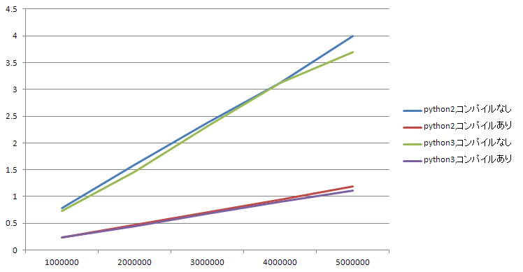

# {{this.$page.frontmatter.title}}

<Date/><ShowCategoriesOfPost/>

{{this.$page.frontmatter.description}}

<!--more-->

## 環境

```bash
$ python --version
Python 2.7.17
$ python3 --version
Python 3.6.9
```

## 正規表現のコンパイルとは

[docs.python.org#re.compile](https://docs.python.org/ja/3/library/re.html#re.compile)

正規表現パターン文字列を正規表現オブジェクトに変換する処理です。

まさしく上記のドキュメントに書いてありますが、

> ```python
> prog = re.compile(pattern)
> result = prog.match(string)
> ```
>
> は、以下と同等です
>
> ```python
> result = re.match(pattern, string)
> ```
>
> が、 `re.compile()` を使い、結果の正規表現オブジェクトを保存して再利用するほうが、一つのプログラムでその表現を何回も使うときに効率的です。

とあるように、コンパイルしなくとも正規表現のマッチングはできるのですが、結局マッチングの際に内部的にコンパイルが行われるため、同じ正規表現パターンを何度も使いまわす場合、コンパイルしておいた方が計算コストが下がるとのこと。

## 計測してみる

`01234567890-`の文字から重複を許して8文字並べた文字列を作成し、正規表現でそれが郵便番号に一致するかを判定するスクリプトで計測します。

正規表現は`[^0-9]`でステップ数をかさまししています。普通に`-`でいいです。

### コンパイルなし

```python
import random
import re
import sys
import time

def process(n):

  patern = "^\d{3}[^0-9]\d{4}$"
  char = '0123456789-'

  targets = []
  for i in range(n):
    targets.append(''.join([random.choice(char) for j in range(8)]))

  counter = 0
  start = time.time()

  for t in targets:
    if re.match(patern, t):
      counter += 1

  elapsed = time.time() - start
  print(str(counter) + " times matched. elapsed: " + str(elapsed))

if __name__ == "__main__":
  process(int(sys.argv[1]))
```

### コンパイルあり

```diff
 import random
 import re
 import sys
 import time

 def process(n):

   patern = "^\d{3}[^0-9]\d{4}$"
+  compiled = re.compile(patern)
   char = '0123456789-'

   targets = []
   for i in range(n):
     targets.append(''.join([random.choice(char) for j in range(8)]))

   counter = 0
   start = time.time()

   for t in targets:
-    if re.match(patern, t):
+    if compiled.match(t):
       counter += 1

   elapsed = time.time() - start
   print(str(counter) + " times matched. elapsed: " + str(elapsed))

 if __name__ == "__main__":
   process(int(sys.argv[1]))

```

### 結果

判定する文字列を100万個～500万個に変化させ、Python2, Python3それぞれで、コンパイルありなしを比較してみます。

それぞれ数回実行した平均値を取っています。

||1000000|2000000|3000000|4000000|5000000|
|---|---|---|---|---|---|
|python2,コンパイルなし|0.779161501|1.597813034|2.377787638|3.126527739|3.989367151|
|python2,コンパイルあり|0.24003973|0.476993608|0.709977448|0.943687598|1.190286875|
|python3,コンパイルなし|0.734194358|1.462329626|2.316887061|3.120065769|3.695157766|
|python3,コンパイルあり|0.231413285|0.445621729|0.675272306|0.9072059|1.110011101|

グラフにするとこう。Python2も3もコンパイルすると回数を重ねるほどに速いですね。



おわり。

<Comments />
