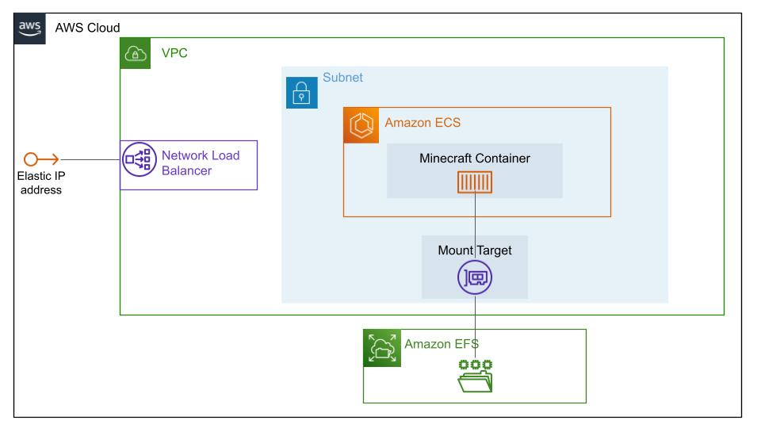

# {{this.$page.frontmatter.title}}

<Date/><CategoriesPerPost/>

{{this.$page.frontmatter.description}}

<!--more-->

## システム構成図

## terraform

[https://github.com/uda-cha/minecraft_on_aws_ecs](https://github.com/uda-cha/minecraft_on_aws_ecs)

`terraform apply`するだけで同じ環境が作れる(はず)

## 構成

* 1つのVPCとsubnetをつくって、その中に全部入れる
* Elastic IPとNLBを使って固定IPを設定
  * NLBのターゲットはVPC全体
  * NLBリスナー/ターゲットともにマイクラのポートのみ
* EFSを払い出し、ECSコンテナからマウントしてマインクラフトのデータを永続化する
* ECSクラスタをVPC内にデプロイ
  * ECSクラスタはVM管理が不要なFargateを選択
* コンテナイメージは[itzg/docker-minecraft-server](https://github.com/itzg/docker-minecraft-server)を拝借
* アプリケーションサーバはPaperを選択

外部公開やめたかったらNLB(とコンテナ自動で付与される動的グローバルIP)を削除するだけなので簡単。
データもEFSに永続化しているので、遊びたいときだけコンテナを起動して、料金を節約することもできます。

## やっていないこと

* ログ監視/メトリクス監視
  * CloudWatchからよしなにやりたい。
* 負荷検証
  * 負荷かけられるほどの人を集めることができない。
* グレースフルリスタート
  * そもそもマイクラのアーキテクチャとして可能なのかな？

## ハマったこと

### 一度ECSのサービスをつくってしまうと後からロードバランサを設定できない

固定IPほしかったのですが、ECSは動的パブリックIPしか払い出してくれないようでした。

そのためEIP + NLBで固定IPを付けようと思ったのですが、ECSサービス初期構築時しかロードバランサ設定できないみたいです。

結局サービス作りなおしました。Terraform化しといてよかった。

### EFSのマウントターゲッにもセキュリティグループを当てられる

マウントターゲットはNIC扱いらしいです。EFS触ったことなかったので知らなかった。

ECSクラスタからアクセスできるようにセキュリティグループを設定してやる必要があります。

私はECSクラスタのセキュリティグループからのアクセスのみEFSマウントターゲットへアクセスできるよう、セキュリティグループを設定しました。

## 感想

ECSはメモリ/CPUなどのリソースをかなり柔軟に設定できるのが良かったです。

自前でNLBを立てる必要はありましたが、固定IPでしかもHTTPやgRPCでないマイクラ独自のプロトコルを扱えるのも良かったです。
(案外独自プロトコル使えるPaaSってない気がする)

<Comments />
