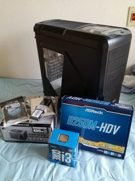
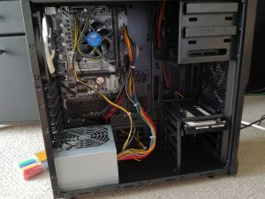
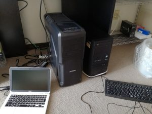

# {{this.$page.frontmatter.title}}

<Date/><CategoriesPerPost/>

{{this.$page.frontmatter.description}}

<!--more-->

あ！

あ！！！！！！！

でかすぎわろた。というわけでぱそこそつくりました。構成は以下の通り。

|項番|品名|価格|
|---|---|---|
|1|ZALMAN Z3 Plus (ATX ブラック)|5,280|
|2|Intel Core i3 7100 BOX|13,580|
|3|ASRock B250M-HDV (B250 1151 DDR4)|8,837|
|4|Kingston KVR21N15S8/4 (DDR4 PC4-17000 4GB)|3,800|
|5|玄人志向 KRPW-L5-400W/80+ (400W)|3,464|
|6|TOSHIBA DT01ACA100 バルク (1TB)|4,722|

合計: 39,683
  
組み立て始めてからBIOSが起動するとこまで3時間ほどで終わりました。初めてでぐぐりながらやったけどこんなもんでできちゃうんだね。パーツ間の相性はある程度調べたけど、最終的にはえいやで買っちゃいました。ファンの電源が足りてなくて4つ中3つしか動いてない以外は特に問題なく無事動いてよかった。これはそのうちなんとかします。

お値段は脅威の4万円以内。マザボケチればもうちょい安くできたけど、今後HDDを増設することを考えてSATAポートが6つあるちょっといいやつにしました。

いまの段階でOSのインストール(CentOS 7)までおわりました。OSのセットアップはこれから。インストール時には一悶着あったのでそれも別記事でまとめときたいと思います。おわり。
