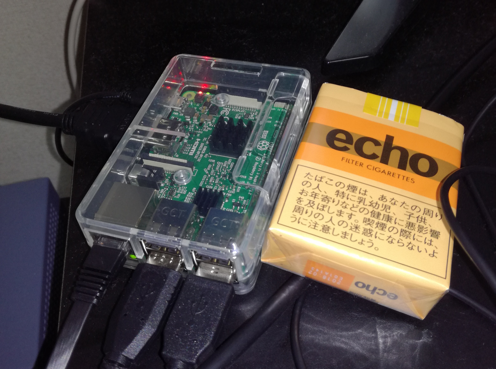
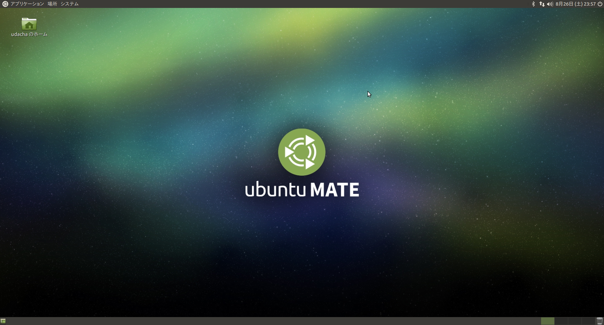
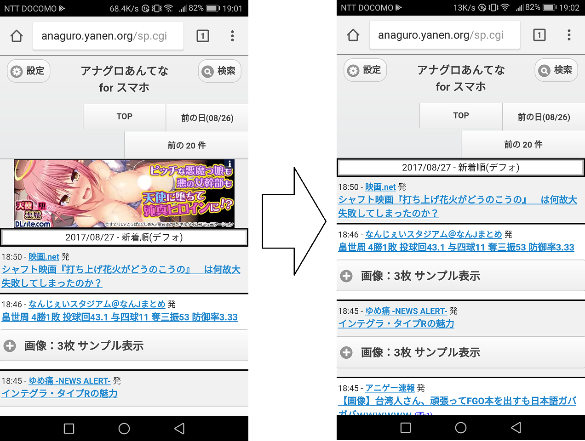

# {{this.$page.frontmatter.title}}

<Date/><CategoriesPerPost/>

{{this.$page.frontmatter.description}}

<!--more-->

## いきさつ

  1. Linuxエンジニアとして話題のラズパイは触っておきたい
  2. いつもレッドハット系なのでたまにはデビアン系OSを
      * Raspbianだと知識の汎用性が下がるからUbuntuで
      * ちゃんと動くか不安なのでラズパイ公認フレーバーのMATEで
  3. スマホ内に立ててる広告ブロック用プロキシがタスクキルですぐ落ちる
      * LAN内にプロキシサーバ立てちゃえばいいじゃん
      * プロキシサーバはおしごとで使うSquidで
  4. ラズパイはmicroSDカードを補助記憶に使うので故障が怖い
      * いつ壊れてもぱっと戻せるようにAnsibleで構築を自動化

## ラズパイとは



数年前から話題になってる超小型コンピュータ。もともと教育用に作られたコンピュータであり、大量導入を想定されているので、基盤だけなら5000円切って買えます。CPUはAMDのしょぼいやつでメモリは1G程度とチープですが、軽量Linuxなら問題なく動かせます。なおOSは自分でインストールする必要があります。

## 準備したもの

* Raspberry Pi 3 Model B(ケース付き)
* microSDカード(クラス4/8GB)
* HDMIケーブル
* 電源タップ(5V/3.0A スイッチ付き)
* 有線マウス/キーボード
* LANケーブル

本体(ケース付き)と電源タップのみ購入しました。計7560円。あとは家に転がってるものを流用しました。電源タップですが、ラズパイ本体には電源スイッチがなく、起動/終了はコンセントをいちいち抜き差しする必要がありめんどいので、スイッチ付きのをおすすめします。

## Ubuntu MATEのインストールメディアを作成

メイトではなくマテです。ちょっとマテ茶✋(^し^)bのマテ。<https://ubuntu-mate.org/download/>からUbuntu MATEのimg.xzファイルを落としてきて、7zipかなんかで解凍してimgファイルを取り出します。それをWIN32DiskImagerでmicroSDカードに書き込んで完了。

2017/08/26現在のリリースでは、解凍後のimgファイルのサイズは4GBほどでしたので、それ以上のサイズのmicroSDカードを準備します(インストール後でも余計なもん入れなければ4GB程度に収まります)。おれは家に転がってた8GBのクラス4のmicroSDカードを使いましたが、可能ならば16GB以上かつクラス10のものを使ったほうが快適かと。

## Ubuntu MATEのインストール

microSDカード、マウス、キーボード、HDMIケーブル、LANケーブルを本体に差してから電源タップを本体に差します。差しただけで勝手に起動します。あとは流れにそってOSをインストール。



MATEのデスクトップきれいでいいですね。ちなみにMATEはGNOME2からフォークしたデスクトップマネージャですが、本家Ubuntuが採用しているunityと比較して大幅に軽量です。さすがにラズビアンほどとまではいかないらしいですけど、ラズパイでもさほどストレスなく動いてくれます。

## OSの初期セットアップ

サーバのセットアップはAnsibleでやるつもりですが、Ansibleはssh越しに動作するため、最低限sshで通信できる必要があります。そこまでは手動でぽちぽちセットアップします。以下やったこと羅列。

```bash
nmtui #有線NICにIP、デフォゲ、DNSサーバ設定。IPv6無効化
sudo apt-get update
sudo apt-get upgrade #時間かかります
sudo apt-get install vim
sudo vim /etc/ssh/sshd_config
-PermitRootLogin prohibit-password
+PermitRootLogin no
sudo systemctl restart ssh
```

ここまでできたらログアウトし、マウスとキーボード、HDMIケーブルを引っこ抜いてOKです。あとはAnsibleでネットワーク越しに設定を投入します。

## Ansibleについて

Ansibleについては別記事書くつもりです。Ansibleとは、ネットワーク越しにコンフィギュレーションレイヤ(OSパラメータやソフトウェア)の構成管理を行うことができるツールです。今回はCentOS7の実機にAnsibleをepelリポジトリからインストールしました。これをAnsible実行端末とし、ネットワーク越しにラズパイへ構成管理を行います。

## Ansibleでやること

  1. ファイアウォール設定
  2. sambaのインストールと設定
  3. squidのインストールと設定

これらをAnsibleでやります。なぜSambaが必要かというと、squidで利用するブラックリストファイルをSambaでエクスポートしているディレクトリに置いておくことで、Windows機やスマホなどからもブラックリストを編集できるようにしたいためです。

なお、各種設定ファイルは全てAnsible実行端末上で作成しておき、Ansibleでそれをラズパイへ配布するようにします。こうすることでmicroSDカードがぶっこわれても、OS初期設定とAnsible実行だけでシステムを復元できるようになります。

## ラズパイ用各種設定ファイル作成

* smb.conf

[以前CnetOS7上に構築したSambaサーバ][1]の設定を全面流用。

```ini
[global]
dos charset = CP932
unix charset = UTF-8
workgroup = SEROTONINWG
server string = Samba %v on %h Linux
hosts allow = 192.168.100. localhost EXCEPT 192.168.100.1
netbios name = srtppc03
security = user
map to guest = bad user
dns proxy = no
log level = 3
#==========================================================
[Share]
path = /samba/share/
browsable =yes
writable = yes
guest ok = yes
guest only = yes
read only = no
create mode = 0777
directory mode = 0777
```

* blacklist

スマホで使ってたものを流用。ホスト名を一行にひとつずつ列挙します。ドメインで指定したい場合は頭に｢.｣をつければOK。たぶんぐぐればなんぼでもリストは見つかると思うし、使いながら追記していけばいいと思う。

```bash
#blacklist
.a8.net
.accesstrade.net
(中略)
ad-feed.com
ad.oret.jp
(後略)
```

* squid.conf

http_accessの内容は上から順番に処理されます。内容は以下です。

  1. ラズパイからの通信はすべて許可する
  2. LAN内への通信はすべて許可する
  3. 外部の80/443ポートへのblacklist記載ホスト/ドメインの通信はすべて拒否
  4. 上記にひっかからないLAN内から外部への通信は許可
  5. そのほかはすべて拒否

なお、microSDカードをいじめないためにキャッシュもしないしログも残しません。

```bash
http_port 8080
visible_hostname srtppc03

acl to_localnet dst 192.168.100.0/24
acl localnet src 192.168.100.0/24
acl blacklist dstdomain "/samba/share/blacklist"
acl internet_ports port 80 443
acl nocache src all

http_access allow localhost
http_access allow to_localnet
http_access deny internet_ports blacklist
http_access allow localnet
http_access deny all

cache deny nocache
cache_log none
cache_store_log none
```

## Ansibleのディレクトリ構成

各種ファイルを以下のディレクトリ構成で置いておきます。

```bash
[udacha@srtppc02 ansible]$ pwd
/etc/ansible
[udacha@srtppc02 ansible]$ tree --charset=hoge
.
|-- ansible.cfg
|-- files_to_distribute
| |-- blacklist
| |-- smb.conf
| `-- squid.conf
|-- squid.yml
|-- squid_development
`-- squid_production
```

## Ansibleの設定ファイル

* squid_development

開発環境のホストIPアドレスを記述しておくファイル。Ansible実行時に-iオプションでこのファイルを指定することで、開発環境へのAnsible実行が可能になります。なお開発環境はWindowsのVirtualBox上にVagrantで作りました。

```bash
192.168.100.203
```

* squid_production

本番環境のラズパイのIPアドレスを記述しておくファイル。本番環境へのAnsible実行時は-iオプションでこっちを指定。

```bash
192.168.100.103
```

* ansible.cfg

Ansibleの挙動を記述しておくファイル。詳しくは別途。テスト環境と本番環境で実行ユーザが変わるのをここで書いているんですがなんか気持ち悪いな。

```ini
[defaults]
log_path = "/var/log/ansible.log"
retry_files_enabled = False
#remote_user = vagrant
remote_user = udacha
become = True
#become_user = vagrant
become_user = udacha
become_ask_pass = True
```

* squid.yml

構築内容を記述したファイル。Playbookと呼ばれます。これも詳しくは別途。

```yaml
---
- hosts: all
  become: yes
  tasks:

## 1.ufw

  - name: 1.1.ufw dont leave logs
    ufw:
      logging: off

  - name: 1.2.ufw accept 22/tcp
    ufw:
      rule: allow
      port: 22
      proto: tcp

  - name: 1.3.1.ufw accept samba
    ufw:
      rule: allow
      port: 137,138
      proto: udp

  - name: 1.3.2.ufw accept samba
    ufw:
      rule: allow
      port: 139,445
      proto: tcp

  - name: 1.4.ufw accept 8080/tcp for squid
    ufw:
      rule: allow
      port: 8080
      proto: tcp

  - name: 1.5.ufw set default policy
    ufw:
      direction: incoming
      policy: deny

  - name: 1.6.ufw reload
    ufw:
      state: reloaded

  - name: 1.7.ufw enable
    ufw:
      state: enabled

##2.samba

  - name: 2.1.samba install
    apt:
      name: samba
      state: latest
      update_cache: yes

  - name: 2.2.samba mkdir
    file:
      path: /samba/share
      state: directory
      mode: 0777
      owner: nobody
      group: nogroup
      recurse: yes

  - name: 2.3.samba distribute config file
    copy:
      src: files_to_distribute/smb.conf
      dest: /etc/samba/smb.conf
      owner: udacha
      group: udacha
      mode: 0644
      backup: yes

  - name: 2.4.smbd enable and restart
    systemd:
      name: smbd
      enabled: yes
      state: restarted

  - name: 2.5.nmbd enable and restart
    systemd:
      name: nmbd
      enabled: yes
      state: restarted

## 3.squid

  - name: 3.1.squid install
    apt:
      name: squid
      state: latest

  - name: 3.2.squid distribute config file
    copy:
      src: files_to_distribute/squid.conf
      dest: /etc/squid/squid.conf
      owner: udacha
      group: udacha
      mode: 0644
      backup: yes

  - name: 3.3.squid distribute blacklist
    copy:
      src: files_to_distribute/blacklist
      dest: /samba/share/blacklist
      owner: nobody
      group: nogroup
      mode: 0666

  - name: 3.4.squid enable
    systemd:
      name: squid
      enabled: yes
      state: restarted

...
```

## Ansible実行

まず一度だけ普通にsshでAnsible実行端末からラズパイに接続します。構築対象のホスト公開鍵を実行端末に登録する必要があるためです。つながりさえすれば接続は切ってOK。

```bash
ssh udacha@192.168.100.103
```

んで以下のコマンドでAnsible実行。

```bash
ansible-playbook -vvv -k -K -i squid_production squid.yml
```

* -vvv：詳細情報を出力。vの数は1個～4個まで可能で、増やすごとにより詳しく実行内容が出力されます。
* -k：sshログイン時のパスワード設定。デフォルトだとssh公開鍵認証で接続しようとします。
* -K：sudo時のパスワード設定。sudo時にパスワードが必要な場合。vagrantで作った開発環境ではパスワードなしでsudoできるので不要です。
* -i：インベントリファイル指定。構築対象のIPアドレスなどが書かれたファイルを指定します。

ansibleが正常に終了したらOK。あとはこのプロキシサーバを利用するクライアント側で、プロキシに192.168.100.103:8080を指定すればおわり。

## 効果

プロキシがある場合とない場合での差はこんな感じ。広告を配信するサーバへのアクセスをblacklistに記述しておくことで、squidがそれをインターネットに見に行く前に403ではじきます。画面もすっきりするし、スマホの通信量も削減できるし良い感じ。

beforeとafter



## 不満

* LAN内設置なのでスマホのLTE通信では効果がない
* 使用しているモバイルルータを外で使う場合、当然LAN内にプロキシサーバは存在しなくなるので、いちいちプロキシを外さないといけない
* 普通のブラウジングなら問題ないが、巨大なファイルをダウンロードする際はラズパイの処理能力がかなりのボトルネックとなる

これらの不満はどっかのVPS借りてそこにプロキシサーバを構築することで解決できるのですが、そのために初期費用5000円だったり月額1000円だったりを払うのもアレです。とりあえずラズパイとsquidとAnsibleの勉強にはなったのでいいかな。

## 所感

SEになって一年半でだいぶいろんなことができるようになってきました。今後はスタンドアロンのサーバではなく、複数サーバが協調して動くシステムを構築してみたいけど、それに乗っけるコンテンツがない。Ansibleももうちょい勉強したい。おわり。

 [1]: https://www.serotoninpower.club/archives/160
