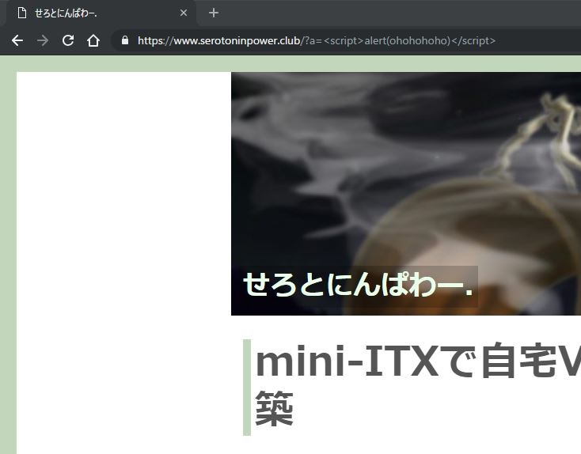
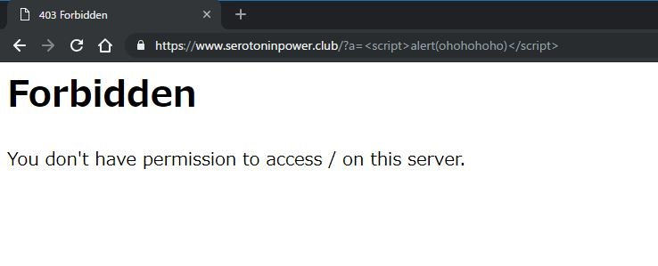

# {{this.$page.frontmatter.title}}

<Date/><CategoriesPerPost/>

{{this.$page.frontmatter.description}}

<!--more-->

## 要件

```bash
$ cat /etc/redhat-release
CentOS Linux release 7.5.1804 (Core)
$ httpd -v
Server version: Apache/2.4.6 (CentOS)
Server built: Jun 27 2018 13:48:59
```

いつの間にかCentOSも7.5になってたんですね。

ちなみに、`mod_security`をインストールすると、以下の二つのhttpdのモジュールが有効化されます。前者は`mod_security`本体で、後者はリクエストごとに一意なトークンを生成するモジュールです。

```bash
security2_module
unique_id_module
```

## インストール

mod_security本体と、WAFの基本ポリシーであるコアルールセット(CRS)をインストールします。epelから。

```bash
sudo yum install mod_security mod_security_crs --enablerepo=epel
```

すると、/etc/httpd/以下にこんなファイル/フォルダが追加されます。

```bash
|-- conf.d
|   `-- mod_security.conf
|-- conf.modules.d
|   `-- 10-mod_security.conf
`-- modsecurity.d
    |-- activated_rules
    |   |-- modsecurity_35_bad_robots.data
    |   |-- modsecurity_35_scanners.data
    |   |-- modsecurity_40_generic_attacks.data
    |   |-- modsecurity_50_outbound.data
    |   |-- modsecurity_50_outbound_malware.data
    |   |-- modsecurity_crs_20_protocol_violations.conf
    |   |-- modsecurity_crs_21_protocol_anomalies.conf
    |   |-- modsecurity_crs_23_request_limits.conf
    |   |-- modsecurity_crs_30_http_policy.conf
    |   |-- modsecurity_crs_35_bad_robots.conf
    |   |-- modsecurity_crs_40_generic_attacks.conf
    |   |-- modsecurity_crs_41_sql_injection_attacks.conf
    |   |-- modsecurity_crs_41_xss_attacks.conf
    |   |-- modsecurity_crs_42_tight_security.conf
    |   |-- modsecurity_crs_45_trojans.conf
    |   |-- modsecurity_crs_47_common_exceptions.conf
    |   |-- modsecurity_crs_48_local_exceptions.conf.example
    |   |-- modsecurity_crs_49_inbound_blocking.conf
    |   |-- modsecurity_crs_50_outbound.conf
    |   |-- modsecurity_crs_59_outbound_blocking.conf
    |   `-- modsecurity_crs_60_correlation.conf
    `-- modsecurity_crs_10_config.conf
```

あとはhttpdを再起動させると、WAFが有効になります。reloadだけじゃなんかうまくいかんかった。

```bash
sudo systemctl restart httpd
```

## 効果の確認

あやしげなクエリ文字列を投げてみます。mod_security導入前は素通りです。



導入後は、きちんとブロックしてくれてます。



ただし、WAFはデフォルトではかなり厳しいルールが入っています。実際、WAFが有効の状態で、このブログの管理画面にログオンすることができませんでした。

## DetectionOnlyモードでWAFのふるまいを観察する

そこで、いったん攻撃を遮断するモードから攻撃を検知だけするモードに変更し、ログを見ながらどんな監査が行われているのか確認します。

```bash
$ sudo vim mod_security.conf
(snip)
#SecRuleEngine On #これをコメントアウトして
SecRuleEngine DetectionOnly #こうする
(snip)
```

あとはしばらく適当に閲覧したりコメントしてみたり、思いつく動作を思いつくだけします。その後、ログを確認します。ちなみにこのログ、ものすごい勢いでサイズが増加していくため、ディスク容量には気を付けてください。

```bash
view /var/log/httpd/modsec_audit.log
```

さっきの例で出した怪しげなクエリ文字列については、以下のように検知されていました。なげえよ。

```bash
--50793211-A--
[10/Nov/2018:13:33:12 +0900] W@Zfh7xwJKqUw3UMLsYD5QAAAAU <アクセス元IPアドレス> 53034 153.122.115.60 443
--50793211-B--
GET /?a=%3Cscript%3Ealert(ohohohoho)%3C/script%3E HTTP/1.1
Host: www.serotoninpower.club
Connection: keep-alive
Cache-Control: max-age=0
Upgrade-Insecure-Requests: 1
User-Agent: Mozilla/5.0 (Windows NT 10.0; Win64; x64) AppleWebKit/537.36 (KHTML, like Gecko) Chrome/70.0.3538.77 Safari/537.36
Accept: text/html,application/xhtml+xml,application/xml;q=0.9,image/webp,image/apng,*/*;q=0.8
Accept-Encoding: gzip, deflate, br
Accept-Language: ja-JP,ja;q=0.9,en-US;q=0.8,en;q=0.7
Cookie: PHPSESSID=<検閲により削除>

--50793211-F--
HTTP/1.1 200 OK
Link: <https://www.serotoninpower.club/wp-json/>; rel="https://api.w.org/"
Strict-Transport-Security: max-age=315360000;
Keep-Alive: timeout=15, max=98
Connection: Keep-Alive
Transfer-Encoding: chunked
Content-Type: text/html; charset=UTF-8

--50793211-E--

--50793211-H--
Message: Warning. Pattern match "(?i:([\\s'\"`\xc2\xb4\xe2\x80\x99\xe2\x80\x98\\(\\)]*?)\\b([\\d\\w]++)([\\s'\"`\xc2\xb4\xe2\x80\x99\xe2\x80\x98\\(\\)]*?)(?:(?:=|<=>|r?like|sounds\\s+like|regexp)([\\s'\"`\xc2\xb4\xe2\x80\x99\xe2\x80\x98\\(\\)]*?)\\2\\b|(?:!=|<=|>=|<>|<|>|\\^|is\\s+not ..." at ARGS:a. [file "/etc/httpd/modsecurity.d/activated_rules/modsecurity_crs_41_sql_injection_attacks.conf"] [line "77"] [id "950901"] [rev "2"] [msg "SQL Injection Attack: SQL Tautology Detected."] [data "Matched Data: script>alert found within ARGS:a: <script>alert(ohohohoho)</script>"] [severity "CRITICAL"] [ver "OWASP_CRS/2.2.9"] [maturity "9"] [accuracy "8"] [tag "OWASP_CRS/WEB_ATTACK/SQL_INJECTION"] [tag "WASCTC/WASC-19"] [tag "OWASP_TOP_10/A1"] [tag "OWASP_AppSensor/CIE1"] [tag "PCI/6.5.2"]
Message: Warning. Pattern match "([\\~\\!\\@\\#\\$\\%\\^\\&\\*\\(\\)\\-\\+\\=\\{\\}\\[\\]\\|\\:\\;\"\\'\\\xc2\xb4\\\xe2\x80\x99\\\xe2\x80\x98\\`\\<\\>].*?){4,}" at ARGS:a. [file "/etc/httpd/modsecurity.d/activated_rules/modsecurity_crs_41_sql_injection_attacks.conf"] [line "159"] [id "981173"] [rev "2"] [msg "Restricted SQL Character Anomaly Detection Alert - Total # of special characters exceeded"] [data "Matched Data: < found within ARGS:a: <script>alert(ohohohoho)</script>"] [ver "OWASP_CRS/2.2.9"] [maturity "9"] [accuracy "8"] [tag "OWASP_CRS/WEB_ATTACK/SQL_INJECTION"]
Message: Warning. Pattern match "(?i)(<script[^>]*>[\\s\\S]*?<\\/script[^>]*>|<script[^>]*>[\\s\\S]*?<\\/script[[\\s\\S]]*[\\s\\S]|<script[^>]*>[\\s\\S]*?<\\/script[\\s]*[\\s]|<script[^>]*>[\\s\\S]*?<\\/script|<script[^>]*>[\\s\\S]*?)" at ARGS:a. [file "/etc/httpd/modsecurity.d/activated_rules/modsecurity_crs_41_xss_attacks.conf"] [line "14"] [id "973336"] [rev "1"] [msg "XSS Filter - Category 1: Script Tag Vector"] [data "Matched Data: <script>alert(ohohohoho)</script> found within ARGS:a: <script>alert(ohohohoho)</script>"] [severity "CRITICAL"] [ver "OWASP_CRS/2.2.9"] [maturity "1"] [accuracy "8"] [tag "OWASP_CRS/WEB_ATTACK/XSS"] [tag "WASCTC/WASC-8"] [tag "WASCTC/WASC-22"] [tag "OWASP_TOP_10/A2"] [tag "OWASP_AppSensor/IE1"] [tag "PCI/6.5.1"]
Message: Warning. Pattern match "\\balert\\b\\W*?\\(" at ARGS:a. [file "/etc/httpd/modsecurity.d/activated_rules/modsecurity_crs_41_xss_attacks.conf"] [line "163"] [id "958052"] [rev "2"] [msg "Cross-site Scripting (XSS) Attack"] [data "Matched Data: alert( found within ARGS:a: <script>alert(ohohohoho)</script>"] [severity "CRITICAL"] [ver "OWASP_CRS/2.2.9"] [maturity "8"] [accuracy "8"] [tag "OWASP_CRS/WEB_ATTACK/XSS"] [tag "WASCTC/WASC-8"] [tag "WASCTC/WASC-22"] [tag "OWASP_TOP_10/A2"] [tag "OWASP_AppSensor/IE1"] [tag "PCI/6.5.1"]
Message: Warning. Pattern match "\\< ?script\\b" at ARGS:a. [file "/etc/httpd/modsecurity.d/activated_rules/modsecurity_crs_41_xss_attacks.conf"] [line "211"] [id "958051"] [rev "2"] [msg "Cross-site Scripting (XSS) Attack"] [data "Matched Data: <script found within ARGS:a: <script>alert(ohohohoho)</script>"] [severity "CRITICAL"] [ver "OWASP_CRS/2.2.9"] [maturity "8"] [accuracy "8"] [tag "OWASP_CRS/WEB_ATTACK/XSS"] [tag "WASCTC/WASC-8"] [tag "WASCTC/WASC-22"] [tag "OWASP_TOP_10/A2"] [tag "OWASP_AppSensor/IE1"] [tag "PCI/6.5.1"]
Message: Warning. Pattern match "<(a|abbr|acronym|address|applet|area|audioscope|b|base|basefront|bdo|bgsound|big|blackface|blink|blockquote|body|bq|br|button|caption|center|cite|code|col|colgroup|comment|dd|del|dfn|dir|div|dl|dt|em|embed|fieldset|fn|font|form|frame|frameset|h1|head|h ..." at ARGS:a. [file "/etc/httpd/modsecurity.d/activated_rules/modsecurity_crs_41_xss_attacks.conf"] [line "301"] [id "973300"] [rev "2"] [msg "Possible XSS Attack Detected - HTML Tag Handler"] [data "Matched Data: <script> found within ARGS:a: <script>alert(ohohohoho)</script>"] [ver "OWASP_CRS/2.2.9"] [maturity "8"] [accuracy "8"] [tag "OWASP_CRS/WEB_ATTACK/XSS"] [tag "WASCTC/WASC-8"] [tag "WASCTC/WASC-22"] [tag "OWASP_TOP_10/A2"] [tag "OWASP_AppSensor/IE1"] [tag "PCI/6.5.1"]
Message: Warning. Pattern match "(fromcharcode|alert|eval)\\s*\\(" at ARGS:a. [file "/etc/httpd/modsecurity.d/activated_rules/modsecurity_crs_41_xss_attacks.conf"] [line "391"] [id "973307"] [rev "2"] [msg "XSS Attack Detected"] [data "Matched Data: alert( found within ARGS:a: <script>alert(ohohohoho)</script>"] [ver "OWASP_CRS/2.2.9"] [maturity "8"] [accuracy "8"] [tag "OWASP_CRS/WEB_ATTACK/XSS"] [tag "WASCTC/WASC-8"] [tag "WASCTC/WASC-22"] [tag "OWASP_TOP_10/A2"] [tag "OWASP_AppSensor/IE1"] [tag "PCI/6.5.1"]
Message: Warning. Pattern match "(?i:<script.*?>)" at ARGS:a. [file "/etc/httpd/modsecurity.d/activated_rules/modsecurity_crs_41_xss_attacks.conf"] [line "472"] [id "973331"] [rev "2"] [msg "IE XSS Filters - Attack Detected."] [data "Matched Data: <script> found within ARGS:a: <script>alert(ohohohoho)</script>"] [ver "OWASP_CRS/2.2.9"] [maturity "8"] [accuracy "8"] [tag "OWASP_CRS/WEB_ATTACK/XSS"] [tag "WASCTC/WASC-8"] [tag "WASCTC/WASC-22"] [tag "OWASP_TOP_10/A2"] [tag "OWASP_AppSensor/IE1"] [tag "PCI/6.5.1"]
Message: Warning. Operator GE matched 5 at TX:inbound_anomaly_score. [file "/etc/httpd/modsecurity.d/activated_rules/modsecurity_crs_60_correlation.conf"] [line "37"] [id "981204"] [msg "Inbound Anomaly Score Exceeded (Total Inbound Score: 38, SQLi=6, XSS=30): IE XSS Filters - Attack Detected."]
Apache-Error: [file "apache2_util.c"] [line 271] [level 3] [client <アクセス元IPアドレス>] ModSecurity: Warning. Pattern match "(?i:([\\\\\\\\s'\\\\"`\\\\xc2\\\\xb4\\\\xe2\\\\x80\\\\x99\\\\xe2\\\\x80\\\\x98\\\\\\\\(\\\\\\\\)]*?)\\\\\\\\b([\\\\\\\\d\\\\\\\\w]++)([\\\\\\\\s'\\\\"`\\\\xc2\\\\xb4\\\\xe2\\\\x80\\\\x99\\\\xe2\\\\x80\\\\x98\\\\\\\\(\\\\\\\\)]*?)(?:(?:=|<=>|r?like|sounds\\\\\\\\s+like|regexp)([\\\\\\\\s'\\\\"`\\\\xc2\\\\xb4\\\\xe2\\\\x80\\\\x99\\\\xe2\\\\x80\\\\x98\\\\\\\\(\\\\\\\\)]*?)\\\\\\\\2\\\\\\\\b|(?:!=|<=|>=|<>|<|>|\\\\\\\\^|is\\\\\\\\s+not ..." at ARGS:a. [file "/etc/httpd/modsecurity.d/activated_rules/modsecurity_crs_41_sql_injection_attacks.conf"] [line "77"] [id "950901"] [rev "2"] [msg "SQL Injection Attack: SQL Tautology Detected."] [data "Matched Data: script>alert found within ARGS:a: <script>alert(ohohohoho)</script>"] [severity "CRITICAL"] [ver "OWASP_CRS/2.2.9"] [maturity "9"] [accuracy "8"] [tag "OWASP_CRS/WEB_ATTACK/SQL_INJECTION"] [tag "WASCTC/WASC-19"] [tag "OWASP_TOP_10/A1"] [tag "OWASP_AppSensor/CIE1"] [tag "PCI/6.5.2"] [hostname "www.serotoninpower.club"] [uri "/"] [unique_id <検閲により削除>]
Apache-Error: [file "apache2_util.c"] [line 271] [level 3] [client <アクセス元IPアドレス>] ModSecurity: Warning. Pattern match "([\\\\\\\\~\\\\\\\\!\\\\\\\\@\\\\\\\\#\\\\\\\\$\\\\\\\\%\\\\\\\\^\\\\\\\\&\\\\\\\\*\\\\\\\\(\\\\\\\\)\\\\\\\\-\\\\\\\\+\\\\\\\\=\\\\\\\\{\\\\\\\\}\\\\\\\\[\\\\\\\\]\\\\\\\\|\\\\\\\\:\\\\\\\\;\\\\"\\\\\\\\'\\\\\\\\\\\\xc2\\\\xb4\\\\\\\\\\\\xe2\\\\x80\\\\x99\\\\\\\\\\\\xe2\\\\x80\\\\x98\\\\\\\\`\\\\\\\\<\\\\\\\\>].*?){4,}" at ARGS:a. [file "/etc/httpd/modsecurity.d/activated_rules/modsecurity_crs_41_sql_injection_attacks.conf"] [line "159"] [id "981173"] [rev "2"] [msg "Restricted SQL Character Anomaly Detection Alert - Total # of special characters exceeded"] [data "Matched Data: < found within ARGS:a: <script>alert(ohohohoho)</script>"] [ver "OWASP_CRS/2.2.9"] [maturity "9"] [accuracy "8"] [tag "OWASP_CRS/WEB_ATTACK/SQL_INJECTION"] [hostname "www.serotoninpower.club"] [uri "/"] [unique_id <検閲により削除>]
Apache-Error: [file "apache2_util.c"] [line 271] [level 3] [client <アクセス元IPアドレス>] ModSecurity: Warning. Pattern match "(?i)(<script[^>]*>[\\\\\\\\s\\\\\\\\S]*?<\\\\\\\\/script[^>]*>|<script[^>]*>[\\\\\\\\s\\\\\\\\S]*?<\\\\\\\\/script[[\\\\\\\\s\\\\\\\\S]]*[\\\\\\\\s\\\\\\\\S]|<script[^>]*>[\\\\\\\\s\\\\\\\\S]*?<\\\\\\\\/script[\\\\\\\\s]*[\\\\\\\\s]|<script[^>]*>[\\\\\\\\s\\\\\\\\S]*?<\\\\\\\\/script|<script[^>]*>[\\\\\\\\s\\\\\\\\S]*?)" at ARGS:a. [file "/etc/httpd/modsecurity.d/activated_rules/modsecurity_crs_41_xss_attacks.conf"] [line "14"] [id "973336"] [rev "1"] [msg "XSS Filter - Category 1: Script Tag Vector"] [data "Matched Data: <script>alert(ohohohoho)</script> found within ARGS:a: <script>alert(ohohohoho)</script>"] [severity "CRITICAL"] [ver "OWASP_CRS/2.2.9"] [maturity "1"] [accuracy "8"] [tag "OWASP_CRS/WEB_ATTACK/XSS"] [tag "WASCTC/WASC-8"] [tag "WASCTC/WASC-22"] [tag "OWASP_TOP_10/A2"] [tag "OWASP_AppSensor/IE1"] [tag "PCI/6.5.1"] [hostname "www.serotoninpower.club"] [uri "/"] [unique_id <検閲により削除>]
Apache-Error: [file "apache2_util.c"] [line 271] [level 3] [client <アクセス元IPアドレス>] ModSecurity: Warning. Pattern match "\\\\\\\\balert\\\\\\\\b\\\\\\\\W*?\\\\\\\\(" at ARGS:a. [file "/etc/httpd/modsecurity.d/activated_rules/modsecurity_crs_41_xss_attacks.conf"] [line "163"] [id "958052"] [rev "2"] [msg "Cross-site Scripting (XSS) Attack"] [data "Matched Data: alert( found within ARGS:a: <script>alert(ohohohoho)</script>"] [severity "CRITICAL"] [ver "OWASP_CRS/2.2.9"] [maturity "8"] [accuracy "8"] [tag "OWASP_CRS/WEB_ATTACK/XSS"] [tag "WASCTC/WASC-8"] [tag "WASCTC/WASC-22"] [tag "OWASP_TOP_10/A2"] [tag "OWASP_AppSensor/IE1"] [tag "PCI/6.5.1"] [hostname "www.serotoninpower.club"] [uri "/"] [unique_id <検閲により削除>]
Apache-Error: [file "apache2_util.c"] [line 271] [level 3] [client <アクセス元IPアドレス>] ModSecurity: Warning. Pattern match "\\\\\\\\< ?script\\\\\\\\b" at ARGS:a. [file "/etc/httpd/modsecurity.d/activated_rules/modsecurity_crs_41_xss_attacks.conf"] [line "211"] [id "958051"] [rev "2"] [msg "Cross-site Scripting (XSS) Attack"] [data "Matched Data: <script found within ARGS:a: <script>alert(ohohohoho)</script>"] [severity "CRITICAL"] [ver "OWASP_CRS/2.2.9"] [maturity "8"] [accuracy "8"] [tag "OWASP_CRS/WEB_ATTACK/XSS"] [tag "WASCTC/WASC-8"] [tag "WASCTC/WASC-22"] [tag "OWASP_TOP_10/A2"] [tag "OWASP_AppSensor/IE1"] [tag "PCI/6.5.1"] [hostname "www.serotoninpower.club"] [uri "/"] [unique_id <検閲により削除>]
Apache-Error: [file "apache2_util.c"] [line 271] [level 3] [client <アクセス元IPアドレス>] ModSecurity: Warning. Pattern match "<(a|abbr|acronym|address|applet|area|audioscope|b|base|basefront|bdo|bgsound|big|blackface|blink|blockquote|body|bq|br|button|caption|center|cite|code|col|colgroup|comment|dd|del|dfn|dir|div|dl|dt|em|embed|fieldset|fn|font|form|frame|frameset|h1|head|h ..." at ARGS:a. [file "/etc/httpd/modsecurity.d/activated_rules/modsecurity_crs_41_xss_attacks.conf"] [line "301"] [id "973300"] [rev "2"] [msg "Possible XSS Attack Detected - HTML Tag Handler"] [data "Matched Data: <script> found within ARGS:a: <script>alert(ohohohoho)</script>"] [ver "OWASP_CRS/2.2.9"] [maturity "8"] [accuracy "8"] [tag "OWASP_CRS/WEB_ATTACK/XSS"] [tag "WASCTC/WASC-8"] [tag "WASCTC/WASC-22"] [tag "OWASP_TOP_10/A2"] [tag "OWASP_AppSensor/IE1"] [tag "PCI/6.5.1"] [hostname "www.serotoninpower.club"] [uri "/"] [unique_id <検閲により削除>]
Apache-Error: [file "apache2_util.c"] [line 271] [level 3] [client <アクセス元IPアドレス>] ModSecurity: Warning. Pattern match "(fromcharcode|alert|eval)\\\\\\\\s*\\\\\\\\(" at ARGS:a. [file "/etc/httpd/modsecurity.d/activated_rules/modsecurity_crs_41_xss_attacks.conf"] [line "391"] [id "973307"] [rev "2"] [msg "XSS Attack Detected"] [data "Matched Data: alert( found within ARGS:a: <script>alert(ohohohoho)</script>"] [ver "OWASP_CRS/2.2.9"] [maturity "8"] [accuracy "8"] [tag "OWASP_CRS/WEB_ATTACK/XSS"] [tag "WASCTC/WASC-8"] [tag "WASCTC/WASC-22"] [tag "OWASP_TOP_10/A2"] [tag "OWASP_AppSensor/IE1"] [tag "PCI/6.5.1"] [hostname "www.serotoninpower.club"] [uri "/"] [unique_id <検閲により削除>]
Apache-Error: [file "apache2_util.c"] [line 271] [level 3] [client <アクセス元IPアドレス>] ModSecurity: Warning. Pattern match "(?i:<script.*?>)" at ARGS:a. [file "/etc/httpd/modsecurity.d/activated_rules/modsecurity_crs_41_xss_attacks.conf"] [line "472"] [id "973331"] [rev "2"] [msg "IE XSS Filters - Attack Detected."] [data "Matched Data: <script> found within ARGS:a: <script>alert(ohohohoho)</script>"] [ver "OWASP_CRS/2.2.9"] [maturity "8"] [accuracy "8"] [tag "OWASP_CRS/WEB_ATTACK/XSS"] [tag "WASCTC/WASC-8"] [tag "WASCTC/WASC-22"] [tag "OWASP_TOP_10/A2"] [tag "OWASP_AppSensor/IE1"] [tag "PCI/6.5.1"] [hostname "www.serotoninpower.club"] [uri "/"] [unique_id <検閲により削除>]
Apache-Error: [file "apache2_util.c"] [line 271] [level 3] [client <アクセス元IPアドレス>] ModSecurity: Warning. Operator GE matched 5 at TX:inbound_anomaly_score. [file "/etc/httpd/modsecurity.d/activated_rules/modsecurity_crs_60_correlation.conf"] [line "37"] [id "981204"] [msg "Inbound Anomaly Score Exceeded (Total Inbound Score: 38, SQLi=6, XSS=30): IE XSS Filters - Attack Detected."] [hostname "www.serotoninpower.club"] [uri "/index.php"] [unique_id <検閲により削除>]
Apache-Handler: application/x-httpd-php
Stopwatch: 1541824391841145 608640 (- - -)
Stopwatch2: 1541824391841145 608640; combined=3985, p1=396, p2=3327, p3=6, p4=100, p5=155, sr=82, sw=1, l=0, gc=0
Response-Body-Transformed: Dechunked
Producer: ModSecurity for Apache/2.9.2 (http://www.modsecurity.org/); OWASP_CRS/2.2.9.
Server: Apache
Engine-Mode: "DETECTION_ONLY"

--50793211-Z--
```

## ログの読み方

上記例では、`-50793211-A-`からセクションが始まり、`-50793211-B-`、`-50793211-F-`と続いていき、`-50793211-Z-`で終わっています。この50793211という数字がトランザクションIDで、その後の英語大文字一文字は、ログのパートを示します。それぞれ以下の意味。(参照：<https://github.com/SpiderLabs/ModSecurity/wiki/ModSecurity-2-Data-Formats#parts>。基本的にWikiになんでも書いてあります。)

- A - 監査ログのヘッダ
- B - HTTPリクエストヘッダ
- C - HTTPリクエストボディ
- D - 未実装
- E - 返そうとしたHTTPレスポンスボディ
- F - HTTPレスポンスヘッダ
- G - 未実装
- H - 監査証跡
- I - アップロードファイル等を削除したHTTPレスポンスボディ
- J - 未実装
- K - マッチした全てのルールの情報
- Z - 監査ログのフッタ

大事なのがH。Hの中に、このトランザクションはどのidのルールでひっかかったか、なんで検知したか(msg)、そのルールidが記載されているファイルはどこにあるか等が書いてあります。今回はIDとなぜ検知されたかを並べてみます。

```bash
950901：
　msg "SQL Injection Attack: SQL Tautology Detected."
981173：
　msg "Restricted SQL Character Anomaly Detection Alert - Total # of special characters exceeded"
973336：
　msg "XSS Filter - Category 1: Script Tag Vector"
958052：
　msg "Cross-site Scripting (XSS) Attack"
958051：
　msg "Cross-site Scripting (XSS) Attack"
973300：
　msg "Possible XSS Attack Detected - HTML Tag Handler"
973307：
　msg "XSS Attack Detected"
973331：
　msg "IE XSS Filters - Attack Detected."
981204：
　msg "Inbound Anomaly Score Exceeded (Total Inbound Score: 38, SQLi=6, XSS=30): IE XSS Filters - Attack Detected."
```

クエリ文字列にJavaScriptぶっこんだだけですけど、SQLインジェクションとしても検知されているようですね。こんな感じで誤検知(偽陽性)がたくさん出ます。

## 偽陽性の削減

どれが偽陽性かがわかれば、それをホワイトリスト形式でコンフィグファイルに記載することで、監査をスルーすることができます。ホワイトリストの書き方はたくさんあります。

ルール定義ファイル自体を指定して除外。

```bash
$ sudo vim /etc/httpd/conf.d/mod_secuirty.conf
(snip)
  #これをコメントアウト
  #Include modsecurity.d/activated_rules/*.conf
  #特定のルール定義ファイル(下記例ではXSS関連のルール定義ファイル)のみ読み込む
  Include modsecurity.d/activated_rules/modsecurity_crs_41_xss_attacks.conf
(snip)
```

ルールIDを指定して除外。

```bash
$ sudo vim /etc/httpd/conf.d/mod_secuirty.conf
(snip)
  SecRuleRemoveById 950901
(snip)
```

定義ファイルやルールIDでWebサイト全体をまるっとホワイトリスト化すると不安な場合は、各種コンテナで範囲を絞ることも可能。また、特定のディレクトリにはそもそも監査をしないという設定も、コンテナ内でのSecRuleEngineの上書きにて可能。

```bash
$ sudo vim /etc/httpd/conf.d/mod_secuirty.conf
(snip)
  <Directory "/var/www/html/hogehoge">
    SecRuleRemoveById 950901
  </Directory>
(snip)
  <Files "*.txt">
    SecRuleRemoveById 950901
  </Files>
(snip)
  <Location "/hogehoge">
    SecRuleEngine Off
  </Location>
(snip)
```

アクセス元のアドレスやドメインで一括許可設定を入れる場合は、SecRuleを使います。詳しい構文はWiki参照。`REMOTE_ADDR`や`REMOTE_HOST`には正規表現が使えます。phaseはそのルールを処理するタイミング。アクセス元を判断するのにHTTPリクエストボディを見る必要はないので1(ヘッダを見た瞬間に処理)を指定。idについては、デフォルトで利用されている200000番台や、CRSに予約されている900000番台以外を適当に利用してかまいません。ちなみにドメインを見る場合は、HostnameLookupsをオンにするの忘れないように(忘れてしばらくはまってたのって誰のことなんだ……)。

```bash
$ sudo vim /etc/httpd/conf.d/mod_secuirty.conf
(snip)
  SecRule REMOTE_ADDR "^127\.0\.0\.1$" "phase:1,nolog,allow,ctl:ruleEngine=Off,ctl:auditEngine=Off,id:1000"
  SecRule REMOTE_HOST "\.piyo\.hoge\.jp$" "phase:1,nolog,allow,ctl:ruleEngine=Off,ctl:auditEngine=Off,id:1001"
(snip)
```

ちなみに、たぶんこれ偽陽性なんだろうけどほんとに無効化しちゃっていいのかな……と不安になったら、各ルールIDにどれくらい偽陽性の可能性があるのかを統計とったサイトがあるので、参考になります。｢very frequent false positives｣って書いてあったらまぁ無効化しちゃっていいんじゃないですかね。サイト全体で無効化するのではなく、コンテナで範囲は絞ったほうがいいけど。

<https://www.netnea.com/cms/2016/01/17/most-frequent-false-positives-triggered-by-owasp-modsecurity-core-rules-2-2-x/>

私はいったん全部自宅からのアクセスは全許可にして、あとは以下の設定を入れてWAFを遮断モード(SecRuleEngine On)に切り替えました。ログと格闘しましたが、この設定を入れないとコメントが一切できなくなるようです。

```bash
<Files wp-comments-post.php>
  SecRuleRemoveById 960024
  SecRuleRemoveById 970901
  SecRuleRemoveById 981243
</Files>
```

あとは運用しながら考えます。なんかアクセスできないとかあったら教えてください。たぶんPOSTメソッドが使われるコメントまわりは怪しい。変な文字列入ったコメントはひっかかりそう(そもそもコメント来ないけど……)。

## おまけ:  ログについて

`mod_security`は、デフォルトだと`modsec_audit.logとerror_log`の両方にログを吐きます。通常どちらかだけで良いと思います。`modsecurity.d/modsecurity_crs_10_config.conf`を以下の通り修正。

```bash
(~snip~)
# -- [[ Alert Logging Control ]] --
# You have three options -
#
# - To log to both the Apache error_log and ModSecurity audit_log file use: "log"
# - To log *only* to the ModSecurity audit_log file use: "nolog,auditlog"
# - To log *only* to the Apache error_log file use: "log,noauditlog"
#
# Ref: http://blog.spiderlabs.com/2010/11/advanced-topic-of-the-week-traditional-vs-anomaly-scoring-detection-modes.html
# Ref: https://github.com/SpiderLabs/ModSecurity/wiki/Reference-Manual#wiki-SecDefaultAction
#
#SecDefaultAction "phase:1,deny,log"
#SecDefaultAction "phase:2,deny,log"
SecDefaultAction "phase:1,deny,nolog,auditlog"
SecDefaultAction "phase:2,deny,nolog,auditlog"
(~snip~)
```
