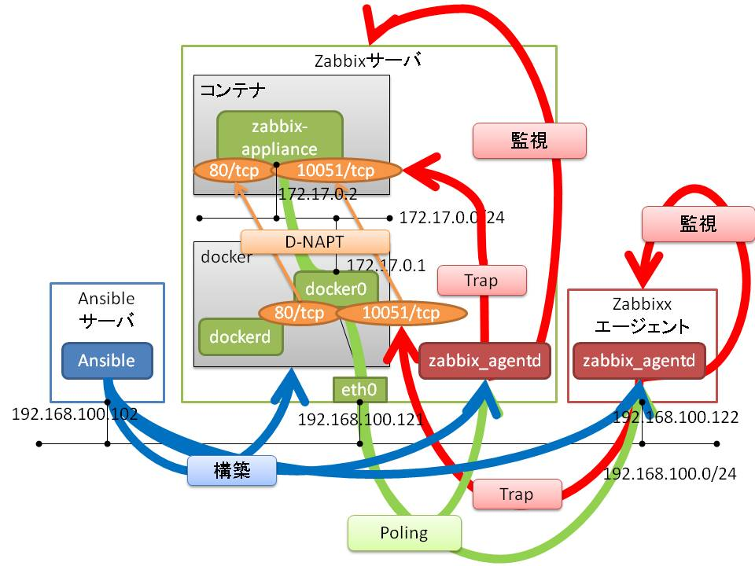
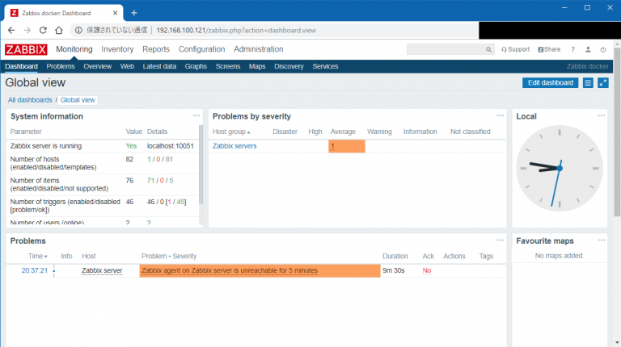
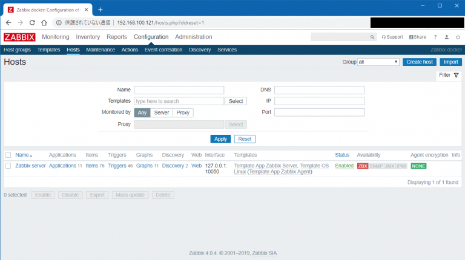
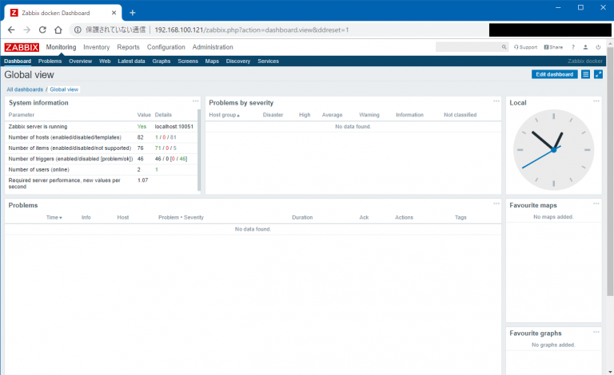
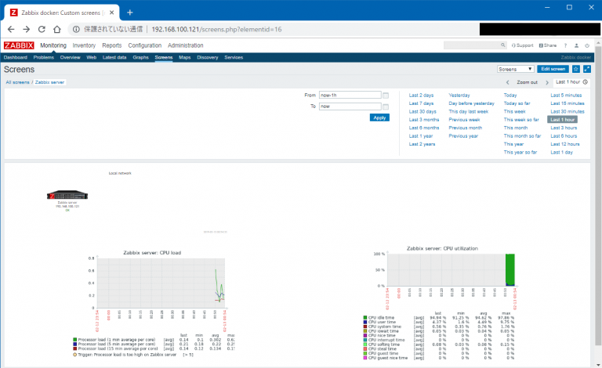
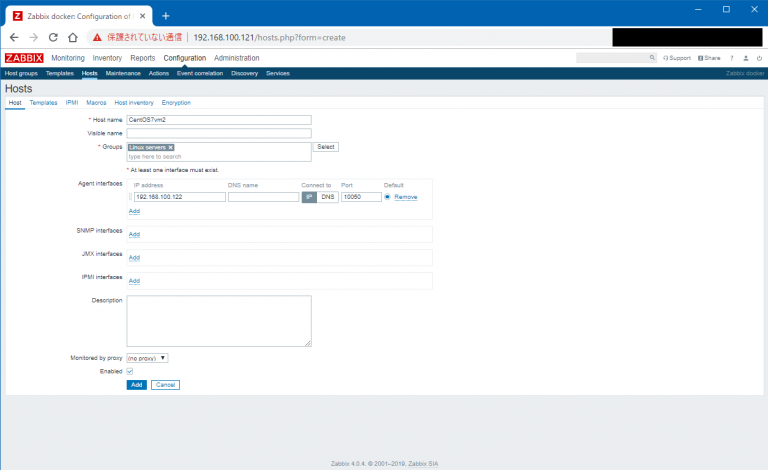
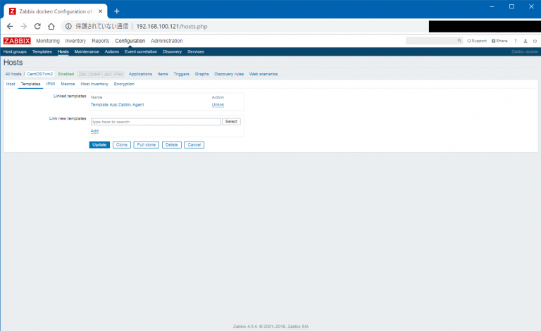
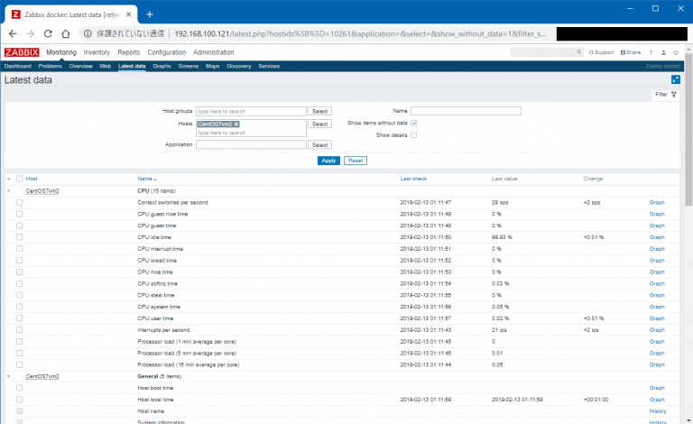

# {{this.$page.frontmatter.title}}

<Date/><CategoriesPerPost/>

{{this.$page.frontmatter.description}}

<!--more-->

## 構成

う～ん図示能力がうんこ！ｗ Zabbixサーバに入れる`zabbix_agentd`とZabbixエージェントに入れる`zabbix_agentd`でPoling/Trap通信の流れが異なることがポイント。後で詳述します。



## 環境

本ブログを書く検証用にZabbixサーバ、ZabbixエージェントはVagrantで作成しました。実際に運用中のZabbixサーバはおうちESXi上で稼働しており、エージェントはいろんなサーバに入っています。

### Zabbixサーバ

```bash
$ hostname -I | awk '{print $2}'
 192.168.100.121
$ cat /etc/redhat-release
 CentOS Linux release 7.6.1810 (Core)
$ docker --version
Docker version 18.09.2, build 6247962
$ docker images -a
REPOSITORY                TAG                 IMAGE ID            CREATED             SIZE
zabbix/zabbix-appliance   centos-latest       56f2068934be        3 weeks ago         645MB
```

### Zabbixエージェント

zabbid_agentdについては同じものをZabbixサーバにも入れます。

```bash
$ hostname -I | awk '{print $2}'
 192.168.100.122
$ cat /etc/redhat-release
 CentOS Linux release 7.6.1810 (Core)
$ zabbix_agentd -V
zabbix_agentd (daemon) (Zabbix) 3.0.22
Revision 84876 14 September 2018, compilation time: Sep 18 2018 21:31:35

Copyright (C) 2018 Zabbix SIA
License GPLv2+: GNU GPL version 2 or later &lt;http://gnu.org/licenses/gpl.html&gt;.
This is free software: you are free to change and redistribute it according to
the license. There is NO WARRANTY, to the extent permitted by law.
```

### Ansibleサーバ

```bash
$ hostname -I | awk '{print $2}'
 192.168.100.102
$ cat /etc/redhat-release
 CentOS Linux release 7.5.1804 (Core)
$ ansible --version
 ansible 2.6.3
   config file = /etc/ansible/ansible.cfg
   configured module search path = [u'/home/udacha/.ansible/plugins/modules', u'/usr/share/ansible/plugins/modules']
   ansible python module location = /usr/lib/python2.7/site-packages/ansible
   executable location = /usr/bin/ansible
   python version = 2.7.5 (default, Jul 13 2018, 13:06:57) [GCC 4.8.5 20150623 (Red Hat 4.8.5-28)]
```

## Ansibleでdockerを構築

まずはAnsibleサーバで作業。dockerをインストールするroleを作ります。CentOS7にしか対応していない作りこみの浅いRole。構築手順自体は[docker公式][1]にありますので、それをしこしこRoleに落とし込んでいく。

```bash
$ tree /etc/ansible/roles/install_docker --charset=N
/etc/ansible/roles/install_docker
|-- handlers
|   `-- main.yml
`-- tasks
    `-- main.yml

2 directories, 2 files
```

### dockerインストール用tasks/main.yml

作業用フォルダを作るtaskがありますが、本手順ではなくてもいいです。

```yaml
---
- name: install prerequisite packages of docker(yum)
  yum:
    name:
      - yum-utils
      - device-mapper-persistent-data
      - lvm2
    state: latest
    update_cache: yes
  when: "ansible_pkg_mgr == 'yum'"
  notify: restart docker

- name: add docker repository
  get_url:
    url: https://download.docker.com/linux/centos/docker-ce.repo
    dest: /etc/yum.repos.d/

- name: install docker(yum)
  yum:
    name: docker-ce
    state: latest
    update_cache: yes
  when: "ansible_pkg_mgr == 'yum'"
  notify: restart docker

- name: enable docker(RedHat)
  systemd:
    name: docker
    enabled: yes
  when: "ansible_os_family == 'RedHat'"

- name: add current user to docker group
  user:
    name: "{{ ansible_ssh_user }}"
    append: yes
    groups: docker
    state: present

- name: create work folder for docker
  file:
    path: /etc/docker/work
    state: directory
    owner: "{{ ansible_ssh_user }}"
    group: "{{ ansible_ssh_user }}"
    mode: 0755
...
```

### dockerインストール用handlers/main.yml

```yaml
---
- name: restart docker(RedHat)
  systemd:
    name: docker
    state: restarted
  when: "ansible_os_family == 'RedHat'"
  listen: restart docker
...
```

### dockerインストール用インベントリファイル(docker_hosts)

Ansibleの構築対象の情報を記載するファイルです。

```ini
192.168.100.121

[all:vars]
ansible_ssh_user=vagrant
ansible_become=true
ansible_become_method=sudo
```

### dockerインストール用 Playbook(docker_main.yml)

roleを呼び出すだけのPlaybookを作成します。

```yaml
---
- hosts: all
  roles:
    - install_docker
```

### zabbix_agentdインストールansible-playbookコマンド実行

ansible-playbookコマンドを利用します。-kオプションで`ansible_ssh_user`のログインパスワードを対話的に入力します。sudo時にパスワード入力が必要な環境では、-Kオプションを付与してsudoパスワードも対話的に入力するようにします。

Ansibleを実行してしまう前に、 `--syntax-check`オプションで文法確認を、`--check`オプションを付与してdry runをしたほうがいいです。ただdry runでは、前のtaskにて起こった変更内容に依存するtaskを後ろで走らせる場合など、うまくチェックできないことがあります。

ちなみに事前にAnsibleサーバから手動でsshで構築対象に接続しておかないと、known_hostsにない知らないサーバだよって怒られるのでやっておきます。

```bash
cd /etc/ansible
ansible-playbook -v -i docker_hosts docker_main.yml -k
```

ずらっと構築内容が表示されて、最後のPLAY RECAPでunreachableやfailedが出ていなければOK。ユーザのdockerグループへの追加があったため、一旦Zabbixサーバをリブートします。これリブートもhandlerでやればいいのに後で気付いた。

## Zabbix Applianceの起動

ここからはZabbixサーバで作業します。[Zabbix Appliance公式のdockerイメージのサイト][2]にコマンドやイメージ名、タグについて説明してあります。

-pオプションの80:80や10051:10051はdocker仮想ブリッジのNAPT設定。XX:YYと記載した場合、dockerホストのXX番ポートにアクセスが来たらコンテナのYY番ポートにNAPTします。なおホスト側のfirewalldは穴を空けるか切るかしておいてください。-eオプションはコンテナに環境変数を渡すオプション。dockerは大体そうなのですが、細かい設定はこのように環境変数で渡すことが多いです。

Zabbix Applianceの公式サイトに記載がある通り、PHPのタイムゾーンは環境変数として渡せます。また、ホストディスカバリを行うプロセス数を増やす(増やさないとZabbix discoverer processes more than 75% busyというエラーが1時間おきくらいに発生する)ためにZBX\_STARTDISCOVERERS=3を、ESXiのディスカバリを有効にしたいためZBX\_STARTVMWARECOLLECTORS=2を付与しています(1だとSTARTDISCOVERERS同様プロセスが詰まる)。

-dオプションはデーモンとしてコンテナを起動するオプション。つけないと標準出力をコンテナに奪われます。

```bash
docker run -d -p 80:80 -p 10051:10051 -e PHP_TZ=Asia/Tokyo -e ZBX_STARTDISCOVERERS=3 -e ZBX_STARTVMWARECOLLECTORS=2 -d zabbix/zabbix-appliance:centos-latest
```

起動が完了したらブラウザからdockerホストのIPアドレスにアクセス。ユーザ名Admin、パスワードzabbixでログオンできます。zabbixサーバがzabbid_agentd と通信できていないよってProblemが出ていますので次のステップで入れます。



## zabbid_agentdをAnsibleでインストール

ここからはまたAnsibleサーバで作業。`zabbid_agentd`は、エージェントの検証用に立てたZabbixエージェントマシンと、Zabbix Applianceを動かしているdockerホストのZabbixサーバマシンの両方に入れ、両方監視します。後者については要注意なので、あとで詳述します。なお、`zabbid_agentd`はdockerコンテナではなく直接インストールします。

作成したRoleはCentOS7とDebian系に対応しています。CentOS7の方はfirewalldが動いていることを前提とします。動いていないとfirewalldのルールを作成しようとした際にこけます。

```bash
$ tree /etc/ansible/roles/install_zabbix_agent --charset=N
/etc/ansible/roles/install_zabbix_agent
|-- handlers
|   `-- main.yml
`-- tasks
    `-- main.yml

2 directories, 2 files
```

### zabbin_agentdインストール用tasks/main.yml

```yaml
---
- name: install prerequisite packages of zabbix agent(yum)
  yum:
    name: epel-release
    state: latest
    update_cache: yes
  when: "ansible_pkg_mgr == 'yum'"

- name: install zabbix agent(yum)
  yum:
    name: zabbix30-agent
    state: latest
    update_cache: yes
    enablerepo: epel
  when: "ansible_pkg_mgr == 'yum'"
  notify: restart zabbix agent

- name: install zabbix agent(apt)
  apt:
    name: zabbix-agent
    state: latest
    update_cache: yes
  when: "ansible_pkg_mgr == 'apt'"
  notify: restart zabbix agent

- name: allow 10050/tcp by firewalld
  firewalld:
    port: 10050/tcp
    permanent: yes
    state: enabled
    immediate: yes
  when: "ansible_os_family == 'RedHat'"
  notify: reload firewalld

- name: allow 10050/tcp by ufw
  ufw:
    rule: allow
    port: 10050
    proto: tcp
  when: "ansible_os_family == 'Debian'"
  notify: reload ufw

- name: edit zabbix_agentd.conf
  lineinfile:
    path: /etc/zabbix/zabbix_agentd.conf
    regexp: "{{ item.regexp }}"
    insertafter: "{{ item.insertafter }}"
    line: "{{ item.line }}"
    backrefs: "{{ item.backrefs }}"
    state: present
  with_items:
    - { regexp: '^Server=', insertafter: '^#Server=', line: "Server={{ zbxsv_address }}", backrefs: "no" }
    - { regexp: '^ServerActive=', insertafter: '^#ServerActive=', line: "ServerActive={{ zbxsv_address }}", backrefs: "no" }
    - { regexp: '^Hostname=', insertafter: 'ignored_by_backrefs', line: "#Hostname=", backrefs: "yes" }
    - { regexp: '^HostnameItem=', insertafter: '^#HostnameItem=', line: "HostnameItem=system.hostname", backrefs: "no" }
    - { regexp: '^HostMetadata=', insertafter: '^#HostMetadata=', line: "HostMetadata=webserver", backrefs: "no" }
  notify: restart zabbix agent

- name: enable zabbix agent
  systemd:
    name: zabbix-agent
    enabled: yes
  notify: restart zabbix agent
...
```

### zabbin_agentdインストール用handlers/main.yml

```yaml
---
- name: restart zabbix agent
  systemd:
    name: zabbix-agent
    state: restarted
  listen: restart zabbix agent

- name: reload ufw
  systemd:
    name: ufw
    state: restarted
  listen: reload ufw

- name: reload firewalld
  systemd:
    name: firewalld
    state: restarted
  listen: reload firewalld
...
```

### zabbid_agentd用インベントリファイル(zbx_agnt_host)

ここが一番はまったところ。インベントリファイルの実物は以下の通り。

```ini
[zbxsrv]
192.168.100.121

[zbxsrv:vars]
zbxsv_address=172.17.0.2

[zbxagnt]
192.168.100.122

[zbxagnt:vars]
zbxsv_address=192.168.100.121

[all:vars]
ansible_ssh_user=vagrant
ansible_become=true
ansible_become_method=sudo
```
  
同じzbxsv\_addressという変数に対し、zabbixサーバマシンとzabbixエージェントマシンで、違う値のIPアドレスが記載されています。この変数はtasks/main.ymlから呼ばれていて、`zabbid_agentd` が接続するZabbixサーバのIPアドレスを、`zabbid_agentd` の設定ファイル(/etc/zabbix/`zabbix_agentd`.conf)に書き込むためのものです。

Zabbixエージェントマシンの`zabbix_agentd`.confの場合、普通にZabbixサーバマシンのIPアドレス(192.168.100.121)を記載すれば良いです。しかし、Zabbixサーバマシンにインストールする`zabbid_agentd`が参照するZabbixサーバのIPアドレスは、通常使用する(外からアクセスできる)IPアドレスではなく、docker仮想ブリッジからZabbix Applianceコンテナに動的に割り当てられたほうのIPアドレスを利用してください。

`zabbid_agentd`の設定ファイルに記載するZabbixサーバのIPアドレスは、`zabbid_agentd`がそのZabbixサーバ以外を信用しないということを意味します。つまり、`zabbid_agentd`とZabbixサーバが通信するためには、`zabbid_agentd`の設定ファイルに記載しているZabbixサーバのIPアドレスと、Zabbixサーバがzabbid_agentdに対しアクセスしてくるIPアドレスが一致していなければなりません。

dockerコンテナに対するインバウンドの通信はdocker仮想ブリッジで作成されたNAPTを利用して行います。しかし、dockerコンテナからのアウトバウンドの通信は、同一ホスト内である限りNAPTではなく単純なルーティングとして行うようです。ホスト側でtcpdumpを動かして確認しました。なぜそうなっているのかについては、[ここのサイト][3]に詳しくdockerとiptablesに関する解説があるのですが、iptables難しい……。多分同一ホスト内だとS-NAPTするルールの前にルーティングしてしまうルールが入ってると思うんですけど。今度じっくり読み解いてみます。

というわけで、dockerコンテナがdockerホスト内で通信通信を行う際は、ルーティングで出ていくため、ZabbixサーバのdockerコンテナからZabbixエージェントがインストールされているdockerホストに対する通信は、IPが変更されずに行われます。そのためdockerコンテナに設定されているIPアドレスを、dockerサーバマシンのdockerエージェントの設定ファイルに記載する必要があるのです。

dockerコンテナに設定されているIPアドレスの確認は、dockerホストにログインし、そこからコンテナのシェルに入って行います。docker psでコンテナのIDを確認し、docker execを使ってシェルに入ってhostname -Iコマンドを使います。dockerホスト側からdocker network inspect bridgeを打ってもいいです。

```bash
$ docker ps
CONTAINER ID        IMAGE                                   COMMAND                  CREATED             STATUS              PORTS                                                   NAMES
f3f295920386        zabbix/zabbix-appliance:centos-latest   "docker-entrypoint.sh"   About an hour ago   Up About an hour    0.0.0.0:80-&gt;80/tcp, 0.0.0.0:10051-&gt;10051/tcp, 443/tcp   laughing_benz
$ docker exec -it f3f295920386 /bin/bash
[root@f3f295920386 zabbix]# hostname -I
172.17.0.2
```

こうして確認できたdockerコンテナのIPアドレスを、dockerホストのzabbid_agentdの設定ファイルに記載します。

### zabbid_agentdインストール用 Playbook(zbx_agnt.yml)

またroleを実行するだけのPlaybookを作成します。

```yaml
---
- hosts: all
  roles:
    - install_zabbix_agent
```

### dockerインストールansible-playbookコマンド実行

Ansibleサーバにて。

```bash
cd /etc/ansible
ansible-playbook -v -i zbx_agnt_host zbx_agnt.yml -k
```

同じくPLAY RECAPでunreachableやfailedが出ていなければOK。

## Zabbixサーバからエージェントを確認

Zabbixのブラウザ画面に戻ります。Configuration→Hostsをクリック。まずはZabbixサーバマシンに入れたzabbid_agentdの確認から。Zabbix Server をクリック。



Host nameを｢Zabbix Server｣から実際のホスト名に変更。これは`zabbix_agentd`.confのHostnameItem=system.hostnameにて、`zabbid_agentd`が自動で読み取るものです。zabbid_agentdが自動で読み取った実際のホスト名と、Zabbixサーバ側のHostの設定が一致していないと監視できません。実際にZabbixサーバのブラウザで表示されるのはHost nameではなくVisible Nameのため、そっちを｢Zabbix Server｣ に変更しておきます。Agent interfacesはZabbixサーバの外向きIPアドレスでOK。docker仮想ブリッジからdockerホスト側に付与されたIPアドレスでもいいはずです。終わったら｢Update｣をクリック。この設定を入れてしばらくすると、Agentと通信ができないというProblemが消えるはずです。



実際にデータが取れているか見てみます。Monitoring→Screens→Zabbix serverをクリックすると、デフォルトで定義されているZabbixサーバーのScreen(サーバごとの監視ダッシュボードのようなもの)が見れて、そこでCPUに関するグラフが見れます。



続いてZabbixエージェントマシンを監視対象に追加。Configuration→Hosts画面の右上の｢Create host｣をクリックします。

Hostタブでは、Host nameには実際のホスト名を記載。GroupsはSelectを押して｢Linux servers｣を選択します。Agent interfacesにIPアドレスを記入。



Templatesタブに移動。監視テンプレートをホストに対して設定することで、テンプレートで定義された監視ができます。今回は何もサービスを入れていないので、｢Template OS Linux｣のみを選択して｢Add｣。このテンプレートにはZabbixエージェントが監視を行うという監視テンプレートである｢Template App Zabbix Agent｣が内包されています。そしたら｢Update｣をクリック。



しばらくすると監視が開始されます。ビルトインで監視が設定されているZabbixサーバと違い、今回手作業で監視対象に追加したZabbixエージェントマシンは、Screenが設定されていないため、取り急ぎ他の方法で監視できていることを確認します。Monitering→Latest data画面のHostsにZabbixエージェントマシンのホスト名を記入して｢Apply｣をクリック。こんな感じで各監視項目と実際に取得できた値が表示されます。



以上。Zabbixって普通に建てるのはそこそこめんどいので、docker-composeもなしのdockerイメージ一発で公式が展開してくれてるのはすごく楽。簡単な検証にはすごい便利だとわかりました。Zabbix監視テンプレートの自作(というかネットに転がってるものの改造とインポート)もやったので、近々メモしたいです。

しかしなんかAnsibleは全然スマートな書き方ができない。vagrant + Ansible + dockerももっとうまいこと組み合わせて検証を爆速化させたい。こんなところでモタモタしている場合ではないんだよな。おわり。

## 参考

* <http://docs.docker.jp/engine/userguide/networking/dockernetworks.html>
* <https://hub.docker.com/r/zabbix/zabbix-appliance/>
* <https://blog.tiqwab.com/2018/02/12/learniing-iptables.html>

 [1]: https://docs.docker.com/install/linux/docker-ce/centos/
 [2]: https://hub.docker.com/r/zabbix/zabbix-appliance/
 [3]: https://blog.tiqwab.com/2018/02/12/learniing-iptables.html
