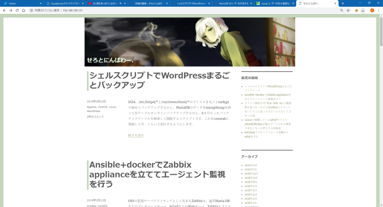

# {{this.$page.frontmatter.title}}

<Date/><CategoriesPerPost/>

{{this.$page.frontmatter.description}}

<!--more-->

## wordpres_bak.sh

```bash
#!/bin/sh

httpdConfDir=/etc/httpd
varWwwHtmlDir=/var/www/html
backUpDate=`date +"%Y%m%d"`
backUpDir=/var/www/wordpres_bak/

###バックアップログファイル
backUpLogFile=${backUpDir}${backUpDate}.log

###/etc/httpd/*のバックアップ
backUpHttpdConf="tar -czvf ${backUpDir}etc_httpd_${backUpDate}.tgz -C ${httpdConfDir} . 2>&1 | tee -a ${backUpLogFile}"
echo \# ${backUpHttpdConf} > ${backUpLogFile}
eval ${backUpHttpdConf}
resultOfHttpdConf=$?

###/var/www/html/*のバックアップ
backUpVarWwwHtml="tar -czvf ${backUpDir}var_www_html_${backUpDate}.tgz -C ${varWwwHtmlDir} . 2>&1 | tee -a ${backUpLogFile}"
echo \# ${backUpVarWwwHtml} >> ${backUpLogFile}
eval ${backUpVarWwwHtml}
resultOfVarWwwHtml=$?

###MariaDBのバックアップ
#wp-config.phpからDBのユーザ名、パスワードを取得しtmpファイルに格納
dbUser=`grep DB_USER /var/www/html/wp-config.php | awk -F\' '{print $4}'`
dbPasswd=`grep DB_PASSWORD /var/www/html/wp-config.php | awk -F\' '{print $4}'`
cat << EOTMPMYCNF > .tmp.my.cnf
[mysqldump]
user=${dbUser}
password=${dbPasswd}
EOTMPMYCNF
#tmpファイルを利用してmysqldump実行
backUpMysql="mysqldump --defaults-file=.tmp.my.cnf --all-databases --events --opt | gzip > ${backUpDir}mysqldump_${backUpDate}.sql.gz"
echo \# ${backUpMysql} >> ${backUpLogFile}
eval ${backUpMysql}
resultOfMysqldump=$?
#tmpファイル削除
rm .tmp.my.cnf

###6カ月以上前のファイルを削除
#\や;のエスケープ忘れずに
findOldFiles="find ${backUpDir} -mtime 180"
echo \# ${findOldFiles} -exec ls -l {} \\\; >> ${backUpLogFile}
eval ${findOldFiles} -exec rm -f {} \\\;
resultOfRmOldFiles=$?

###実行結果のサマリをログファイル先頭に記載
#変数にサマリを格納。\nは後ほどのsedに改行だと解釈され、
#\は変数格納時の改行コードをエスケープする
resultOfAll="
---Summary---\n\
resultOfHttpdConf=${resultOfHttpdConf}\n\
resultOfVarWwwHtml=${resultOfVarWwwHtml}\n\
resultOfMysqldump=${resultOfMysqldump}\n\
resultOfRmOldFiles=${resultOfRmOldFiles}\n\
---Detail---
"
#\\は\記号をエスケープしている
sed -i "1i\\${resultOfAll}" ${backUpLogFile} 2>&1
```

## リストア

20190306追記。ローカル環境でリストアを行うため、ネットワークやSSL設定に関わるhttpd.confはリストアしません。WordPressのファイル群とDBのリストアを行います。

```bash
#環境構築(vagrantで構築した内容べた書き)
$ sudo yum install httpd php php-mysql mariadb mariadb-server -y
$ sudo sed -i -e 's/SELINUX=enforcing/SELINUX=disabled/g' /etc/selinux/config
$ sudo systemctl enable httpd mariadb
$ systemctl start httpd mariadb

#ここでいったんリブート。そして環境の確認
$ cat /etc/redhat-release
CentOS Linux release 7.6.1810 (Core)
$ httpd -v
Server version: Apache/2.4.6 (CentOS)
Server built:   Nov  5 2018 01:47:09
$ php -v
PHP 5.4.16 (cli) (built: Oct 30 2018 19:30:51)
Copyright (c) 1997-2013 The PHP Group
Zend Engine v2.4.0, Copyright (c) 1998-2013 Zend Technologies
$ mysql -V
mysql  Ver 15.1 Distrib 5.5.60-MariaDB, for Linux (x86_64) using readline 5.1

#mariadbのデータベース(ここではzzzz)、ユーザ作成
mysql -u root
MariaDB [(none)]> create database zzzz;
#シングルクオーテーション忘れずに
MariaDB [(none)]> create user '${ユーザ名}'@'localhost' identified by '${パスワード}';
MariaDB [(none)]> grant all on zzzz.* to '${ユーザ名}'@'localhost';
MariaDB [(none)]> exit

#ここでバックアップしたファイルをホームディレクトリにコピー
$ pwd
/home/vagrant
$ ls -l
total 79648
-rw-r--r-- 1 vagrant vagrant   353748 Feb 24 14:35 mysqldump_20190224.sql.gz
-rw-r--r-- 1 vagrant vagrant 81201872 Feb 24 14:35 var_www_html_20190224.tgz

#mariadbのリストア
$ gunzip mysqldump_20190224.sql.gz
$ ls
mysqldump_20190224.sql  var_www_html_20190224.tgz
$ mysql -u ${ユーザ名} -p < mysqldump_20190224.sql

#WordPressのコンテンツのリストア
$ sudo cp var_www_html_20190224.tgz /var/www/html
$ sudo tar xvfz var_www_html_20190224.tgz
```

## 動作確認

ブラウザからアクセス。ローカル環境にブログがリストアできました。ただしリンクは全部FQDNで記載されているため、リンク先もきちんとリストアできているか確認するためには、確認する端末のhostsファイルかなんかにFQDNと今回リストアを実施したサーバのローカルIPアドレスを書き込んでおく必要があります。



## 所感

だらだらブログ書くのはだらだら書くべきときだけにして、普段はこういう風にサクッと書くようにしたい。
