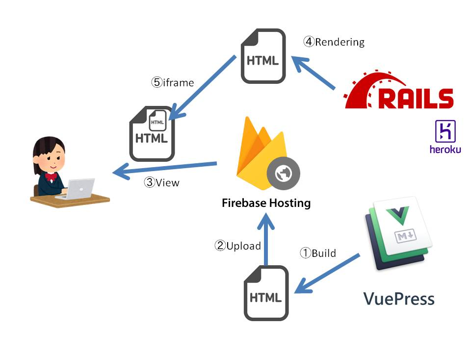

# {{this.$page.frontmatter.title}}

<Date/><CategoriesPerPost/>

{{this.$page.frontmatter.description}}

<!--more-->

## いままで

VuePressでjs + markdownで書いていたブログを静的なhtmlにビルドし、ビルド結果をFirebase Hostingにアップロードしているところまでは変わりません。

コメント機能は、Railsで生成したhtmlを、iframeでVuePressでビルドしたhtmlの中に埋め込んでいました。

## これから

コメントは、Railsからjsonで返すようにしました。

クライアント側で、js([axios](https://github.com/axios/axios))でREST APIを投げ、そのjsonを取ってきます。

取ってきたjsonをパースし、htmlとして再描写するようにしました。

::: tip
「いままで」と比べて、jsが新しくアップロードされたみたいな絵になっていますが、厳密にいうと「いままで」でもjsはアップロードされていました。

「これから」では、axiosを使ってjsonを取りに行くようにしたよと強調するために、「いままで」では省いています
:::

## 何がうれしいか

* iframeのセキュリティについて気にしなくてよくなる
  * 特にブラウザによってiframeに対するセキュリティポリシーが微妙に違うので、細かい対応が必要でした。
* デザインに関するコードをVuePress側に集中させることができる
  * iframeだと、スタイルは当然Rails側で実装しないといけなかったです。
  * これでRailsは純粋なAPIサーバになったので、全てのスタイルをVuePressに集約することができます。

## 所感

特に意味なし日記でした。

ちなみに、RailsはHerokuの無料プランで動かしています。

しばらくアクセスがないと自動でシャットダウンされ、次回アクセス時に起動からしないといけないので大変時間がかかります。

Cloud Runをちょっと使ってみたいので移行しようかな。

<Comments />
